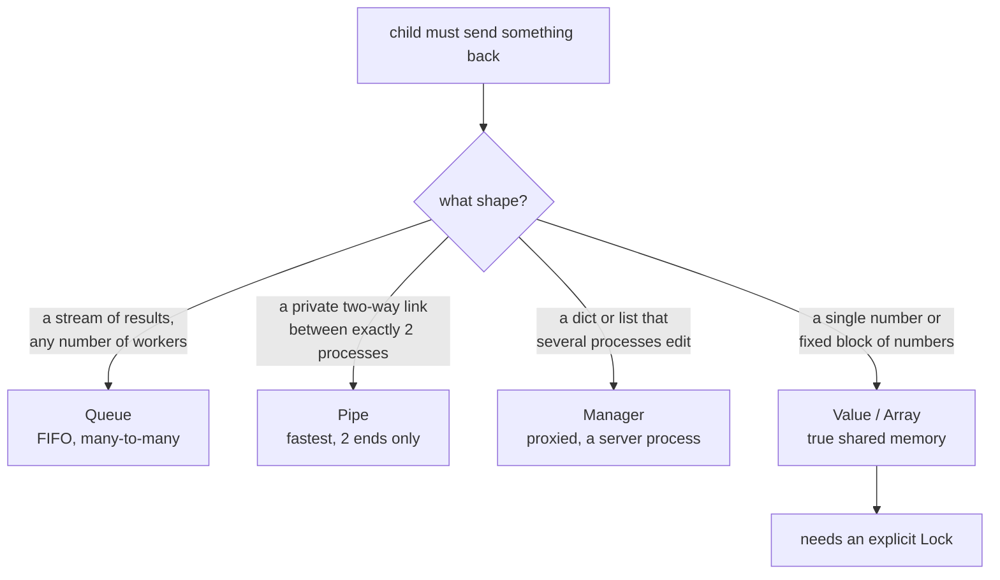

## Why sharing is different

Processes do **not** share memory like threads.

So you can’t safely update a global variable and expect other processes to see it.

## multiprocessing.Queue (recommended)

Use a Queue to send messages/results.

```python title="mp_queue.py" showLineNumbers{1}
from multiprocessing import Process, Queue


def worker(q: Queue, x: int) -> None:
    q.put(x * x)


if __name__ == "__main__":
    q = Queue()

    procs = [Process(target=worker, args=(q, i)) for i in range(5)]
    for p in procs:
        p.start()

    results = [q.get() for _ in procs]

    for p in procs:
        p.join()

    print(sorted(results))
```

## Pipe

`Pipe` is a two-way connection.

```python title="mp_pipe.py" showLineNumbers{1}
from multiprocessing import Process, Pipe


def worker(conn):
    conn.send("hello")
    conn.close()


if __name__ == "__main__":
    parent, child = Pipe()
    p = Process(target=worker, args=(child,))
    p.start()
    print(parent.recv())
    p.join()
```

## Manager (shared dict/list)

Manager provides proxy objects.

```python title="mp_manager.py" showLineNumbers{1}
from multiprocessing import Process, Manager


def worker(shared, i):
    shared[i] = i * i


if __name__ == "__main__":
    with Manager() as manager:
        shared = manager.dict()

        procs = [Process(target=worker, args=(shared, i)) for i in range(5)]
        for p in procs:
            p.start()
        for p in procs:
            p.join()

        print(dict(shared))
```

## Guidance

- Prefer passing data via Queue when possible.
- Use Manager for simple shared state (slower than local memory).

import DataCampExercise from "../../../../components/DataCampExercise.astro";
import Quiz from "../../../../components/Quiz.astro";

## Choosing a channel

Processes do not share memory, so everything they exchange must be **copied** across a
boundary. The four tools differ in shape, not in power:



Start with the mistake this all exists to prevent:

```python title="not_shared.py" showLineNumbers{1}
import multiprocessing as mp

def add(lst):
    lst.append("from child")

if __name__ == "__main__":
    lst = []
    p = mp.Process(target=add, args=(lst,)); p.start(); p.join()
    print(lst)          # []   <- the child appended to ITS OWN copy
```

The list was pickled into the child. The child's append succeeded — in the child. The
parent's list is untouched, and no error is raised anywhere.

## The four channels, measured

```python title="channels.py" showLineNumbers{1}
q = mp.Queue()                     # FIFO, any number of readers and writers
# child: q.put(i*i) for i in range(5); q.put(None)
# parent receives: [0, 1, 4, 9, 16]      None used as the "done" sentinel

parent_conn, child_conn = mp.Pipe()   # exactly two ends
# child: conn.send({"pid": ..., "payload": [1, 2, 3]})
# parent: conn.recv() -> {'pid': 19392, 'payload': [1, 2, 3]}

with mp.Manager() as m:            # a real server process holding the objects
    d, l = m.dict(), m.list([1, 2])
    # after the child writes: d -> {'child': 'wrote this'}   l -> [1, 2, 99]
```

A `Pipe` carries arbitrary **picklable objects**, not bytes — the dict above arrived
intact. A `Manager` dict is a *proxy*: every read and write is a round trip to a
separate server process, which is why it is the most convenient and the slowest.

:::caution[The sentinel is not optional]
`q.get()` blocks forever when the queue is empty. A consumer loop needs a way to know
production has stopped — conventionally one `None` per producer. Forgetting it hangs
the program with no error and no CPU use, which is the hardest kind of failure to find.
:::

## See it move

`Value` is genuine shared memory, and that is exactly why it can be corrupted.
`v.value += 1` is three operations — read, add, write — and a second process can land
between them. Run it with the lock off and watch updates disappear.

```p5 title="Lost updates without a Lock" desc="v.value += 1 is read, add, write. Two processes interleaving those steps overwrite each other, so increments are silently lost." height="340"
let locked = false;
let a = { step: 0, reg: 0 };
let b = { step: 0, reg: 0 };
let shared = 0;
let done = 0;
let lost = 0;
let owner = -1;         // which process holds the lock
let tick = 0;

function setup() {
  createCanvas(600, 340);
  textFont("monospace");
  reset();
}

function reset() {
  a = { step: 0, reg: 0 };
  b = { step: 0, reg: 0 };
  shared = 0; done = 0; lost = 0; owner = -1; tick = 0;
}

function advance(p, id) {
  if (locked) {
    if (owner === -1) owner = id;
    if (owner !== id) return;
  }
  if (p.step === 0) { p.reg = shared; p.step = 1; }
  else if (p.step === 1) { p.reg = p.reg + 1; p.step = 2; }
  else {
    shared = p.reg;
    p.step = 0;
    done++;
    if (locked) owner = -1;
  }
}

function draw() {
  background(13, 17, 23);
  tick++;
  if (tick % 14 === 0) advance(a, 0);
  if (tick % 14 === 7) advance(b, 1);
  lost = done - shared;

  noStroke();
  fill(230);
  textSize(13);
  textAlign(LEFT, TOP);
  text("two processes each running  v.value += 1", 24, 18);
  fill(locked ? color(120, 190, 130) : color(232, 110, 110));
  textSize(11);
  text(locked ? "Lock held: only one process may be inside the three steps"
              : "no Lock: both processes interleave freely", 24, 38);

  drawProc("process A", a, 0, 70);
  drawProc("process B", b, 1, 160);

  stroke(48, 56, 68);
  strokeWeight(1);
  fill(20, 26, 34);
  rect(24, 248, 250, 40, 5);
  noStroke();
  fill(255, 211, 67);
  textSize(15);
  textAlign(LEFT, CENTER);
  text("v.value = " + shared, 38, 268);

  textSize(11);
  fill(150);
  text("increments performed: " + done, 292, 258);
  fill(lost > 0 ? color(232, 110, 110) : color(120, 190, 130));
  text(lost > 0 ? "LOST: " + lost : "none lost", 292, 278);

  drawBtn(24, 300, 190, locked ? "Lock: ON" : "Lock: OFF");
  drawBtn(226, 300, 90, "reset");
}

function drawProc(name, p, id, y) {
  const steps = ["read v.value", "add 1", "write back"];
  noStroke();
  fill(150);
  textSize(11);
  textAlign(LEFT, TOP);
  text(name + "   register = " + p.reg, 24, y);
  const blocked = locked && owner !== -1 && owner !== id;
  for (let i = 0; i < 3; i++) {
    const x = 24 + i * 130;
    const on = p.step === i && !blocked;
    stroke(on ? color(255, 211, 67) : color(48, 56, 68));
    strokeWeight(on ? 2 : 1);
    fill(on ? color(38, 34, 18) : color(18, 23, 30));
    rect(x, y + 20, 118, 30, 4);
    noStroke();
    fill(on ? color(255, 211, 67) : 120);
    textSize(11);
    textAlign(CENTER, CENTER);
    text(steps[i], x + 59, y + 35);
  }
  if (blocked) {
    noStroke();
    fill(232, 110, 110);
    textAlign(LEFT, CENTER);
    textSize(11);
    text("waiting for lock", 420, y + 35);
  }
}

function drawBtn(x, y, w, label) {
  const hot = mouseX > x && mouseX < x + w && mouseY > y && mouseY < y + 24;
  stroke(hot ? color(255, 211, 67) : color(60, 70, 84));
  strokeWeight(1);
  fill(hot ? color(34, 40, 50) : color(22, 28, 36));
  rect(x, y, w, 24, 4);
  noStroke();
  fill(hot ? color(255, 211, 67) : 200);
  textSize(11);
  textAlign(CENTER, CENTER);
  text(label, x + w / 2, y + 12);
}

function mousePressed() {
  if (mouseY < 300 || mouseY > 324) return;
  if (mouseX > 24 && mouseX < 214) { locked = !locked; reset(); }
  if (mouseX > 226 && mouseX < 316) { reset(); }
}
```

Two processes, 10,000 increments each, measured:

| | result | expected | lost |
|:--|--:|--:|--:|
| with `mp.Lock()` | **20,000** | 20,000 | 0 |
| without a lock | **15,347** | 20,000 | **4,653** |

Nearly a quarter of the work vanished, with no exception and no warning. The number
differs on every run, which is the signature of a race — and the reason a test that
passes once proves nothing here.

```python title="locking.py" showLineNumbers{1}
v = mp.Value("i", 0)
lock = mp.Lock()

def worker(v, lock):
    for _ in range(10_000):
        with lock:          # remove this line and increments are lost
            v.value += 1
```

## What the copying costs

```python title="cost.py" showLineNumbers{1}
# 200,000 ints put on a Queue and taken off again: 33 ms
```

Every object crossing a process boundary is pickled on one side and unpickled on the
other. That is why sending a large DataFrame to a worker can cost more than the work
the worker was sent to do — and why it is usually better to send a *description* of the
task, like a range of indices, and let the child load the data itself.

## Check yourself

<Quiz
  questions={[
    {
      q: "A parent passes an empty list to a child, which appends to it. What does the parent see afterwards?",
      options: [
        "the appended item, since lists are mutable",
        "an empty list, because the child received a pickled copy",
        "a TypeError, because lists cannot be passed to processes",
        "the appended item, but only after join()",
      ],
      answer: 1,
      explain:
        "Arguments are pickled into the child. The child mutated its own copy successfully, so nothing raises — the parent's list is simply still empty.",
    },
    {
      q: "Two processes each run v.value += 1 ten thousand times on a shared Value with no Lock. What is a realistic result?",
      options: [
        "exactly 20000, because Value is shared memory",
        "exactly 10000, because one process overwrites the other entirely",
        "a varying number below 20000, such as 15347",
        "a deadlock",
      ],
      answer: 2,
      explain:
        "+= is read, add, write. Interleaving those steps loses updates. Measured 15347 of 20000 on one run, and a different figure on the next — that variability is what identifies a race.",
    },
    {
      q: "Why does a consumer loop reading mp.Queue conventionally need a sentinel such as None?",
      options: [
        "to mark which producer sent each item",
        "because q.get() on an empty queue blocks forever, so the consumer needs an explicit end signal",
        "because Queue cannot hold more than a fixed number of items",
        "to force the queue to flush its buffer",
      ],
      answer: 1,
      explain:
        "An empty queue is indistinguishable from one whose producer is merely slow, so get() waits. Without a sentinel the program hangs using no CPU and raising nothing.",
    },
    {
      q: "Which channel is a proxy backed by a separate server process, making it the most convenient and the slowest?",
      options: [
        "Pipe",
        "Queue",
        "Manager",
        "Array",
      ],
      answer: 2,
      explain:
        "A Manager hosts the real dict or list in its own process; every read and write is a round trip. Value and Array are true shared memory, and Pipe is a direct two-ended link.",
    },
  ]}
/>

## 🧪 Try It Yourself

### Exercise 1 – Start a Process

<DataCampExercise
  lang="python"
  hint={`Use \`multiprocessing.Process(target=fn)\` and call \`.start()\`.`}
  code={`# Task: Exercise 1 – Start a Process
from multiprocessing import Process

def greet(name):
    print(f"Hello from {name}")

if __name__ == "__main__":
    # Hint: create a Process with target=greet and args=("worker",)
    p = Process(target=greet, args=(___, ))   # replace ___ with "worker"
    p.___()                                    # replace ___ with start
    p.___()                                    # replace ___ with join

# ── Expected Output ───────────────────────────────────────────
# Hello from worker
# ──────────────────────────────────────────────────────────────`}
  solution={`from multiprocessing import Process

def greet(name):
    print(f"Hello from {name}")

if __name__ == "__main__":
    p = Process(target=greet, args=("worker",))
    p.start()
    p.join()`}
  sct={`test_output_contains("Hello from worker")
success_msg("Process created and joined!")`}
  height={150}
/>

### Exercise 2 – Process Pool map()

<DataCampExercise
  lang="python"
  hint={`Use \`Pool.map(fn, iterable)\` to apply a function across multiple processes.`}
  code={`# Task: Exercise 2 – Process Pool map()
from multiprocessing import Pool

def square(n):
    return n * n

if __name__ == "__main__":
    # Hint: create a Pool with 2 workers
    with Pool(___) as p:            # replace ___ with 2
        results = p.___(square, [1, 2, 3, 4])  # replace ___ with map
        print(results)

# ── Expected Output ───────────────────────────────────────────
# [1, 4, 9, 16]
# ──────────────────────────────────────────────────────────────`}
  solution={`from multiprocessing import Pool

def square(n):
    return n * n

if __name__ == "__main__":
    with Pool(2) as p:
        results = p.map(square, [1, 2, 3, 4])
        print(results)`}
  sct={`test_output_contains("[1, 4, 9, 16]")
success_msg("Pool.map runs tasks in parallel!")`}
  height={145}
/>

### Exercise 3 – Multiprocessing Queue

<DataCampExercise
  lang="python"
  hint={`Use \`multiprocessing.Queue\` with \`.put()\` and \`.get()\` to share data.`}
  code={`# Task: Exercise 3 – Multiprocessing Queue
from multiprocessing import Process, Queue

def worker(q, value):
    q.___(value * 2)    # replace ___ with put

if __name__ == "__main__":
    q = Queue()
    p = Process(target=worker, args=(q, 21))
    p.start(); p.join()
    print("Result:", q.___())   # replace ___ with get

# ── Expected Output ───────────────────────────────────────────
# Result: 42
# ──────────────────────────────────────────────────────────────`}
  solution={`from multiprocessing import Process, Queue

def worker(q, value):
    q.put(value * 2)

if __name__ == "__main__":
    q = Queue()
    p = Process(target=worker, args=(q, 21))
    p.start(); p.join()
    print("Result:", q.get())`}
  sct={`test_output_contains("Result: 42")
success_msg("Queue passes data between processes!")`}
  height={148}
/>

