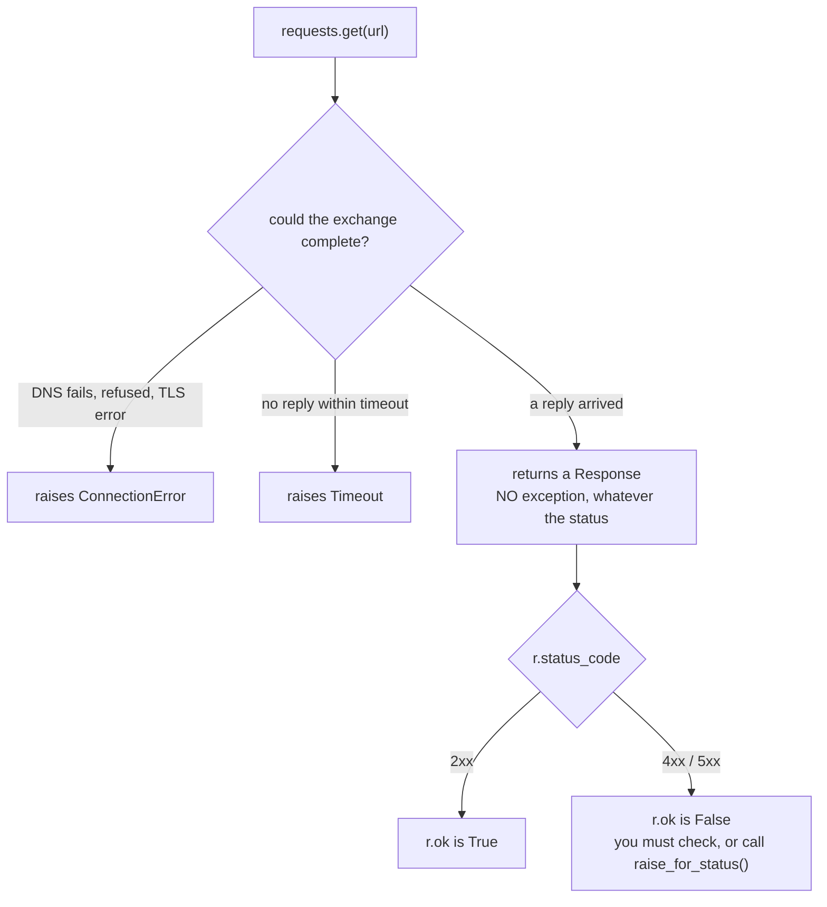

## What is an HTTP request?

An HTTP request asks a server for something.

Common verbs:

- `GET`: fetch data
- `POST`: send data
- `PUT/PATCH`: update
- `DELETE`: remove

## GET request

```python title="get_request.py" showLineNumbers{1}
import requests

url = "https://api.github.com"
r = requests.get(url, timeout=10)

print(r.status_code)
print(r.headers.get("content-type"))
print(r.json().keys())
```

## Query parameters

```python title="params.py" showLineNumbers{1}
import requests

url = "https://api.github.com/search/repositories"
params = {"q": "python", "sort": "stars", "per_page": 5}

r = requests.get(url, params=params, timeout=10)
r.raise_for_status()

data = r.json()
print("count:", data["total_count"])
for item in data["items"]:
    print(item["full_name"], item["stargazers_count"])
```

## POST JSON

```python title="post_json.py" showLineNumbers{1}
import requests

url = "https://httpbin.org/post"
payload = {"name": "ravi", "role": "learner"}

r = requests.post(url, json=payload, timeout=10)
r.raise_for_status()

print(r.json()["json"])  # echoed back
```

## Timeouts and retries

### Always set timeouts

Without a timeout, a request can hang forever.

### Basic retry pattern

```python title="retry_pattern.py" showLineNumbers{1}
import time
import requests

url = "https://httpbin.org/status/503"

for attempt in range(3):
    try:
        r = requests.get(url, timeout=5)
        r.raise_for_status()
        print("success")
        break
    except requests.RequestException as e:
        print("attempt failed:", attempt + 1, e)
        time.sleep(1)
else:
    print("all retries failed")
```

## Good practice checklist

- Use `timeout=`
- Call `raise_for_status()` for non-2xx responses
- Don’t log secrets (API keys)

import DataCampExercise from "../../../../components/DataCampExercise.astro";
import Quiz from "../../../../components/Quiz.astro";

## A bad status is not an exception

This trips up almost everyone once. `requests.get` raises only when it could not
*complete* the exchange. A server that answers "404" answered — the call succeeds:



Measured against a local endpoint that returns 404:

```python title="not_an_error.py" showLineNumbers{1}
r = requests.get(f"{BASE}/404")

print(r.status_code)     # 404
print(r.ok)              # False
print(bool(r))           # False   <- `if r:` works, and is easy to forget
print(r.json())          # {'error': 'not found'}   <- the body still parses

r.raise_for_status()     # requests.HTTPError: 404 Client Error: Not Found for url: ...
```

`bool(r)` following `r.ok` is the detail worth remembering: `if response:` means *did it
succeed*, not *did I get a response*. A truthiness test on a 404 is `False` even though
the object is perfectly real.

:::caution[Pick one and be consistent]
Either call `raise_for_status()` and handle `HTTPError`, or check `r.ok` explicitly.
Code that does neither treats an error page as data — which is how a 500 page ends up
parsed as a record and written to a database.
:::

## `.json()` fails on anything that is not JSON

```python title="json_fail.py" showLineNumbers{1}
r = requests.get(f"{BASE}/html")     # Content-Type: text/html
r.json()
# requests.exceptions.JSONDecodeError: Expecting value: line 1 column 1 (char 0)

r.text        # '<html><body>not json</body></html>'   <- always available
```

The error message points at "line 1 column 1" because the very first character was `<`.
When an API misbehaves, that message almost always means **you received an HTML error
page** — a login redirect, a proxy notice, or a gateway error — not malformed JSON.

## Let `requests` build the URL

```python title="params.py" showLineNumbers{1}
r = requests.get(f"{BASE}/search", params={"q": "a b&c", "page": 2})
print(r.url)
# http://127.0.0.1:61392/search?q=a+b%26c&page=2
```

The space became `+` and the `&` became `%26`, so the value cannot break out and invent
a new parameter. Building query strings with f-strings is how injection bugs and
mysterious truncated values happen.

```python title="headers.py" showLineNumbers{1}
r = requests.get(url, headers={"X-Demo": "hello"})   # server saw 'hello'
```

## See it move

A request has phases, and a timeout can be set on each. Drag the limit and watch which
phase gets cut off — this is the difference between "the site is slow" and "the site is
down".

```p5 title="Where a timeout applies" desc="A request resolves DNS, connects, sends, waits for the server, then reads the body. requests takes (connect, read) timeouts; a single number applies to both." height="330"
let budget = 2.0;    // seconds
const PHASES = [
  { n: "DNS lookup", d: 0.10, c: [120, 150, 190] },
  { n: "TCP connect", d: 0.15, c: [110, 160, 210] },
  { n: "TLS handshake", d: 0.25, c: [100, 170, 220] },
  { n: "server thinking", d: 3.00, c: [255, 211, 67] },
  { n: "read body", d: 0.20, c: [120, 190, 130] },
];

function setup() {
  createCanvas(600, 330);
  textFont("monospace");
}

function draw() {
  background(13, 17, 23);
  const total = PHASES.reduce(function (a, p) { return a + p.d; }, 0);
  const scale = 460 / total;

  noStroke();
  fill(230);
  textSize(13);
  textAlign(LEFT, TOP);
  text("one request, phase by phase", 24, 16);
  fill(120);
  textSize(11);
  text("the endpoint sleeps 3s before replying", 24, 36);

  let acc = 0;
  let cutPhase = -1;
  for (let i = 0; i < PHASES.length; i++) {
    const p = PHASES[i];
    const x = 24 + acc * scale;
    const w = p.d * scale;
    const startsAfterCut = acc >= budget;
    const spansCut = acc < budget && acc + p.d > budget;
    if (spansCut) cutPhase = i;

    stroke(48, 56, 68);
    strokeWeight(1);
    fill(startsAfterCut ? color(22, 26, 32) : color(p.c[0] * 0.3, p.c[1] * 0.3, p.c[2] * 0.3));
    rect(x, 70, max(2, w - 2), 44, 3);

    noStroke();
    fill(startsAfterCut ? 60 : color(p.c[0], p.c[1], p.c[2]));
    textSize(9);
    textAlign(CENTER, TOP);
    if (w > 34) text(p.n, x + w / 2, 120);
    if (w > 44) text(p.d + "s", x + w / 2, 134);
    acc += p.d;
  }

  const bx = 24 + budget * scale;
  stroke(232, 110, 110);
  strokeWeight(2);
  line(bx, 60, bx, 124);
  noStroke();
  fill(232, 110, 110);
  triangle(bx - 6, 52, bx + 6, 52, bx, 60);
  textAlign(LEFT, BOTTOM);
  textSize(11);
  text("timeout = " + nf(budget, 0, 2) + "s", bx + 8, 52);

  fill(20, 26, 34);
  stroke(48, 56, 68);
  strokeWeight(1);
  rect(24, 170, 460, 60, 5);
  noStroke();
  textAlign(LEFT, TOP);
  textSize(12);
  if (budget >= total) {
    fill(120, 190, 130);
    text("completes: status 200", 38, 184);
    fill(120);
    textSize(11);
    text("measured with timeout=10 -> 200 after 3.01s", 38, 206);
  } else {
    fill(232, 110, 110);
    text("raises requests.exceptions.ReadTimeout", 38, 184);
    fill(120);
    textSize(11);
    const nm = cutPhase >= 0 ? PHASES[cutPhase].n : "before the first phase";
    text("cut during: " + nm + "    measured timeout=0.5 -> ReadTimeout after 0.51s", 38, 206);
  }

  fill(120);
  textSize(11);
  textAlign(LEFT, TOP);
  text("drag to change the timeout", 24, 250);
  const sx = 24, sw = 460;
  stroke(60, 70, 84);
  strokeWeight(2);
  line(sx, 278, sx + sw, 278);
  const px = sx + (budget / 4.0) * sw;
  noStroke();
  fill(255, 211, 67);
  circle(px, 278, 13);

  fill(90);
  textSize(10);
  textAlign(LEFT, TOP);
  text("requests.get(url, timeout=(connect, read)) sets the two separately", 24, 298);
}

function mouseDragged() { setBudget(); }
function mousePressed() { setBudget(); }

function setBudget() {
  if (mouseY < 264 || mouseY > 292) return;
  budget = constrain((mouseX - 24) / 460, 0, 1) * 4.0;
}
```

Measured against an endpoint that sleeps 3 s:

| call | outcome |
|:--|:--|
| `requests.get(url, timeout=0.5)` | **`ReadTimeout` after 0.51 s** |
| `requests.get(url, timeout=10)` | `200` after 3.01 s |

:::danger[Without `timeout`, requests waits forever]
There is **no default timeout**. A single unresponsive host can hang a script for hours
with no error and no output. Pass `timeout=` on every call you make — it is the one
argument that should never be omitted.
:::

## Text, bytes, and encoding

```python title="body.py" showLineNumbers{1}
r.text        # str   — decoded using r.encoding ('utf-8' here)
r.content     # bytes — exactly what arrived, 36 bytes
```

Use `.content` for anything that is not text — images, zip files, PDFs. Use `.text`
when you want a string, and set `r.encoding` yourself if the server's declaration is
wrong.

## Check yourself

<Quiz
  questions={[
    {
      q: "requests.get returns a response with status 404. What happens?",
      options: [
        "an HTTPError is raised immediately",
        "nothing is raised; r.status_code is 404, r.ok is False, and r.json() still parses the body",
        "a ConnectionError is raised",
        "the call returns None",
      ],
      answer: 1,
      explain:
        "The exchange completed, so requests returns normally. Only transport failures raise. Use raise_for_status() or check r.ok to turn a bad status into an error.",
    },
    {
      q: "r.json() raises JSONDecodeError: Expecting value: line 1 column 1 (char 0). What is the most likely cause?",
      options: [
        "the JSON has a trailing comma",
        "the response body is not JSON at all, typically an HTML error or login page",
        "the response was empty because of a timeout",
        "the encoding was not UTF-8",
      ],
      answer: 1,
      explain:
        "Failing at the very first character means the body did not start like JSON. Print r.text and r.headers['Content-Type'] — it is usually HTML from a proxy, redirect or gateway.",
    },
    {
      q: "What does requests.get(url, params={'q': 'a b&c', 'page': 2}) produce as a URL?",
      options: [
        "...?q=a b&c&page=2, unchanged",
        "...?q=a+b%26c&page=2, with the space and ampersand encoded",
        "it raises, because the value contains an ampersand",
        "...?q=abc&page=2, with special characters stripped",
      ],
      answer: 1,
      explain:
        "requests percent-encodes values so a stray & cannot invent a new parameter. This is why building query strings by hand with f-strings is a bug waiting to happen.",
    },
    {
      q: "What is the default timeout for requests.get?",
      options: [
        "30 seconds",
        "5 seconds",
        "there is none; the call can block indefinitely",
        "it matches the operating system TCP timeout of 2 minutes",
      ],
      answer: 2,
      explain:
        "requests has no default timeout, so an unresponsive server hangs the script silently. Measured: timeout=0.5 raised ReadTimeout after 0.51 s; without one there is nothing to stop the wait.",
    },
  ]}
/>

## 🧪 Try It Yourself

### Exercise 1 – GET Request

<DataCampExercise
  lang="python"
  hint={`Use \`requests.get(url)\` and check \`.status_code\`.`}
  code={`# Task: Exercise 1 – GET Request
import requests

# Hint: make a GET request
r = requests.___(  "https://httpbin.org/get"  )   # replace ___ with get
print("Status:", r.___)                            # replace ___ with status_code

# ── Expected Output ───────────────────────────────────────────
# Status: 200
# ──────────────────────────────────────────────────────────────`}
  solution={`import requests

r = requests.get("https://httpbin.org/get")
print("Status:", r.status_code)`}
  sct={`test_output_contains("Status: 200")
success_msg("GET request succeeded!")`}
  height={120}
/>

### Exercise 2 – POST with JSON

<DataCampExercise
  lang="python"
  hint={`Use \`requests.post(url, json=data)\` and \`.json()\` to read the response.`}
  code={`# Task: Exercise 2 – POST with JSON
import requests

payload = {"name": "Alice", "score": 99}
# Hint: POST with json= keyword
r = requests.___("https://httpbin.org/post", ___=payload)  # replace blanks: post, json
print("Sent name:", r.___()["json"]["name"])                # replace ___ with json

# ── Expected Output ───────────────────────────────────────────
# Sent name: Alice
# ──────────────────────────────────────────────────────────────`}
  solution={`import requests

payload = {"name": "Alice", "score": 99}
r = requests.post("https://httpbin.org/post", json=payload)
print("Sent name:", r.json()["json"]["name"])`}
  sct={`test_output_contains("Sent name: Alice")
success_msg("POST with JSON works!")`}
  height={130}
/>

### Exercise 3 – Handle Timeout

<DataCampExercise
  lang="python"
  hint={`Pass \`timeout=seconds\` to \`requests.get()\` to avoid hanging indefinitely.`}
  code={`# Task: Exercise 3 – Handle Timeout
import requests

try:
    # Hint: set timeout=0.001 to force a timeout
    r = requests.get("https://httpbin.org/delay/5", ___=0.001)  # replace ___ with timeout
except requests.exceptions.Timeout:
    print("Request timed out!")

# ── Expected Output ───────────────────────────────────────────
# Request timed out!
# ──────────────────────────────────────────────────────────────`}
  solution={`import requests

try:
    r = requests.get("https://httpbin.org/delay/5", timeout=0.001)
except requests.exceptions.Timeout:
    print("Request timed out!")`}
  sct={`test_output_contains("Request timed out!")
success_msg("Timeout prevents hanging!")`}
  height={130}
/>

