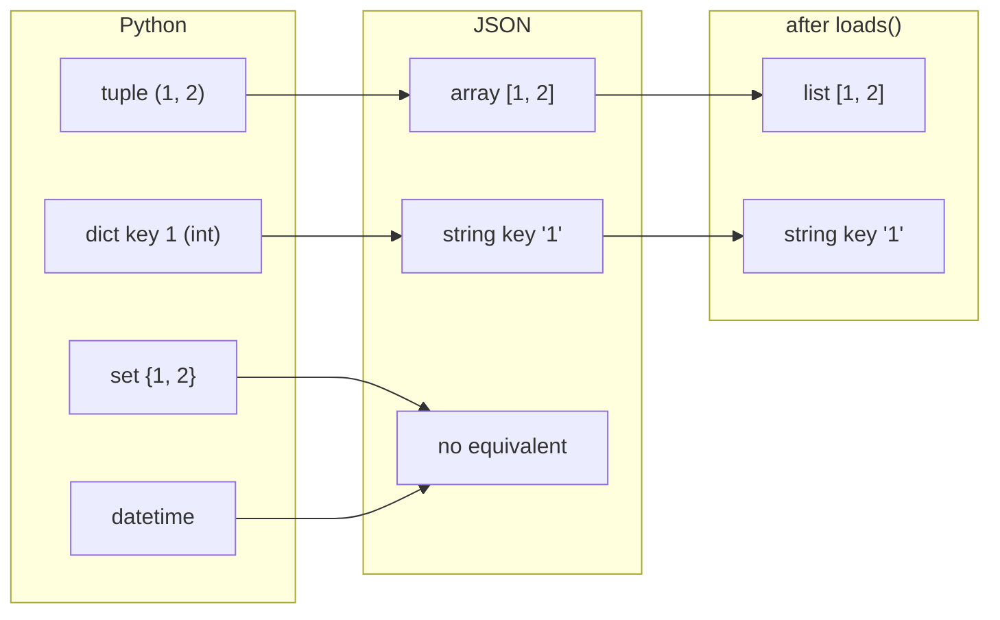

## What is JSON?

JSON is a text format for structured data.

- objects → Python dict
- arrays → Python list

## Parse JSON

```python title="parse_json.py" showLineNumbers{1}
import requests

r = requests.get("https://api.github.com", timeout=10)
obj = r.json()

print(type(obj))
print(obj.get("current_user_url"))
```

## Validate fields safely

APIs may change or fields may be missing.

```python title="safe_access.py" showLineNumbers{1}
data = {"user": {"name": "Ravi"}}

name = data.get("user", {}).get("name")
email = data.get("user", {}).get("email")  # might be None

print(name, email)
```

## Convert JSON list to pandas

```python title="json_to_df.py" showLineNumbers{1}
import requests
import pandas as pd

url = "https://api.github.com/search/repositories"
params = {"q": "data analytics", "per_page": 10}

r = requests.get(url, params=params, timeout=10)
r.raise_for_status()

items = r.json()["items"]
rows = [
    {
        "name": it["full_name"],
        "stars": it["stargazers_count"],
        "language": it.get("language"),
    }
    for it in items
]

df = pd.DataFrame(rows)
print(df.head())
```

## Common errors

- `KeyError`: field missing → use `.get()`
- `JSONDecodeError`: response not JSON → check status code/content

import DataCampExercise from "../../../../components/DataCampExercise.astro";
import Quiz from "../../../../components/Quiz.astro";

## The round trip is not lossless

JSON has six types. Python has many more. Everything you send is mapped onto the
nearest JSON type, and what comes back is that JSON type — **not what you started
with**:



```python title="round_trip.py" showLineNumbers{1}
import json

s = json.dumps({"tup": (1, 2), "intkey": {1: "a"}})
print(s)                     # {"tup": [1, 2], "intkey": {"1": "a"}}

back = json.loads(s)
print(type(back["tup"]).__name__)          # list   <- was a tuple
print(list(back["intkey"])[0])             # '1'    <- was the integer 1

json.dumps({"s": {1, 2}})    # TypeError: Object of type set is not JSON serializable
```

Two of these are silent and one is loud:

- A **tuple** becomes a list. No warning.
- An **integer dict key** becomes a string. No warning — and `back["intkey"][1]` now
  raises `KeyError`.
- A **set** raises `TypeError`. Convert it with `sorted(...)` or `list(...)` first.
- **datetime** also raises. Send ISO strings with `.isoformat()`.

:::caution[The int-key trap]
`{1: "a"}` survives `dumps` and comes back as `{"1": "a"}`. Code that writes with
integer keys and reads with integer keys works perfectly until the data makes a round
trip through JSON, then fails with `KeyError: 1` on data that looks correct when
printed.
:::

## Numbers deserve a second look

```python title="numbers.py" showLineNumbers{1}
json.loads("1")        # 1     (int)
json.loads("1.0")      # 1.0   (float)   <- the decimal point decides the type
json.loads("1e400")    # inf             <- silently, no error

json.dumps(10**25)     # '10000000000000000000000000'   Python round-trips it exactly
# but 2**53 = 9007199254740992 is the largest integer a JavaScript client
# can represent exactly, so a large id may be corrupted by the *consumer*
```

`1e400` overflowing to `inf` without complaint is the dangerous one — you get a float
that poisons every later calculation. And note the asymmetry: Python handles huge
integers fine, so an id that survives your tests can still be mangled by a browser
reading the same payload. APIs send large ids as **strings** for exactly this reason.

`NaN` is a related trap: `json.dumps(float("nan"))` produces `NaN`, which Python reads
back happily and which **is not valid JSON** — strict parsers in other languages reject
it.

## See it move

Click a Python value to send it through `dumps` and back. Watch which ones come home
unchanged, which quietly change type, and which refuse to go at all.

```p5 title="What survives a JSON round trip" desc="Tuples return as lists and integer keys as strings, both silently. Sets and datetimes raise. Only str, int, float, bool, None, list and dict survive unchanged." height="340"
let idx = 0;
const ITEMS = [
  { py: "'hello'",      js: "\"hello\"",   back: "'hello'",     kind: "same" },
  { py: "42",           js: "42",         back: "42",          kind: "same" },
  { py: "3.14",         js: "3.14",       back: "3.14",        kind: "same" },
  { py: "True",         js: "true",       back: "True",        kind: "same" },
  { py: "None",         js: "null",       back: "None",        kind: "same" },
  { py: "[1, 2]",       js: "[1, 2]",     back: "[1, 2]",      kind: "same" },
  { py: "(1, 2)",       js: "[1, 2]",     back: "[1, 2]",      kind: "changed" },
  { py: "{1: 'a'}",     js: "{\"1\": \"a\"}", back: "{'1': 'a'}", kind: "changed" },
  { py: "1e400",        js: "Infinity",   back: "inf",         kind: "changed" },
  { py: "{1, 2}",       js: "TypeError",  back: "-",           kind: "error" },
  { py: "datetime.now()", js: "TypeError", back: "-",          kind: "error" },
];

function setup() {
  createCanvas(600, 340);
  textFont("monospace");
}

function kindColor(k) {
  if (k === "same") return color(120, 190, 130);
  if (k === "changed") return color(255, 211, 67);
  return color(232, 110, 110);
}

function draw() {
  background(13, 17, 23);
  const it = ITEMS[idx];

  noStroke();
  fill(230);
  textSize(13);
  textAlign(LEFT, TOP);
  text("json.dumps  then  json.loads", 24, 16);
  fill(120);
  textSize(11);
  text("click a value on the left", 24, 36);

  for (let i = 0; i < ITEMS.length; i++) {
    const y = 62 + i * 24;
    const on = i === idx;
    stroke(on ? kindColor(ITEMS[i].kind) : color(40, 48, 58));
    strokeWeight(1);
    fill(on ? color(28, 34, 44) : color(17, 22, 29));
    rect(24, y, 158, 21, 3);
    noStroke();
    fill(on ? kindColor(ITEMS[i].kind) : 130);
    textSize(11);
    textAlign(LEFT, CENTER);
    text(ITEMS[i].py, 34, y + 10);
  }

  const bx = 210;
  const labels = ["Python", "JSON text", "after loads()"];
  const vals = [it.py, it.js, it.back];
  for (let s = 0; s < 3; s++) {
    const y = 74 + s * 74;
    stroke(s === 1 ? color(75, 139, 190) : kindColor(it.kind));
    strokeWeight(1);
    fill(20, 26, 34);
    rect(bx, y, 360, 46, 4);
    noStroke();
    fill(110);
    textSize(9);
    textAlign(LEFT, TOP);
    text(labels[s], bx + 12, y + 6);
    fill(s === 1 ? color(75, 139, 190) : kindColor(it.kind));
    textSize(14);
    textAlign(LEFT, CENTER);
    text(vals[s], bx + 12, y + 29);

    if (s < 2) {
      stroke(60, 70, 84);
      strokeWeight(1);
      const my = y + 46;
      line(bx + 180, my, bx + 180, my + 28);
      noStroke();
      fill(90);
      textSize(9);
      textAlign(LEFT, CENTER);
      text(s === 0 ? "dumps" : "loads", bx + 188, my + 14);
    }
  }

  noStroke();
  textAlign(LEFT, TOP);
  textSize(11);
  fill(kindColor(it.kind));
  let msg = "survives unchanged";
  if (it.kind === "changed") msg = "type changed, and nothing warned you";
  if (it.kind === "error") msg = "raises TypeError: not JSON serializable";
  text(msg, bx, 300);
}

function mousePressed() {
  for (let i = 0; i < ITEMS.length; i++) {
    const y = 62 + i * 24;
    if (mouseX > 24 && mouseX < 182 && mouseY > y && mouseY < y + 21) idx = i;
  }
}
```

## Reading a response defensively

Real payloads have optional fields, and `[]` raises on the first one that is missing:

```python title="safe_access.py" showLineNumbers{1}
r = {"user": {"name": "ada"}}

r["user"]["email"]                     # KeyError: 'email'
r["user"].get("email")                 # None
r.get("account", {}).get("email")      # None   <- safe even though 'account' is absent
```

The `.get("key", {})` chain is the idiom worth memorising: supplying an empty dict as
the default keeps the chain going instead of raising halfway through.

For anything deeper than two levels, validate the shape once at the boundary rather
than sprinkling `.get` everywhere — a `dataclass`, or a library like `pydantic`, turns
"this field was missing" into one clear error at the point of parsing.

## Writing JSON you will be glad to read

```python title="dumps_options.py" showLineNumbers{1}
obj = {"b": 2, "a": [1, 2, 3]}

json.dumps(obj)                              # {"b": 2, "a": [1, 2, 3]}      24 bytes
json.dumps(obj, separators=(",", ":"))       # {"b":2,"a":[1,2,3]}           19 bytes
json.dumps(obj, sort_keys=True)              # {"a": [1, 2, 3], "b": 2}
json.dumps({"city": "Kraków"})               # {"city": "Krak\u00f3w"}       23 bytes
json.dumps({"city": "Kraków"}, ensure_ascii=False)   # {"city": "Kraków"}    19 bytes
```

- **`separators=(",", ":")`** for anything going over a network — 19 bytes against 24
  on this tiny object, and the gap widens with size.
- **`sort_keys=True`** for anything written to a file and compared later; without it a
  diff is noise.
- **`ensure_ascii=False`** to keep text readable. Both forms decode to the same string;
  the escaped version is only larger and harder to read.

## Check yourself

<Quiz
  questions={[
    {
      q: "You json.dumps a dict with the integer key 1, then json.loads it back. What key does the result have?",
      options: [
        "the integer 1, unchanged",
        "the string '1', because JSON object keys are always strings",
        "it raises TypeError, since int keys are not serializable",
        "the key is dropped",
      ],
      answer: 1,
      explain:
        "JSON keys can only be strings, so dumps converts silently. Code that then looks up data[1] raises KeyError on data that prints as if it were fine.",
    },
    {
      q: "What does json.loads('1e400') return?",
      options: [
        "a ValueError, since the number is too large",
        "the string '1e400'",
        "inf, silently",
        "the largest representable float",
      ],
      answer: 2,
      explain:
        "It overflows to float infinity with no error, and inf then contaminates every later calculation. Validate numeric ranges when the source is not yours.",
    },
    {
      q: "Which of these raises TypeError when passed to json.dumps?",
      options: [
        "a tuple",
        "None",
        "a set",
        "a nested list",
      ],
      answer: 2,
      explain:
        "A set has no JSON equivalent and raises 'Object of type set is not JSON serializable'. A tuple does not raise — it silently becomes an array, which is arguably worse.",
    },
    {
      q: "Given r = {'user': {'name': 'ada'}}, which expression safely yields None instead of raising?",
      options: [
        "r['account']['email']",
        "r.get('account')['email']",
        "r.get('account', {}).get('email')",
        "r['account'].get('email')",
      ],
      answer: 2,
      explain:
        "Supplying {} as the default keeps the chain alive when 'account' is missing. The other three all hit a missing key or call .get on None.",
    },
  ]}
/>

## 🧪 Try It Yourself

### Exercise 1 – Parse JSON Response

<DataCampExercise
  lang="python"
  hint={`Use \`.json()\` on a requests response to get a Python dict.`}
  code={`# Task: Exercise 1 – Parse JSON Response
import requests

r = requests.get("https://httpbin.org/json")
# Hint: call .json() to parse the body
data = r.___()     # replace ___ with json
print(type(data))  # should be <class 'dict'>

# ── Expected Output ───────────────────────────────────────────
# <class 'dict'>
# ──────────────────────────────────────────────────────────────`}
  solution={`import requests

r = requests.get("https://httpbin.org/json")
data = r.json()
print(type(data))`}
  sct={`test_output_contains("<class 'dict'>")
success_msg(".json() parses the response body!")`}
  height={120}
/>

### Exercise 2 – Serialize Python to JSON

<DataCampExercise
  lang="python"
  hint={`Use \`json.dumps(obj)\` to convert a dict to a JSON string.`}
  code={`# Task: Exercise 2 – Serialize Python to JSON
import json

data = {"language": "Python", "version": 3}
# Hint: use json.dumps() to serialize
text = json.___( data )   # replace ___ with dumps
print(type(text))
print(text)

# ── Expected Output ───────────────────────────────────────────
# <class 'str'>
# {"language": "Python", "version": 3}
# ──────────────────────────────────────────────────────────────`}
  solution={`import json

data = {"language": "Python", "version": 3}
text = json.dumps(data)
print(type(text))
print(text)`}
  sct={`test_output_contains("<class 'str'>")
test_output_contains("Python")
success_msg("json.dumps() serializes data!")`}
  height={130}
/>

### Exercise 3 – Parse JSON String

<DataCampExercise
  lang="python"
  hint={`Use \`json.loads(text)\` to convert a JSON string back to a Python object.`}
  code={`# Task: Exercise 3 – Parse JSON String
import json

text = '{"city": "Berlin", "pop": 3800000}'
# Hint: use json.loads() to parse
obj = json.___(text)    # replace ___ with loads
print(obj["city"])
print(obj["pop"])

# ── Expected Output ───────────────────────────────────────────
# Berlin
# 3800000
# ──────────────────────────────────────────────────────────────`}
  solution={`import json

text = '{"city": "Berlin", "pop": 3800000}'
obj = json.loads(text)
print(obj["city"])
print(obj["pop"])`}
  sct={`test_output_contains("Berlin")
test_output_contains("3800000")
success_msg("json.loads() parses JSON strings!")`}
  height={130}
/>

