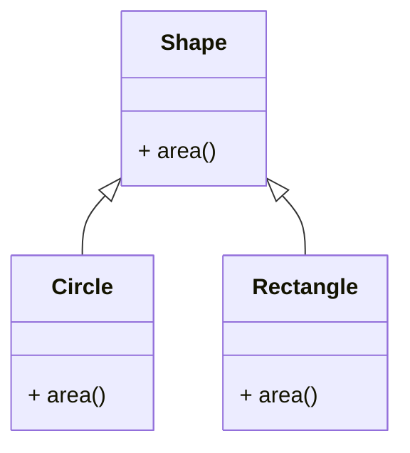

## Abstraction in OOPs with Python: Unveiling the Essence of Simplicity

Abstraction is a fundamental concept in object-oriented programming (OOP) that allows developers to focus on essential aspects of an object while hiding the unnecessary details. In Python, abstraction provides a powerful mechanism for creating clean, modular, and easily maintainable code. Let's delve into the world of abstraction, exploring its definition, implementation, and the impact it has on the design and structure of Python programs.

## Understanding Abstraction

### 1. **Abstraction Defined**
   - Abstraction involves representing essential features of an object while hiding the complex and intricate details. It simplifies the interaction with objects by providing a high-level view.

### 2. **Real-world Analogy**
   - Think of abstraction as driving a car. As a driver, you focus on essential controls like the steering wheel, pedals, and gears, abstracting away the intricate details of the engine's internal workings.

### 3. **Key Components**
   - Abstraction in OOPs typically involves two key components:
     - **Abstract Classes:** Classes that cannot be instantiated on their own and may contain abstract methods (methods without a defined implementation).
     - **Abstract Methods:** Methods declared in an abstract class but have no implementation. They are meant to be implemented by the subclasses.
  
## Syntax of Abstraction in Python
Abstraction in Python is achieved through abstract classes and abstract methods. The `abc` module provides the necessary tools to create abstract base classes and abstract methods. The @abstractmethod decorator is used to define abstract methods within an abstract class.

```python title="abstraction_syntax.py" showLineNumbers{1} {1, 3-6}
from abc import ABC, abstractmethod

class className(ABC):
    @abstractmethod
    def methodName(self):
        pass
```

In this syntax:
- We import the `ABC` class and the `abstractmethod` decorator from the `abc` module.
- We define an abstract class `className` that inherits from the `ABC` class.
- We define an abstract method `methodName` using the x@xxxxxxxxxxxxxxx decorator. The method has no implementation, indicated by the `pass` statement.
- The abstract class `className` serves as a blueprint for creating concrete classes that provide specific implementations for the abstract methods.
- Users can interact with the abstract class and its methods without needing to know the specific implementations in the concrete classes.
- The abstract class and its abstract methods guide the structure and behavior of the concrete classes that inherit from it.

:::tip
The `abc` module is part of the Python standard library and does not require any additional installation.
:::

:::note
An abstract class cannot be instantiated on its own. It requires concrete subclasses to provide specific implementations for the abstract methods. Attempting to instantiate an abstract class directly will raise a TypeError. Abstract classes are designed to be used as base classes for other classes. 

Abstract methods must be implemented in concrete subclasses. If a concrete subclass fails to implement an abstract method, it will raise a TypeError at runtime. This ensures that all abstract methods are implemented in the concrete subclasses, promoting a consistent and reliable design.
:::

### Abstract Methods in Python
Abstract methods are methods declared in an abstract class but have no implementation. They are meant to be implemented by the subclasses. The @abstractmethod decorator is used to define abstract methods within an abstract class.

```python title="abstract_methods.py" showLineNumbers{1} {1, 3-6}
from abc import ABC, abstractmethod

class Shape(ABC):
    @abstractmethod
    def area(self):
        pass
```

In this example:
- We define an abstract class `Shape` that inherits from the `ABC` class.
- We define an abstract method `area` using the @abstractmethod decorator. The method has no implementation, indicated by the `pass` statement.
- The `area` method is meant to be implemented by concrete subclasses that inherit from the `Shape` class.
- The abstract method `area` captures the essential behavior of calculating the area of a shape, providing a high-level view of the functionality without specifying the specific implementation.

### Abstract Method with operation in Python
Abstract methods can also have operations in them. The @abstractmethod decorator is used to define abstract methods within an abstract class.

```python title="abstract_methods.py" showLineNumbers{1} {1, 3-6}
from abc import ABC, abstractmethod

class Shape(ABC):
    @abstractmethod
    def area(self):
        return 0

class Circle(Shape):
    def area(self):
        return super().area()

circle = Circle()
print(circle.area())
```

Output:
```cmd title="command" showLineNumbers{1} {2-6}
C:\Users\user\Desktop>python abstract_methods.py
0
```

In this example:
- We define an abstract class `Shape` that inherits from the `ABC` class.
- We define an abstract method `area` using the @abstractmethod decorator. The method has a default implementation that returns 0.
- We define a concrete class `Circle` that inherits from the `Shape` class and provides a specific implementation for the `area` method.
- The `Circle` class overrides the `area` method to call the `area` method of the superclass using the `super()` function, which invokes the default implementation in the abstract class.
- We create an object of type `Circle` and call the `area` method on the object, which invokes the overridden method in the `Circle` class, returning 0.
- The abstract method `area` provides a high-level view of the functionality, allowing concrete subclasses to provide specific implementations while still allowing for default behavior.
- The default implementation in the abstract method serves as a fallback, providing a consistent behavior across concrete subclasses.

### Abstraction Diagram
The following diagram illustrates the concept of abstraction in Python, where an abstract class `Shape` defines an abstract method `area`. The concrete class `Circle` inherits from the abstract class `Shape` and provides a specific implementation for the `area` method.



### Concrete Classes in Python
Concrete classes are derived from abstract classes and provide concrete implementations for the abstract methods. They can be instantiated and used to interact with the functionality provided by the abstract class.

```python title="concrete_classes.py" showLineNumbers{1} {5-6,13-14}
class Circle(Shape):
    def __init__(self, radius):
        self.radius = radius

    def area(self):
        return 3.14 * self.radius * self.radius

class Rectangle(Shape):
    def __init__(self, length, width):
        self.length = length
        self.width = width

    def area(self):
       return self.length * self.width
```

In this example:
- We define two concrete classes `Circle` and `Rectangle` that inherit from the `Shape` class.
- The `Circle` class provides a concrete implementation for the `area` method, calculating the area of a circle based on the radius.
- The `Rectangle` class provides a concrete implementation for the `area` method, calculating the area of a rectangle based on the length and width.
- The concrete classes `Circle` and `Rectangle` provide specific implementations for the abstract method `area` defined in the `Shape` class, allowing users to interact with the functionality of the abstract class through the concrete classes.
- The concrete classes demonstrate the polymorphic behavior achieved through abstraction, where objects of different classes can be treated uniformly based on a common interface.
- Users can interact with the concrete classes without needing to know the specific implementations in the abstract class, promoting a high-level, intuitive approach to designing and interacting with objects.


## Implementing Abstraction in Python

### 1. **Abstract Classes in Python**
   - Python provides abstraction through abstract base classes (ABCs) using the `abc` module. To create an abstract class, inherit from the `ABC` class, and use the `@abstractmethod` decorator for abstract methods.

```python title="abstraction.py" showLineNumbers{1} {1, 3-6}
from abc import ABC, abstractmethod

class Shape(ABC):
    @abstractmethod
    def area(self):
        pass

shape = Shape()  # Raises TypeError: Can't instantiate abstract class Shape with abstract methods area
```

Output:
```cmd title="command" showLineNumbers{1} {2-6}
C:\Users\user\Desktop>python abstraction.py
Traceback (most recent call last):
  File "abstraction.py", line 6, in <module>
    shape = Shape()  # Raises TypeError: Can't instantiate abstract class Shape with abstract methods area
TypeError: Can't instantiate abstract class Shape with abstract methods area
```

### 2. **Concrete Classes**
   - Concrete classes are derived from abstract classes and provide concrete implementations for the abstract methods.

```python title="abstraction.py" showLineNumbers{1} {5-6,13-14}
class Circle(Shape):
    def __init__(self, radius):
        self.radius = radius

    def area(self):
        return 3.14 * self.radius * self.radius

class Rectangle(Shape):
    def __init__(self, length, width):
        self.length = length
        self.width = width

    def area(self):
       return self.length * self.width

circle = Circle(5)
rectangle = Rectangle(4, 6)
print(circle.area())
print(rectangle.area())
```

Output:
```cmd title="command" showLineNumbers{1} {2-6}
C:\Users\user\Desktop>python abstraction.py
78.5
24
```

In this example, we define an abstract class `Shape` with an abstract method `area`. We then create two concrete classes `Circle` and `Rectangle` that inherit from the `Shape` class and provide concrete implementations for the `area` method. We create objects of type `Circle` and `Rectangle` and call the `area` method on each object, which invokes the respective implementations of the `area` method in the concrete classes. The output demonstrates the polymorphic behavior achieved through abstraction.


### 3. **Usage**
   - Users can interact with abstract classes and their methods without needing to know the specific implementations in the concrete classes.

```python title="abstraction.py" showLineNumbers{1} {1-2, 7-8}
def print_area(shape):
    print(f"Area: {shape.area()}")

circle = Circle(5)
rectangle = Rectangle(4, 6)

print_area(circle)      
print_area(rectangle)
```

Output:
```cmd title="command" showLineNumbers{1} {2-8}
C:\Users\user\Desktop>python abstraction.py
Area: 78.5
Area: 24
```

In this example, we define a function `print_area` that takes an object of type `Shape` and calls the `area` method on the object. We then create objects of type `Circle` and `Rectangle` and pass them to the `print_area` function. The `print_area` function interacts with the abstract class `Shape` without needing to know the specific implementations in the concrete classes, demonstrating the power of abstraction.

## Advantages of Abstraction

### 1. **Encapsulation of Complexity**
   - Abstraction encapsulates the complexity of an object, allowing users to interact with a simplified and high-level representation.

### 2. **Modularity**
   - Abstract classes serve as modular building blocks that can be extended and reused in various contexts, promoting code reusability.

### 3. **Focus on Essential Details**
   - Users can focus on essential aspects of an object without being burdened by unnecessary details, leading to more straightforward and readable code.

### 4. **Adaptability**
   - Abstraction allows for the creation of abstract classes with abstract methods. Concrete classes provide specific implementations, making the code adaptable to different scenarios.

### 5. **Ease of Maintenance**
   - Changes to the internal details of concrete classes do not affect users interacting with abstract classes, resulting in easier maintenance.

## Best Practices for Abstraction in Python

### 1. **Meaningful Abstractions**
   - Create abstract classes that represent meaningful and cohesive abstractions. Avoid creating overly complex abstract classes with too many responsibilities.

### 2. **Clear Interfaces**
   - Ensure that the interfaces provided by abstract classes are clear and well-documented, guiding users on how to interact with the abstraction.

### 3. **Consistent Naming Conventions**
   - Follow consistent naming conventions for abstract classes and abstract methods, making the code more readable and understandable.

### 4. **Effective Use of Abstract Methods**
   - Use abstract methods judiciously. Abstract methods should capture the essence of what all subclasses must implement, avoiding unnecessary abstraction.

### 5. **Polymorphism**
   - Leverage abstraction to achieve polymorphism, where objects of different classes can be treated uniformly based on a common interface.

## Conclusion:

Abstraction in Python empowers developers to create clean, modular, and adaptable code by hiding unnecessary details and focusing on essential aspects of objects. Through the use of abstract classes and abstract methods, Python promotes a high-level, intuitive approach to designing and interacting with objects. Embrace abstraction to simplify complexity, enhance modularity, and create code that stands the test of time in the ever-evolving landscape of software development. For more information, refer to the official [Python documentation](https://docs.python.org/3/library/abc.html) on abstract base classes. For more tutorials and articles on Python, visit the Python Central Hub.