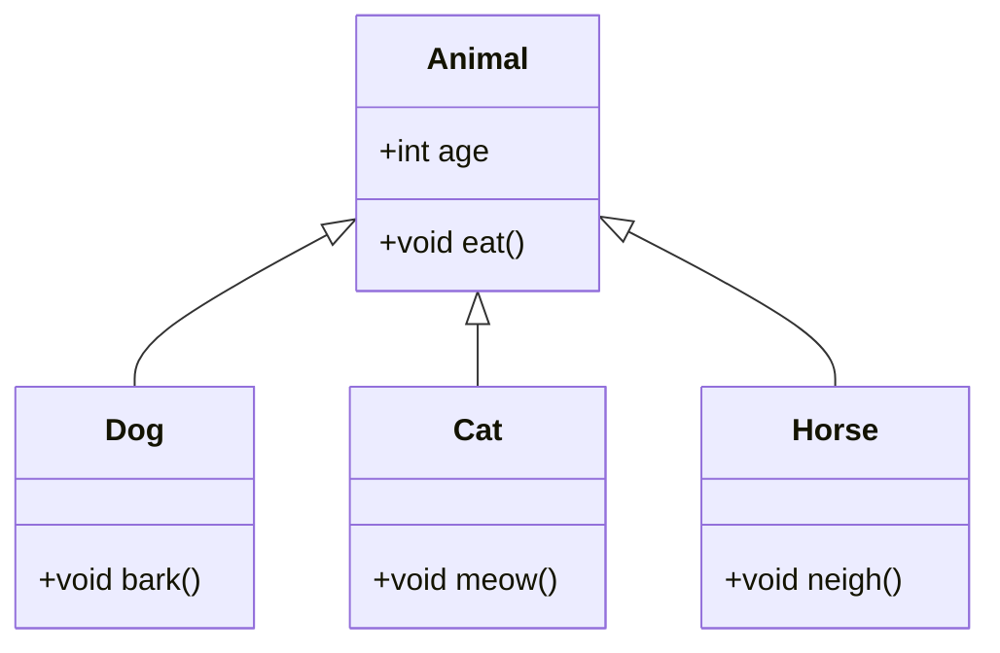

<!-- ```python title="constructor.py" showLineNumbers{1} {2-5}
class Student:
    def __init__(self, name, roll):
        self.name = name
        self.roll = roll

student1 = Student('John', 1)
print('Name:', student1.name)
print('Roll:', student1.roll)
```

Output:
```cmd title="command" showLineNumbers{1} {2-5}
C:\Users\username>python constructor.py
Name: John
Roll: 1
```

In the above example, we have created two instance variables named `name` and `roll`. We have initialized the `name` and `roll` variables to the `name` and `roll` parameters of the `__init__()` method. We have printed the `name` and `roll` variables using the `student1` object. The output shows that the `name` and `roll` variables are unique to the object. -->


## Inheritance in Python: Building on Foundations
Inheritance is a fundamental concept in object-oriented programming (OOP) that allows a new class (subclass or derived class) to inherit attributes and behaviors from an existing class (superclass or base class). This mechanism promotes code reuse, extensibility, and the creation of a hierarchical structure among classes. In Python, inheritance is implemented with a straightforward syntax, emphasizing simplicity and flexibility.

## What is Inheritance in Python?
Inheritance is a way of creating a new class for using details of an existing class without modifying it. The newly formed class is a derived class (or child class). Similarly, the existing class is a base class (or parent class). The derived class inherits all the features from the base class and can have additional features of its own. Inheritance is one of the most important aspects of OOP. It provides code reusability to the program because we do not have to write the same code again and again. We can just inherit the properties of one class into another class. Let's see how to implement inheritance in Python.

## Terminologies related to Inheritance
### Super Class:
The class whose features are inherited is known as a superclass(or a base class or a parent class).
### Sub Class:
The class that inherits the other class is known as a subclass(or a derived class, extended class, or child class). The subclass can add its own fields and methods in addition to the superclass fields and methods.
### Reusability:
Inheritance supports the concept of “reusability”, i.e. when we want to create a new class and there is already a class that includes some of the code that we want, we can derive our new class from the existing class. By doing this, we are reusing the fields and methods of the existing class.

## Diagrammatic Representation of Inheritance


In this diagram, three classes are inherited from the Animal class. These three classes are the subclasses of the Animal class. The Animal class is the superclass of all the three classes. The Dog, Cat, and Horse classes inherit the Animal class. They are the subclasses of the Animal class. The Dog, Cat, and Horse classes can have additional properties that are not in the Animal class. They can have their own properties unique to each of them. The Dog class can have a bark() method. The Cat class can have a meow() method. The Horse class can have a neigh() method. All these methods are unique to each of the subclasses. But the eat() method is common to all the subclasses. It is inherited from the Animal class. This is how inheritance works.

## Syntax of Inheritance in Python
```python title="Syntax of Inheritance in Python" showLineNumbers{1} {1-2, 4-5}
class BaseClass:
  Body of base class

class DerivedClass(BaseClass, [BaseClass2, BaseClass3, ...]):
    Body of derived class
```

In the above example, we have created two classes named `BaseClass` and `DerivedClass`. The `DerivedClass` is derived from the `BaseClass`. The `BaseClass` is the superclass and the `DerivedClass` is the subclass. The `DerivedClass` is derived from the `BaseClass` using the syntax `class DerivedClass(BaseClass):`. The `BaseClass` is passed as an argument to the `DerivedClass`. The `BaseClass` is the superclass and the `DerivedClass` is the subclass. The `DerivedClass` inherits the features of the `BaseClass`. The `BaseClass` is also called the parent class and the `DerivedClass` is also called the child class. You can use multiple parent classes by separating them with a comma. For example, `class DerivedClass(BaseClass1, BaseClass2, BaseClass3):`.

