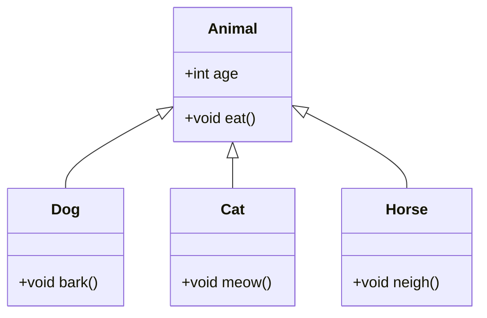
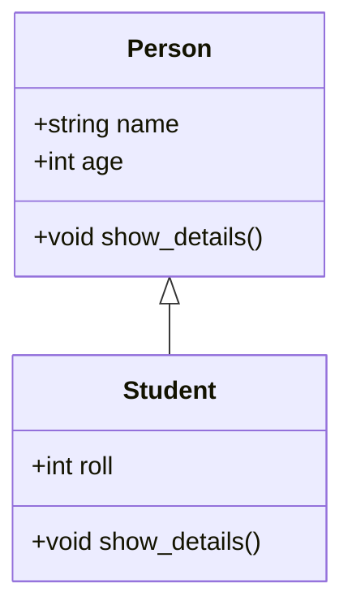

<!-- ```python title="constructor.py" showLineNumbers{1} {2-5}
class Student:
    def __init__(self, name, roll):
        self.name = name
        self.roll = roll

student1 = Student('John', 1)
print('Name:', student1.name)
print('Roll:', student1.roll)
```

Output:
```cmd title="command" showLineNumbers{1} {2-5}
C:\Users\username>python constructor.py
Name: John
Roll: 1
```

In the above example, we have created two instance variables named `name` and `roll`. We have initialized the `name` and `roll` variables to the `name` and `roll` parameters of the `__init__()` method. We have printed the `name` and `roll` variables using the `student1` object. The output shows that the `name` and `roll` variables are unique to the object. -->


## Inheritance in Python: Building on Foundations
Inheritance is a fundamental concept in object-oriented programming (OOP) that allows a new class (subclass or derived class) to inherit attributes and behaviors from an existing class (superclass or base class). This mechanism promotes code reuse, extensibility, and the creation of a hierarchical structure among classes. In Python, inheritance is implemented with a straightforward syntax, emphasizing simplicity and flexibility.

## What is Inheritance in Python?
Inheritance is a way of creating a new class for using details of an existing class without modifying it. The newly formed class is a derived class (or child class). Similarly, the existing class is a base class (or parent class). The derived class inherits all the features from the base class and can have additional features of its own. Inheritance is one of the most important aspects of OOP. It provides code reusability to the program because we do not have to write the same code again and again. We can just inherit the properties of one class into another class. Let's see how to implement inheritance in Python.

## Terminologies related to Inheritance
### Super Class:
The class whose features are inherited is known as a superclass(or a base class or a parent class).
### Sub Class:
The class that inherits the other class is known as a subclass(or a derived class, extended class, or child class). The subclass can add its own fields and methods in addition to the superclass fields and methods.
### Reusability:
Inheritance supports the concept of “reusability”, i.e. when we want to create a new class and there is already a class that includes some of the code that we want, we can derive our new class from the existing class. By doing this, we are reusing the fields and methods of the existing class.

## Diagrammatic Representation of Inheritance


In this diagram, three classes are inherited from the `Animal` class. These three classes are the subclasses of the `Animal` class. The `Animal` class is the superclass of all the three classes. The `Dog`, `Cat`, and `Horse` classes inherit the `Animal` class. They are the subclasses of the `Animal` class. The `Dog`, `Cat`, and `Horse` classes can have additional properties that are not in the `Animal` class. They can have their own properties unique to each of them. The `Dog` class can have a `bark()` method. The `Cat` class can have a `meow()` method. The `Horse` class can have a `neigh()` method. All these methods are unique to each of the subclasses. But the `eat()` method is common to all the subclasses. It is inherited from the `Animal` class. This is how inheritance works.

## Syntax of Inheritance in Python
```python title="Syntax of Inheritance in Python" showLineNumbers{1} {1-2, 4-5}
class BaseClass:
  Body of base class

class DerivedClass(BaseClass, [BaseClass2, BaseClass3, ...]):
    Body of derived class
```

In the above example, we have created two classes named `BaseClass` and `DerivedClass`. The `DerivedClass` is derived from the `BaseClass`. The `BaseClass` is the superclass and the `DerivedClass` is the subclass. The `DerivedClass` is derived from the `BaseClass` using the syntax `class DerivedClass(BaseClass):`. The `BaseClass` is passed as an argument to the `DerivedClass`. The `BaseClass` is the superclass and the `DerivedClass` is the subclass. The `DerivedClass` inherits the features of the `BaseClass`. The `BaseClass` is also called the parent class and the `DerivedClass` is also called the child class. You can use multiple parent classes by separating them with a comma. For example, `class DerivedClass(BaseClass1, BaseClass2, BaseClass3):`.

## Example of Inheritance in Python
```python title="inheritance.py" showLineNumbers{1} {2-4, 10-13, 20}
class Person:
    def __init__(self, name, age):
        self.name = name
        self.age = age

    def show_details(self):
        print('Name:', self.name)
        print('Age:', self.age)

class Student(Person):
    def __init__(self, name, age, roll):
        super().__init__(name, age)
        self.roll = roll

    def show_details(self):
        super().show_details()
        print('Roll:', self.roll)

student1 = Student('John', 20, 101)
student1.show_details()
```

Output:
```cmd title="command" showLineNumbers{1} {2-5}
C:\Users\username>python inheritance.py
Name: John
Age: 20
Roll: 101
```

In the above example, we have created two classes named `Person` and `Student`. The `Student` class is derived from the `Person` class. The `Person` class is the superclass and the `Student` class is the subclass. The `Student` class inherits the features of the `Person` class. The `Person` class has two instance variables named `name` and `age`. The `Student` class has three instance variables named `name`, `age`, and `roll`. The `Student` class has a method named `show_details()` that prints the `name`, `age`, and `roll` variables. The `Student` class has a constructor that takes three parameters `name`, `age`, and `roll`. The `super()` function is used to call the constructor of the superclass. The `super()` function is used in the `__init__()` method of the `Student` class. The `super()` function is also used to call the `show_details()` method of the superclass.

## __init__() method in Inheritance
In Python, You can call the Parent class's `__init__()` method by the following two ways:
1. `ParentClassName.__init__(self, args)`
2. `super().__init__(args)`

### ParentClassName.__init__(self, args)
In this method, you have to specify the name of the parent class in the `__init__()` method. You have to pass the `self` keyword as the first argument to the `__init__()` method. You have to pass the arguments of the `__init__()` method of the parent class as the second argument to the `__init__()` method. Let's see an example of this method.

```python title="inheritance.py" showLineNumbers{1} {2-4, 10-13, 20}
class Person:
    def __init__(self, name, age):
        self.name = name
        self.age = age

    def show_details(self):
        print('Name:', self.name)
        print('Age:', self.age)

class Student(Person):
    def __init__(self, name, age, roll):
        Person.__init__(self, name, age)
        self.roll = roll

    def show_details(self):
        Person.show_details(self)
        print('Roll:', self.roll)

student1 = Student('John', 20, 101)
student1.show_details()
```

Output:
```cmd title="command" showLineNumbers{1} {2-5}
C:\Users\username>python inheritance.py
Name: John
Age: 20
Roll: 101
```

In the above example, we have created two classes named `Person` and `Student`. The `Student` class is derived from the `Person` class. The `Person` class is the superclass and the `Student` class is the subclass. The `Student` class inherits the features of the `Person` class. The `Person` class has two instance variables named `name` and `age`. The `Student` class has three instance variables named `name`, `age`, and `roll`. The `Student` class has a method named `show_details()` that prints the `name`, `age`, and `roll` variables. The `Student` class has a constructor that takes three parameters `name`, `age`, and `roll`. The `Person.__init__(self, name, age)` statement is used to call the constructor of the superclass. The `Person.show_details(self)` statement is used to call the `show_details()` method of the superclass.

## super() method in Inheritance
In python, `super()` method is used to access the methods and properties of the parent class. The `super()` method returns the proxy object that allows you to refer parent class by `super()`. The `super()` method is useful for accessing inherited methods that have been overridden in a class. The `super()` method can be used to call the `__init__()` method of the parent class from the child class so that you don't need to rewrite the code in the child class. Let's see an example of this method.

```python title="inheritance.py" showLineNumbers{1} {2-4, 10-13,16, 20}
class Person:
    def __init__(self, name, age):
        self.name = name
        self.age = age

    def show_details(self):
        print('Name:', self.name)
        print('Age:', self.age)

class Student(Person):
    def __init__(self, name, age, roll):
        super().__init__(name, age)
        self.roll = roll

    def show_details(self):
        super().show_details()
        print('Roll:', self.roll)

student1 = Student('John', 20, 101)
student1.show_details()
```

Output:
```cmd title="command" showLineNumbers{1} {2-5}
C:\Users\username>python inheritance.py
Name: John
Age: 20
Roll: 101
```

In the above example, we have created two classes named `Person` and `Student`. The `Student` class is derived from the `Person` class. The `Person` class is the superclass and the `Student` class is the subclass. The `Student` class inherits the features of the `Person` class. The `Person` class has two instance variables named `name` and `age`. The `Student` class has three instance variables named `name`, `age`, and `roll`. The `Student` class has a method named `show_details()` that prints the `name`, `age`, and `roll` variables. The `Student` class has a constructor that takes three parameters `name`, `age`, and `roll`. The `super().__init__(name, age)` statement is used to call the constructor of the superclass. The `super().show_details()` statement is used to call the `show_details()` method of the superclass.

## Overriding Methods in Inheritance
In Python, you can override the methods of the superclass in the subclass. You can override the methods of the superclass by creating a method with the same name in the subclass. Let's see an example of this.

```python title="inheritance.py" showLineNumbers{1} {2-4, 10-13, 20}
class Person:
    def __init__(self, name, age):
        self.name = name
        self.age = age

    def show_details(self):
        print('Name:', self.name)
        print('Age:', self.age)

class Student(Person):
    def __init__(self, name, age, roll):
        super().__init__(name, age)
        self.roll = roll

    def show_details(self):
        super().show_details()
        print('Roll:', self.roll)

student1 = Student('John', 20, 101)
student1.show_details()
```

Output:
```cmd title="command" showLineNumbers{1} {2-5}
C:\Users\username>python inheritance.py
Name: John
Age: 20
Roll: 101
```

In the above example, we have created two classes named `Person` and `Student`. The `Student` class is derived from the `Person` class. The `Person` class is the superclass and the `Student` class is the subclass. The `Student` class inherits the features of the `Person` class. The `Person` class has two instance variables named `name` and `age`. The `Student` class has three instance variables named `name`, `age`, and `roll`. The `Student` class has a method named `show_details()` that prints the `name`, `age`, and `roll` variables. The `Student` class has a constructor that takes three parameters `name`, `age`, and `roll`. The `super().__init__(name, age)` statement is used to call the constructor of the superclass. The `super().show_details()` statement is used to call the `show_details()` method of the superclass.

## Types of Inheritance in Python
There are five types of inheritance in Python. They are:
1. **Single Inheritance**
2. **Multiple Inheritance**
3. **Multilevel Inheritance**
4. **Hierarchical Inheritance**
5. **Hybrid Inheritance**
---
```mermaid title="Types of Inheritance" desc="Types of Inheritance in Python"
graph LR
    A[Inheritance] --> B[Single Inheritance]
    A --> C[Multiple Inheritance]
    A --> D[Multilevel Inheritance]
    A --> E[Hierarchical Inheritance]
    A --> F[Hybrid Inheritance]
```

### Single Inheritance
In single inheritance, a class is allowed to inherit from only one class. It is the simplest form of inheritance in which a class inherits from only one base class. Let's see an example of single inheritance.

#### Diagrammatic Representation of Single Inheritance


```python title="single_inheritance.py" showLineNumbers{1} {2-4, 10-13, 20}
class Person:
    def __init__(self, name, age):
        self.name = name
        self.age = age

    def show_details(self):
        print('Name:', self.name)
        print('Age:', self.age)

class Student(Person):
    def __init__(self, name, age, roll):
        super().__init__(name, age)
        self.roll = roll

    def show_details(self):
        super().show_details()
        print('Roll:', self.roll)

student1 = Student('John', 20, 101)
student1.show_details()
```

Output:
```cmd title="command" showLineNumbers{1} {2-5}
C:\Users\username>python single_inheritance.py
Name: John
Age: 20
Roll: 101
```

In the above example, we have created two classes named `Person` and `Student`. The `Student` class is derived from the `Person` class. The `Person` class is the superclass and the `Student` class is the subclass. The `Student` class inherits the features of the `Person` class. The `Person` class has two instance variables named `name` and `age`. The `Student` class has three instance variables named `name`, `age`, and `roll`. The `Student` class has a method named `show_details()` that prints the `name`, `age`, and `roll` variables. The `Student` class has a constructor that takes three parameters `name`, `age`, and `roll`. The `super().__init__(name, age)` statement is used to call the constructor of the superclass. The `super().show_details()` statement is used to call the `show_details()` method of the superclass.


### Multiple Inheritance
In multiple inheritance, a class is allowed to inherit from more than one class. It is the process of deriving a new class that inherits the attributes from two or more classes. The derived class can have its own features in addition to the features of the base classes. Let's see an example of multiple inheritance.

#### Diagrammatic Representation of Multiple Inheritance
```mermaid title="Multiple Inheritance" desc="Multiple Inheritance in Python"
classDiagram
    Father <|-- Child
    Mother <|-- Child
    Father : +string nature
    Mother : +string kind
    Father : +void get_nature()
    Mother : +void get_kind()
    Child : +void get_details()
```
