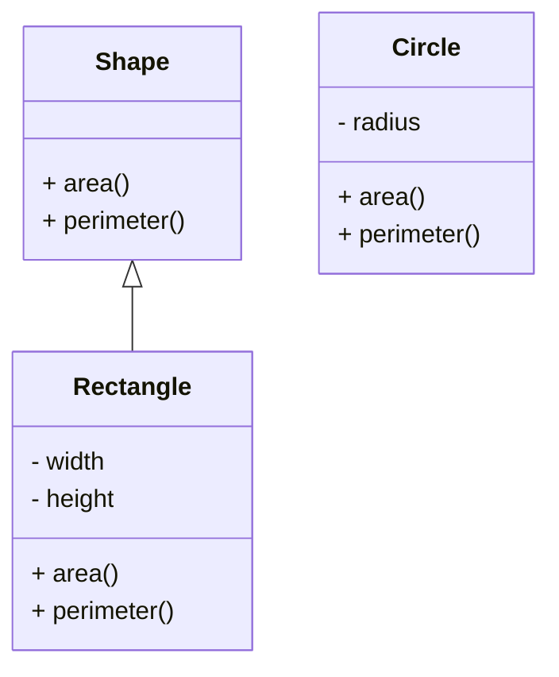

## Interfaces in Python : Implementing Abstract Base Classes
In Python, an interface is a collection of abstract methods. Python does not have a native support for interfaces, but we can use Abstract Base Classes to create interfaces in Python.

An interface is like a contract. It defines the syntax that any class must follow to implement that interface. An interface is like a blueprint for a class. If a class follows the blueprint, it is guaranteed to provide the necessary functionality.

### Abstract Base Classes
Python comes with a module which provides the infrastructure for defining Abstract Base Classes (ABCs). The module is called `abc`. ABCs allow you to define a set of methods that must be implemented by the derived classes.

To create an interface in Python, you can create an abstract class using the `abc` module. The abstract class can have abstract methods that must be implemented by the derived classes.

Here is an example of an interface in Python using the `abc` module:

```python title="interfaces.py" showLineNumbers{1} {1, 3-6, 8-10}
from abc import ABC, abstractmethod

class Shape(ABC):
    @abstractmethod
    def area(self):
        pass

    @abstractmethod
    def perimeter(self):
        pass
```

In the above example, we have created an interface called `Shape`. The `Shape` interface has two abstract methods `area` and `perimeter`. Any class that implements the `Shape` interface must provide the implementation for these two methods.

Here is an example of a class that implements the `Shape` interface:

```python title="rectangle.py" showLineNumbers{1} {1, 3-6, 8-9, 11-12}
from interfaces import Shape

class Rectangle(Shape):
    def __init__(self, width, height):
        self.width = width
        self.height = height

    def area(self):
        return self.width * self.height

    def perimeter(self):
        return 2 * (self.width + self.height)
```

In the above example, we have created a class called `Rectangle` that implements the `Shape` interface. The `Rectangle` class provides the implementation for the `area` and `perimeter` methods.

Here is an example of a class that does not implement the `Shape` interface:

```python title="circle.py" showLineNumbers{1} {1-3, 5-6, 8-9}
class Circle:
    def __init__(self, radius):
        self.radius = radius

    def area(self):
        return 3.14 * self.radius * self.radius

    def perimeter(self):
        return 2 * 3.14 * self.radius
```

In the above example, we have created a class called `Circle` that does not implement the `Shape` interface. The `Circle` class provides the implementation for the `area` and `perimeter` methods, but it does not implement the `Shape` interface.



In this example, we have created an interface called `Shape` with two abstract methods `area` and `perimeter`. We have created a class called `Rectangle` that implements the `Shape` interface. We have also created a class called `Circle` that does not implement the `Shape` interface.

### Calling Interface Methods
You can call the interface methods using the object of the class that implements the interface. Here is an example:

```python title="main.py" showLineNumbers{1} {1, 3-7}
from rectangle import Rectangle

r = Rectangle(5, 10)
print("Area:", r.area())
print("Perimeter:", r.perimeter())
```

Output:

```cmd title="Command" showLineNumbers{1} {1}
C:\Users\username\Desktop> python main.py
Area: 50
Perimeter: 30
```

In this example, we have created an object of the `Rectangle` class and called the `area` and `perimeter` methods. The `Rectangle` class implements the `Shape` interface, so it provides the implementation for the `area` and `perimeter` methods.

:::warning
You can create an object of the Abstract Base Class, but you cannot call the abstract methods using the object of the Abstract Base Class. You must create a derived class and then call the abstract methods using the object of the derived class.

If you try to call the abstract methods using the object of the Abstract Base Class, you will get an error.

```python title="main.py" showLineNumbers{1} {1, 3-7}
from interfaces import Shape

s = Shape()
print("Area:", s.area())
print("Perimeter:", s.perimeter())
```

Output:

```cmd title="Error" showLineNumbers{1}
C:\Users\username\Desktop> python main.py
TypeError: Can't instantiate abstract class Shape with abstract methods area, perimeter
```

In this example, we have created an object of the `Shape` interface and tried to call the `area` and `perimeter` methods. Since the `Shape` interface is an abstract class, we cannot create an object of the `Shape` interface, and we cannot call the `area` and `perimeter` methods using the object of the `Shape` interface.

:::

## Conclusion
In Python, an interface is a collection of abstract methods. Python does not have a native support for interfaces, but we can use Abstract Base Classes to create interfaces in Python. An interface is like a contract. It defines the syntax that any class must follow to implement that interface. An interface is like a blueprint for a class. For more information, you can refer to the [official documentation](https://docs.python.org/3/library/abc.html) of the `abc` module. For more tutorials, you can visit the Python Central Hub.
