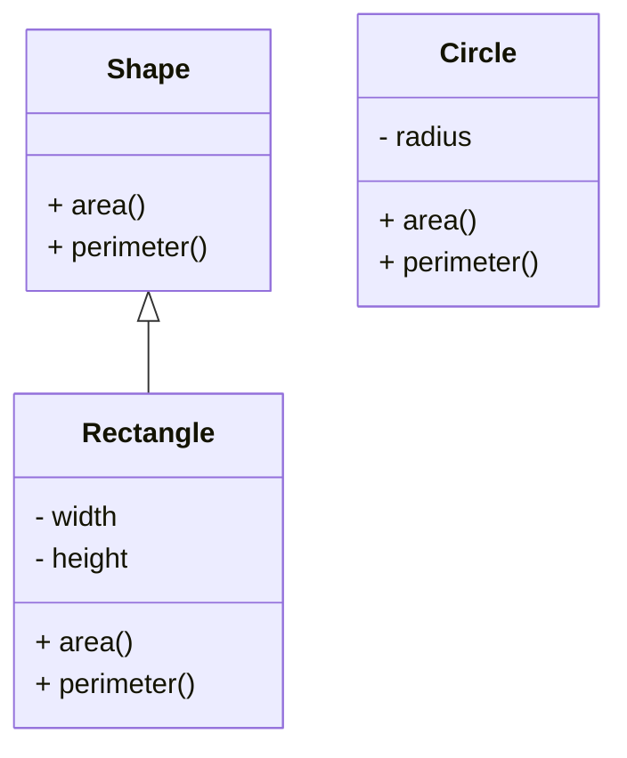

## Interfaces in Python : Implementing Abstract Base Classes
In Python, an interface is a collection of abstract methods. Python does not have a native support for interfaces, but we can use Abstract Base Classes to create interfaces in Python.

An interface is like a contract. It defines the syntax that any class must follow to implement that interface. An interface is like a blueprint for a class. If a class follows the blueprint, it is guaranteed to provide the necessary functionality.

### Abstract Base Classes
Python comes with a module which provides the infrastructure for defining Abstract Base Classes (ABCs). The module is called `abc`. ABCs allow you to define a set of methods that must be implemented by the derived classes.

To create an interface in Python, you can create an abstract class using the `abc` module. The abstract class can have abstract methods that must be implemented by the derived classes.

Here is an example of an interface in Python using the `abc` module:

```python title="interfaces.py" showLineNumbers{1} {1, 3-6, 8-10}
from abc import ABC, abstractmethod

class Shape(ABC):
    @abstractmethod
    def area(self):
        pass

    @abstractmethod
    def perimeter(self):
        pass
```

In the above example, we have created an interface called `Shape`. The `Shape` interface has two abstract methods `area` and `perimeter`. Any class that implements the `Shape` interface must provide the implementation for these two methods.

Here is an example of a class that implements the `Shape` interface:

```python title="rectangle.py" showLineNumbers{1} {1, 3-6, 8-9, 11-12}
from interfaces import Shape

class Rectangle(Shape):
    def __init__(self, width, height):
        self.width = width
        self.height = height

    def area(self):
        return self.width * self.height

    def perimeter(self):
        return 2 * (self.width + self.height)
```

In the above example, we have created a class called `Rectangle` that implements the `Shape` interface. The `Rectangle` class provides the implementation for the `area` and `perimeter` methods.

Here is an example of a class that does not implement the `Shape` interface:

```python title="circle.py" showLineNumbers{1} {1-3, 5-6, 8-9}
class Circle:
    def __init__(self, radius):
        self.radius = radius

    def area(self):
        return 3.14 * self.radius * self.radius

    def perimeter(self):
        return 2 * 3.14 * self.radius
```

In the above example, we have created a class called `Circle` that does not implement the `Shape` interface. The `Circle` class provides the implementation for the `area` and `perimeter` methods, but it does not implement the `Shape` interface.



In this example, we have created an interface called `Shape` with two abstract methods `area` and `perimeter`. We have created a class called `Rectangle` that implements the `Shape` interface. We have also created a class called `Circle` that does not implement the `Shape` interface.

### Calling Interface Methods
You can call the interface methods using the object of the class that implements the interface. Here is an example:

```python title="main.py" showLineNumbers{1} {1, 3-7}
from rectangle import Rectangle

r = Rectangle(5, 10)
print("Area:", r.area())
print("Perimeter:", r.perimeter())
```

Output:

```cmd title="Command" showLineNumbers{1} {1}
C:\Users\username\Desktop> python main.py
Area: 50
Perimeter: 30
```

In this example, we have created an object of the `Rectangle` class and called the `area` and `perimeter` methods. The `Rectangle` class implements the `Shape` interface, so it provides the implementation for the `area` and `perimeter` methods.

:::warning
You can create an object of the Abstract Base Class, but you cannot call the abstract methods using the object of the Abstract Base Class. You must create a derived class and then call the abstract methods using the object of the derived class.

If you try to call the abstract methods using the object of the Abstract Base Class, you will get an error.

```python title="main.py" showLineNumbers{1} {1, 3-7}
from interfaces import Shape

s = Shape()
print("Area:", s.area())
print("Perimeter:", s.perimeter())
```

Output:

```cmd title="Error" showLineNumbers{1}
C:\Users\username\Desktop> python main.py
TypeError: Can't instantiate abstract class Shape with abstract methods area, perimeter
```

In this example, we have created an object of the `Shape` interface and tried to call the `area` and `perimeter` methods. Since the `Shape` interface is an abstract class, we cannot create an object of the `Shape` interface, and we cannot call the `area` and `perimeter` methods using the object of the `Shape` interface.

:::

## Conclusion
In Python, an interface is a collection of abstract methods. Python does not have a native support for interfaces, but we can use Abstract Base Classes to create interfaces in Python. An interface is like a contract. It defines the syntax that any class must follow to implement that interface. An interface is like a blueprint for a class. For more information, you can refer to the [official documentation](https://docs.python.org/3/library/abc.html) of the `abc` module. For more tutorials, you can visit the Python Central Hub.


---

import DataCampExercise from "../../../../components/DataCampExercise.astro";

## Try it: Interfaces (ABC) Exercises

### Exercise 1 – Define an Interface

<DataCampExercise
  lang="python"
  hint={`Use ABC with @abstractmethod to define an interface.`}
  code={`# Task: Exercise 1 – Define an Interface
# Follow the steps below and fill in the blanks.
# Use the 'Show Solution' button only after you have tried!

# Hint: Add the import statement(s) at the very top of your code.
from abc import ABC, abstractmethod
# Above import is provided -- understand what it brings in.

# Hint: Define the class using 'class ClassName:' -- remember the colon!
class Drawable(ABC):
    # Step: Define the class body (attributes, __init__, methods).
    # Hint: Use 'def function_name(param1, param2):' to define a function.
    # Step: Write the required code here.
    # @abstractmethod
    # replace the comment above with working code
    # Hint: print(value) displays output; print(a, b) prints multiple values.
    def draw(self):
        # Step: Write the function body here.
        pass  # remove 'pass' and add your code
        # Hint: Use ABC with @abstractmethod to define an interface.
        # Step: Write the required code here.
        # pass
        # replace the comment above with working code

# Hint: Run after every change -- small steps are easier to debug!
class Circle(Drawable):
    # Step: Define the class body (attributes, __init__, methods).
    def draw(self):
        # Step: Write the function body here.
        pass  # remove 'pass' and add your code
        # Step: Call print() with the right argument(s).
        # Example structure: print("Drawing Circle")
        print(___)  # replace ___ with the correct expression

# Step: Assign the correct value to 'c'.
c = ___  # replace ___ with the correct value
# Step: Write the required code here.
# c.draw()
# replace the comment above with working code

# ── Expected Output ──────────────────────────────────────────
# Drawing Circle
# ──────────────────────────────────────────────────────────────`}
  solution={`from abc import ABC, abstractmethod
class Drawable(ABC):
    @abstractmethod
    def draw(self):
        pass
class Circle(Drawable):
    def draw(self):
        print("Drawing Circle")
c = Circle()
c.draw()`}
  sct={`test_output_contains("Drawing Circle")
success_msg("Interface implementation works!")`}
  height={230}
/>

### Exercise 2 – Multiple Abstract Methods

<DataCampExercise
  lang="python"
  hint={`A class implementing an interface must override all abstract methods.`}
  code={`# Task: Exercise 2 – Multiple Abstract Methods
# Follow the steps below and fill in the blanks.
# Use the 'Show Solution' button only after you have tried!

# Hint: Add the import statement(s) at the very top of your code.
from abc import ABC, abstractmethod
# Above import is provided -- understand what it brings in.

class Serializable(ABC):
    # Step: Define the class body (attributes, __init__, methods).
    # Hint: Define the class using 'class ClassName:' -- remember the colon!
    # Step: Write the required code here.
    # @abstractmethod
    # replace the comment above with working code
    def serialize(self):
        # Step: Write the function body here.
        pass  # remove 'pass' and add your code
        # Hint: Use 'def function_name(param1, param2):' to define a function.
        # Step: Write the required code here.
        # pass
        # replace the comment above with working code
    # Step: Write the required code here.
    # @abstractmethod
    # replace the comment above with working code
    # Hint: The return statement sends a value back -- place it at the end of the function.
    def deserialize(self, data):
        # Step: Write the function body here.
        pass  # remove 'pass' and add your code
        # Step: Write the required code here.
        # pass
        # replace the comment above with working code

# Hint: print(value) displays output; print(a, b) prints multiple values.
class JSONData(Serializable):
    # Step: Define the class body (attributes, __init__, methods).
    def serialize(self):
        # Step: Write the function body here.
        pass  # remove 'pass' and add your code
        # Hint: A class implementing an interface must override all abstract methods.
        # Step: Return the computed result.
        # return ___  (should be something like: '{"key": "value"}')
    def deserialize(self, data):
        # Step: Write the function body here.
        pass  # remove 'pass' and add your code
        # Step: Return the computed result.
        # return ___  (should be something like: data.strip("{}"))

# Step: Assign the correct value to 'j'.
j = ___  # replace ___ with the correct value
# Step: Call print() with the right argument(s).
# Example structure: print(j.serialize())
print(___)  # replace ___ with the correct expression

# ── Expected Output ──────────────────────────────────────────
# (Run your completed code to check the output)
# ──────────────────────────────────────────────────────────────`}
  solution={`from abc import ABC, abstractmethod
class Serializable(ABC):
    @abstractmethod
    def serialize(self):
        pass
    @abstractmethod
    def deserialize(self, data):
        pass
class JSONData(Serializable):
    def serialize(self):
        return '{"key": "value"}'
    def deserialize(self, data):
        return data.strip("{}")
j = JSONData()
print(j.serialize())`}
  sct={`test_output_contains('{"key": "value"}')
success_msg("Multiple interface methods work!")`}
  height={300}
/>

### Exercise 3 – isinstance with Interface

<DataCampExercise
  lang="python"
  hint={`Use isinstance() to verify an object implements an interface.`}
  code={`# Task: Exercise 3 – isinstance with Interface
# Follow the steps below and fill in the blanks.
# Use the 'Show Solution' button only after you have tried!

# Hint: Add the import statement(s) at the very top of your code.
from abc import ABC, abstractmethod
# Above import is provided -- understand what it brings in.

# Hint: Define the class using 'class ClassName:' -- remember the colon!
class Flyable(ABC):
    # Step: Define the class body (attributes, __init__, methods).
    # Hint: Use 'def function_name(param1, param2):' to define a function.
    # Step: Write the required code here.
    # @abstractmethod
    # replace the comment above with working code
    # Hint: print(value) displays output; print(a, b) prints multiple values.
    def fly(self):
        # Step: Write the function body here.
        pass  # remove 'pass' and add your code
        # Hint: Use isinstance() to verify an object implements an interface.
        # Step: Write the required code here.
        # pass
        # replace the comment above with working code

# Hint: Run after every change -- small steps are easier to debug!
class Bird(Flyable):
    # Step: Define the class body (attributes, __init__, methods).
    def fly(self):
        # Step: Write the function body here.
        pass  # remove 'pass' and add your code
        # Step: Call print() with the right argument(s).
        # Example structure: print("Bird flying!")
        print(___)  # replace ___ with the correct expression

# Step: Assign the correct value to 'b'.
b = ___  # replace ___ with the correct value
# Step: Call print() with the right argument(s).
# Example structure: print(isinstance(b, Flyable))
print(___)  # replace ___ with the correct expression
# Step: Write the required code here.
# b.fly()
# replace the comment above with working code

# ── Expected Output ──────────────────────────────────────────
# Bird flying!
# ──────────────────────────────────────────────────────────────`}
  solution={`from abc import ABC, abstractmethod
class Flyable(ABC):
    @abstractmethod
    def fly(self):
        pass
class Bird(Flyable):
    def fly(self):
        print("Bird flying!")
b = Bird()
print(isinstance(b, Flyable))
b.fly()`}
  sct={`test_output_contains("True")
test_output_contains("Bird flying!")
success_msg("Interface isinstance check works!")`}
  height={250}
/>

