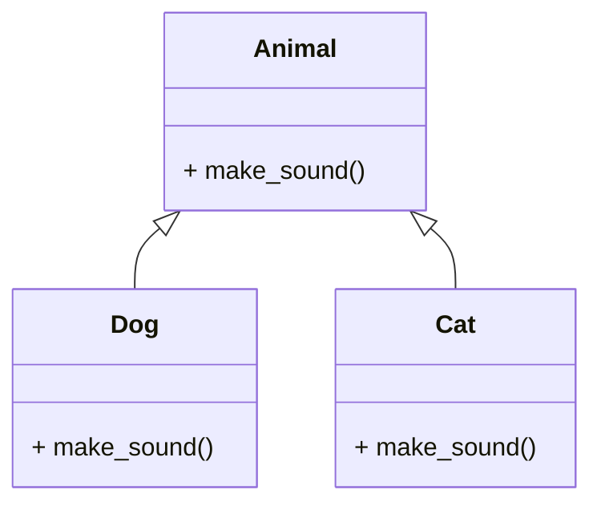

## Method Overriding in Python: Redefining Behavior with Elegance
Method overriding is a fundamental concept in object-oriented programming (OOP) that allows a subclass to provide a specific implementation of a method that is already defined in its superclass. This process enables the subclass to tailor the behavior of the inherited method to suit its own requirements. In Python, method overriding contributes to the flexibility and extensibility of code, promoting a clean and elegant approach to designing and extending classes.

## The Basics of Method Overriding:
Inheritance in Python allows a subclass to inherit attributes and methods from its superclass. Method overriding occurs when a method in the subclass has the same name and parameters as a method in its superclass. The overridden method in the subclass provides a specialized implementation, effectively replacing the method inherited from the superclass.

## Method Overriding Syntax:
The syntax for method overriding in Python is as follows:

```python title="method_overriding.py" {2-3, 6-7}
class Superclass:
    def method(self):
        pass

class Subclass(Superclass):
    def method(self):
        pass
```

In this example, the `Subclass` overrides the `method` inherited from the `Superclass` by redefining it with the same name and parameters. The `method` in the `Subclass` provides a specialized implementation that replaces the `method` inherited from the `Superclass`.

## Method Overriding Example:
Let's look at an example of method overriding in Python:

```python title="method_overriding.py" {2-3, 6-7, 10-11}
class Animal:
    def make_sound(self):
        print("Generic animal sound")

class Dog(Animal):
    def make_sound(self):
        print("Bark!")

class Cat(Animal):
    def make_sound(self):
        print("Meow!")

dog = Dog()
cat = Cat()
dog.make_sound()
cat.make_sound()
```

Output:
```cmd title="command" showLineNumbers{1} {2-5}
Bark!
Meow!
```

In this example, we have a base class `Animal` with a method `make_sound`. We have two subclasses `Dog` and `Cat` that override the `make_sound` method inherited from the `Animal` class. The `Dog` and `Cat` classes provide specialized implementations of the `make_sound` method that are specific to each animal. The `Dog` class overrides the `make_sound` method to print "Bark!", while the `Cat` class overrides the `make_sound` method to print "Meow!". When we call the `make_sound` method on the `dog` and `cat` objects, the overridden methods in the respective subclasses are invoked, printing "Bark!" and "Meow!".

## Diagrammatic Representation of Method Overriding:
The following diagram illustrates the concept of method overriding in Python:



In this example, the `Animal` class has a method `make_sound`. The `Dog` and `Cat` classes inherit from the `Animal` class and override the `make_sound` method. The `Dog` class overrides the `make_sound` method to print "Bark!", while the `Cat` class overrides the `make_sound` method to print "Meow!". When we call the `make_sound` method on the `dog` and `cat` objects, the overridden methods in the respective subclasses are invoked, printing "Bark!" and "Meow!".

## Method Overriding vs. Method Overloading
Method overriding is often confused with method overloading. However, they are two different concepts. Method overloading is the ability to define multiple methods with the same name but with different parameters. Method overriding is the ability of a subclass to change the implementation of a method provided by one of its ancestors. Overriding is a very important part of OOP since it is the feature that makes inheritance exploit its full power.

| Method Overriding | Method Overloading |
| :--- | :--- |
| Method overriding is the ability of a subclass to change the implementation of a method provided by one of its ancestors. | Method overloading is the ability to define multiple methods with the same name but with different parameters. |
| Method overriding is a very important part of OOP since it is the feature that makes inheritance exploit its full power. | Method overloading is not a very important part of OOP. |
| Method overriding is achieved by redefining a method in the subclass with the same name and parameters as a method in its superclass. | Method overloading is achieved by defining multiple methods with the same name but with different parameters. |
| Method overriding is also known as runtime polymorphism. | Method overloading is also known as compile-time polymorphism. |
| Method overriding is a feature of inheritance. | Method overloading is not a feature of inheritance. |
| Method overriding is a key element of polymorphism in OOP. | Method overloading is not a key element of polymorphism in OOP. |

## More examples of Method Overriding:
Let's look at an example of method overriding in Python:

```python title="method_overriding.py" {6-7, 14-15, 21-22, 31-32}
class Employee:
    def __init__(self, name, salary):
        self.name = name
        self.salary = salary

    def work(self):
        print(self.name + " is working.")

class SoftwareEngineer(Employee):
    def __init__(self, name, salary, level):
        super().__init__(name, salary)
        self.level = level

    def work(self):
        print(self.name + " is coding.")

    def debug(self):
        print(self.name + " is debugging.")

class Designer(Employee):
    def work(self):
        print(self.name + " is designing.")

    def draw(self):
        print(self.name + " is drawing.")

software_engineer = SoftwareEngineer("John", 1000, "Junior")
designer = Designer("Jane", 1000)
employees = [software_engineer, designer]

for employee in employees:
    employee.work()
```

Output:
```cmd title="command" showLineNumbers{1} {2-5}
C:\Users\username>python method_overriding.py
John is coding.
Jane is designing.
```

In this example, we have a base class `Employee` with a method `work`. We have two subclasses `SoftwareEngineer` and `Designer` that override the `work` method inherited from the `Employee` class. The `SoftwareEngineer` and `Designer` classes provide specialized implementations of the `work` method that are specific to each employee. The `SoftwareEngineer` class overrides the `work` method to print "John is coding.", while the `Designer` class overrides the `work` method to print "Jane is designing.". When we call the `work` method on the `software_engineer` and `designer` objects, the overridden methods in the respective subclasses are invoked, printing "John is coding." and "Jane is designing.".

**Another example of method overriding**:
```python title="method_overriding" {5-6, 13-14, 21-22, 28-29}
class Person:
    def __init__(self, name):
        self.name = name

    def greet(self):
        print("Hello, I am " + self.name + ".")

class Student(Person):
    def __init__(self, name, roll_number):
        super().__init__(name)
        self.roll_number = roll_number

    def greet(self):
        print("Hello, I am " + self.name + ". My roll number is " + str(self.roll_number) + ".")

class Teacher(Person):
    def __init__(self, name, subject):
        super().__init__(name)
        self.subject = subject

    def greet(self):
        print("Hello, I am " + self.name + ". I teach " + self.subject + ".")

student = Student("John", 1)
teacher = Teacher("Jane", "Math")
people = [student, teacher]

for person in people:
    person.greet()
```

Output:
```cmd title="command" showLineNumbers{1} {2-5}
C:\Users\username>python method_overriding.py
Hello, I am John. My roll number is 1.
Hello, I am Jane. I teach Math.
```

In this example, we have a base class `Person` with a method `greet`. We have two subclasses `Student` and `Teacher` that override the `greet` method inherited from the `Person` class. The `Student` and `Teacher` classes provide specialized implementations of the `greet` method that are specific to each person. The `Student` class overrides the `greet` method to print "Hello, I am John. My roll number is 1.", while the `Teacher` class overrides the `greet` method to print "Hello, I am Jane. I teach Math.". When we call the `greet` method on the `student` and `teacher` objects, the overridden methods in the respective subclasses are invoked, printing "Hello, I am John. My roll number is 1." and "Hello, I am Jane. I teach Math.".

## Base Overriding Methods:
In Python, there are several methods that are commonly overridden in subclasses. These methods are known as base overriding methods. Let's look at some of the base overriding methods in Python:

1. **`__init__`**
2. **`__str__`**
3. **`__repr__`**
4. **`__del__`**

#### 1. **`__init__`:**
The `__init__` method is used to initialize an object. It is called when an object is created from a class and allows the class to initialize the attributes of the class.
```python title="base_overriding_methods.py" showLineNumbers{1} {2-3, 6-8}
class Person:
    def __init__(self, name):
        self.name = name
class Student(Person):
    def __init__(self, name, roll_number):
        super().__init__(name)
        self.roll_number = roll_number
student = Student("John", 1)
print(student.name)
print(student.roll_number)
```
Output:
```cmd title="command" showLineNumbers{1} {2-5}
C:\Users\username>python base_overriding_methods.py
John
1
```
In this example, we have a base class `Person` with an `__init__` method. We have a subclass `Student` that overrides the `__init__` method inherited from the `Person` class. The `Student` class overrides the `__init__` method to initialize the `name` and `roll_number` attributes of the `Student` class. When we create a `Student` object, the `__init__` method in the `Student` class is invoked, initializing the `name` and `roll_number` attributes of the `Student` object.

#### 2. **`__str__`:**
The `__str__` method is used to return a string representation of an object. It is called when the `print()` or `str()` function is invoked on an object.
```python title="base_overriding_methods.py" showLineNumbers{1} {4-5, 11-12}
class Person:
    def __init__(self, name):
        self.name = name
    def __str__(self):
        return "Person: " + self.name

class Student(Person):
    def __init__(self, name, roll_number):
        super().__init__(name)
        self.roll_number = roll_number
    def __str__(self):
        return "Student: " + self.name + " " + str(self.roll_number)

student = Student("John", 1)
print(student)
```

Output:
```cmd title="command" showLineNumbers{1} {2-5}
C:\Users\username>python base_overriding_methods.py
Student: John 1
```

In this example, we have a base class `Person` with a `__str__` method. We have a subclass `Student` that overrides the `__str__` method inherited from the `Person` class. The `Student` class overrides the `__str__` method to return a string representation of the `Student` object. When we call the `print()` function on the `student` object, the `__str__` method in the `Student` class is invoked, returning a string representation of the `Student` object.

#### 3. **`__repr__`:**
The `__repr__` method is used to return a string representation of an object. It is called when the `repr()` function is invoked on an object.
```python title="base_overriding_methods.py" showLineNumbers{1} {4-5, 11-12}
class Person:
    def __init__(self, name):
        self.name = name
    def __repr__(self):
        return "Person: " + self.name

class Student(Person):
    def __init__(self, name, roll_number):
        super().__init__(name)
        self.roll_number = roll_number
    def __repr__(self):
        return "Student: " + self.name + " " + str(self.roll_number)

student = Student("John", 1)
print(repr(student))
```

Output:
```cmd title="command" showLineNumbers{1} {2-5}
C:\Users\username>python base_overriding_methods.py
Student: John 1
```

In this example, we have a base class `Person` with a `__repr__` method. We have a subclass `Student` that overrides the `__repr__` method inherited from the `Person` class. The `Student` class overrides the `__repr__` method to return a string representation of the `Student` object. When we call the `repr()` function on the `student` object, the `__repr__` method in the `Student` class is invoked, returning a string representation of the `Student` object.

#### 4. **`__del__`:**
The `__del__` method is used to delete an object. It is called when an object is deleted using the `del` keyword.
```python title="base_overriding_methods.py" showLineNumbers{1} {4-5, 11-12}
class Person:
    def __init__(self, name):
        self.name = name
    def __del__(self):
        print("Deleting " + self.name)

class Student(Person):
    def __init__(self, name, roll_number):
        super().__init__(name)
        self.roll_number = roll_number
    def __del__(self):
        print("Deleting " + self.name + " " + str(self.roll_number))

student = Student("John", 1)
del student
```

Output:
```cmd title="command" showLineNumbers{1} {2-5}
C:\Users\username>python base_overriding_methods.py
Deleting John 1
```

In this example, we have a base class `Person` with a `__del__` method. We have a subclass `Student` that overrides the `__del__` method inherited from the `Person` class. The `Student` class overrides the `__del__` method to print a message when the `Student` object is deleted. When we delete the `student` object using the `del` keyword, the `__del__` method in the `Student` class is invoked, printing a message.

:::tip
You can override any method in a subclass, but you should only override base overriding methods when it makes sense to do so. You can override any magic method in a subclass.
:::

## Key Features and Considerations:

#### 1. **Method Signature:**
   - The overriding method in the subclass must have the same method signature (name and parameters) as the method in the superclass.

#### 2. **Dynamic Binding:**
   - Method overriding in Python involves dynamic binding, where the decision about which method to call is made at runtime based on the type of the object.

#### 3. **Access to Superclass Method:**
   - Inside the overridden method, you can access the method of the superclass using the `super()` function.

   ```python title="method_overriding.py" showLineNumbers{1} {1-4}
   class Dog(Animal):
       def make_sound(self):
           super().make_sound()  # Calls the make_sound method of the superclass
           print("Bark!")
   ```

#### 4. **Polymorphism:**
   - Method overriding is a key element of polymorphism in OOP. It allows objects of different classes to be treated uniformly based on a common interface.

   ```python title="method_overrinding.py" showLineNumbers{1} {1-4}
   animals = [Dog(), Cat()]
   for animal in animals:
       animal.make_sound()  # Outputs: Bark!  Meow!
   ```

   Output:
    
```cmd title="command" showLineNumbers{1} {2-5}
C:\Users\username>python method_overriding.py
Generic animal sound
Bark!
Generic animal sound
Meow!
```

#### 5. **Consistency Across the Hierarchy:**
   - In a class hierarchy, if a method is overridden in a subclass, it should be consistently overridden in all its subclasses. This ensures a predictable and maintainable codebase.

## Use Cases and Best Practices:

#### 1. **Customizing Behavior:**
   - Method overriding is useful when you want to customize the behavior of a method inherited from a superclass to better suit the needs of a subclass.

#### 2. **Extending Functionality:**
   - Subclasses can override methods to extend or enhance the functionality provided by the superclass.

#### 3. **Maintaining a Common Interface:**
   - Method overriding contributes to maintaining a common interface across related classes, facilitating polymorphism.

#### 4. **Design Patterns:**
   - Method overriding is often employed in design patterns like the Template Method Pattern, where a superclass provides a template method that is overridden by its subclasses.


## Conclusion:

Method overriding in Python is a powerful mechanism for tailoring the behavior of a subclass by redefining methods inherited from its superclass. It promotes code reuse, flexibility, and consistency across class hierarchies. Understanding and leveraging method overriding is essential for creating well-structured and extensible object-oriented code in Python. For more information on method overriding, refer to the [official documentation](https://docs.python.org/3/tutorial/classes.html#inheritance). For more tutorials on object-oriented programming in Python, refer to the [official documentation](https://docs.python.org/3/tutorial/classes.html). For more tutorial, visit Python Central Hub.