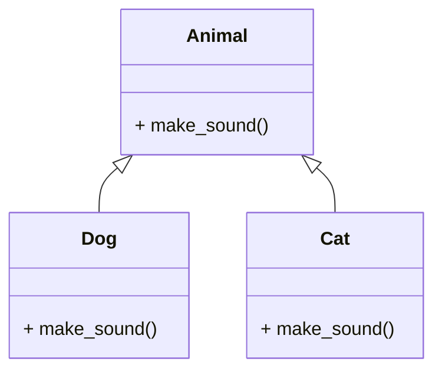

<!-- ```python title="function_overloading.py" showLineNumbers{1} {1-3, 5-7, 9-11}
def add(a, b):
    print("Two arguments\n")
    return a + b

def add(a, b, c):
    print("Three arguments\n")
    return a + b + c

def add(a, b, c, d):
    print("Four arguments\n")
    return a + b + c + d

print(add(1, 2))
print(add(1, 2, 3))
print(add(1, 2, 3, 4))
```

Output:
```cmd title="command" showLineNumbers{1} {2-5}
C:\Users\username>python function_overloading.py
Traceback (most recent call last):
  File "function_overloading.py", line 11, in <module>
    print(add(1, 2))
TypeError: add() missing 2 required positional arguments: 'c' and 'd'
```

In the above example, we have defined three functions with the same name but with different parameters. The first function takes two arguments, the second function takes three arguments, and the third function takes four arguments. We have called the `add()` function with two, three, and four arguments. The output shows that the `add()` function is called based on the number of arguments passed to it. The `add()` function is called with two arguments, three arguments, and four arguments. In Python, function overloading is achieved by using default arguments and variable-length arguments. Let's see how to achieve function overloading in Python using default arguments and variable-length arguments. -->

## Method Overriding in Python: Redefining Behavior with Elegance
Method overriding is a fundamental concept in object-oriented programming (OOP) that allows a subclass to provide a specific implementation of a method that is already defined in its superclass. This process enables the subclass to tailor the behavior of the inherited method to suit its own requirements. In Python, method overriding contributes to the flexibility and extensibility of code, promoting a clean and elegant approach to designing and extending classes.

## The Basics of Method Overriding:
Inheritance in Python allows a subclass to inherit attributes and methods from its superclass. Method overriding occurs when a method in the subclass has the same name and parameters as a method in its superclass. The overridden method in the subclass provides a specialized implementation, effectively replacing the method inherited from the superclass.

## Method Overriding Syntax:
The syntax for method overriding in Python is as follows:

```python title="method_overriding.py" {2-3, 6-7}
class Superclass:
    def method(self):
        pass

class Subclass(Superclass):
    def method(self):
        pass
```

In this example, the `Subclass` overrides the `method` inherited from the `Superclass` by redefining it with the same name and parameters. The `method` in the `Subclass` provides a specialized implementation that replaces the `method` inherited from the `Superclass`.

## Method Overriding Example:
Let's look at an example of method overriding in Python:

```python title="method_overriding.py" {2-3, 6-7, 10-11}
class Animal:
    def make_sound(self):
        print("Generic animal sound")

class Dog(Animal):
    def make_sound(self):
        print("Bark!")

class Cat(Animal):
    def make_sound(self):
        print("Meow!")

dog = Dog()
cat = Cat()
dog.make_sound()
cat.make_sound()
```

Output:
```cmd title="command" showLineNumbers{1} {2-5}
Bark!
Meow!
```

In this example, we have a base class `Animal` with a method `make_sound`. We have two subclasses `Dog` and `Cat` that override the `make_sound` method inherited from the `Animal` class. The `Dog` and `Cat` classes provide specialized implementations of the `make_sound` method that are specific to each animal. The `Dog` class overrides the `make_sound` method to print "Bark!", while the `Cat` class overrides the `make_sound` method to print "Meow!". When we call the `make_sound` method on the `dog` and `cat` objects, the overridden methods in the respective subclasses are invoked, printing "Bark!" and "Meow!".

## Diagrammatic Representation of Method Overriding:
The following diagram illustrates the concept of method overriding in Python:



In this example, the `Animal` class has a method `make_sound`. The `Dog` and `Cat` classes inherit from the `Animal` class and override the `make_sound` method. The `Dog` class overrides the `make_sound` method to print "Bark!", while the `Cat` class overrides the `make_sound` method to print "Meow!". When we call the `make_sound` method on the `dog` and `cat` objects, the overridden methods in the respective subclasses are invoked, printing "Bark!" and "Meow!".

## Method Overriding vs. Method Overloading
Method overriding is often confused with method overloading. However, they are two different concepts. Method overloading is the ability to define multiple methods with the same name but with different parameters. Method overriding is the ability of a subclass to change the implementation of a method provided by one of its ancestors. Overriding is a very important part of OOP since it is the feature that makes inheritance exploit its full power.

| Method Overriding | Method Overloading |
| :--- | :--- |
| Method overriding is the ability of a subclass to change the implementation of a method provided by one of its ancestors. | Method overloading is the ability to define multiple methods with the same name but with different parameters. |
| Method overriding is a very important part of OOP since it is the feature that makes inheritance exploit its full power. | Method overloading is not a very important part of OOP. |
| Method overriding is achieved by redefining a method in the subclass with the same name and parameters as a method in its superclass. | Method overloading is achieved by defining multiple methods with the same name but with different parameters. |
| Method overriding is also known as runtime polymorphism. | Method overloading is also known as compile-time polymorphism. |
| Method overriding is a feature of inheritance. | Method overloading is not a feature of inheritance. |
| Method overriding is a key element of polymorphism in OOP. | Method overloading is not a key element of polymorphism in OOP. |


## Key Features and Considerations:

#### 1. **Method Signature:**
   - The overriding method in the subclass must have the same method signature (name and parameters) as the method in the superclass.

#### 2. **Dynamic Binding:**
   - Method overriding in Python involves dynamic binding, where the decision about which method to call is made at runtime based on the type of the object.

#### 3. **Access to Superclass Method:**
   - Inside the overridden method, you can access the method of the superclass using the `super()` function.

   ```python title="method_overriding.py" showLineNumbers{1} {1-4}
   class Dog(Animal):
       def make_sound(self):
           super().make_sound()  # Calls the make_sound method of the superclass
           print("Bark!")
   ```

#### 4. **Polymorphism:**
   - Method overriding is a key element of polymorphism in OOP. It allows objects of different classes to be treated uniformly based on a common interface.

   ```python title="method_overrinding.py" showLineNumbers{1} {1-4}
   animals = [Dog(), Cat()]
   for animal in animals:
       animal.make_sound()  # Outputs: Bark!  Meow!
   ```

   Output:
   ```cmd title="command" showLineNumbers{1} {2-5}
    C:\Users\username>python method_overriding.py
    Generic animal sound
    Bark!
    Generic animal sound
    Meow!
    ```

#### 5. **Consistency Across the Hierarchy:**
   - In a class hierarchy, if a method is overridden in a subclass, it should be consistently overridden in all its subclasses. This ensures a predictable and maintainable codebase.

## Use Cases and Best Practices:

#### 1. **Customizing Behavior:**
   - Method overriding is useful when you want to customize the behavior of a method inherited from a superclass to better suit the needs of a subclass.

#### 2. **Extending Functionality:**
   - Subclasses can override methods to extend or enhance the functionality provided by the superclass.

#### 3. **Maintaining a Common Interface:**
   - Method overriding contributes to maintaining a common interface across related classes, facilitating polymorphism.

#### 4. **Design Patterns:**
   - Method overriding is often employed in design patterns like the Template Method Pattern, where a superclass provides a template method that is overridden by its subclasses.


## Conclusion:

Method overriding in Python is a powerful mechanism for tailoring the behavior of a subclass by redefining methods inherited from its superclass. It promotes code reuse, flexibility, and consistency across class hierarchies. Understanding and leveraging method overriding is essential for creating well-structured and extensible object-oriented code in Python.