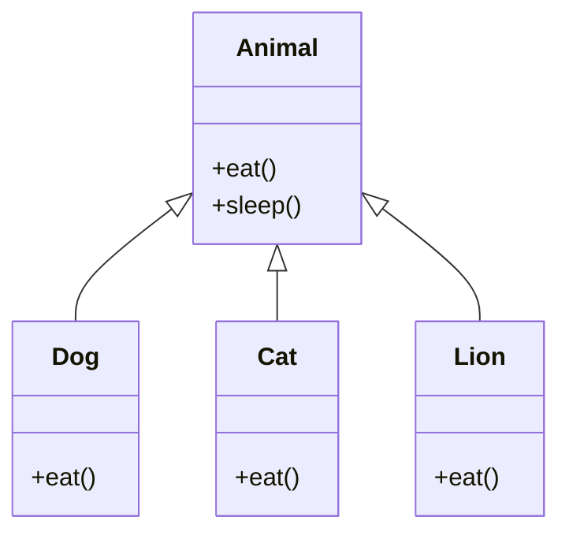

<!-- ```python title="constructor.py" showLineNumbers{1} {2-5}
class Student:
    def __init__(self, name, roll):
        self.name = name
        self.roll = roll

student1 = Student('John', 1)
print('Name:', student1.name)
print('Roll:', student1.roll)
```

Output:
```cmd title="command" showLineNumbers{1} {2-5}
C:\Users\username>python constructor.py
Name: John
Roll: 1
```

In the above example, we have created two instance variables named `name` and `roll`. We have initialized the `name` and `roll` variables to the `name` and `roll` parameters of the `__init__()` method. We have printed the `name` and `roll` variables using the `student1` object. The output shows that the `name` and `roll` variables are unique to the object. -->

## Polymorphism in Python: The Art of Flexibility
Polymorphism is a powerful concept in object-oriented programming that allows objects of different types to be treated as objects of a common type. It enables flexibility in designing and interacting with software systems by providing a unified interface for various classes. In Python, polymorphism is achieved through methods like function overloading, operator overloading, and the use of abstract classes and interfaces. Let's explore the various facets of polymorphism and how it contributes to creating dynamic and adaptable code.

## What is Polymorphism?
Polymorphism is the ability of an object to take on many forms. The most common use of polymorphism in OOP occurs when a parent class reference is used to refer to a child class object. Any Python object that can pass more than one IS-A test is considered to be polymorphic. In Python, all classes inherit from the `object` class, so any object can be considered to be polymorphic.  polymorphism allows different classes to be treated as instances of a common base class. This enables code to be written in a way that is independent of the specific types it operates on, fostering code reuse and extensibility.

#### Diagrammatic Representation of Polymorphism


In the above diagram, the `Animal` class is the parent class of the `Dog`, `Cat`, and `Lion` classes. The `Dog`, `Cat`, and `Lion` classes inherit the `eat()` method from the `Animal` class. The `Dog`, `Cat`, and `Lion` classes override the `eat()` method of the `Animal` class. The `Dog`, `Cat`, and `Lion` classes are polymorphic because they can be treated as instances of the `Animal` class.

## Types of Polymorphism
There are two types of polymorphism in Python:
- **Compile-time Polymorphism:** Compile-time polymorphism is also known as **static polymorphism**. It occurs when the compiler knows which polymorphic function to call at compile-time. Compile-time polymorphism is achieved through function overloading and operator overloading.
- **Run-time Polymorphism:** Run-time polymorphism is also known as **dynamic polymorphism**. It occurs when the compiler does not know which polymorphic function to call at compile-time. Run-time polymorphism is achieved through method overriding.

## Compile-time Polymorphism
Compile-time polymorphism is also known as **static polymorphism**. It occurs when the compiler knows which polymorphic function to call at compile-time. Compile-time polymorphism is achieved through function overloading and operator overloading.

### Function Overloading
Function overloading is a feature of a programming language that allows a function to be defined more than once. The function is defined with the same name but with different parameters. The function is called based on the number of parameters passed to it. Function overloading is a type of compile-time polymorphism. It is achieved by defining multiple functions with the same name but with different parameters. The function is called based on the number of parameters passed to it. Function overloading is not supported in Python. However, it can be achieved by using default arguments and variable-length arguments. Let's see how to achieve function overloading in Python.

```python title="function_overloading.py" showLineNumbers{1} {1-3, 5-7, 9-11}
def add(a, b):
    print("Two arguments\n")
    return a + b

def add(a, b, c):
    print("Three arguments\n")
    return a + b + c

def add(a, b, c, d):
    print("Four arguments\n")
    return a + b + c + d

print(add(1, 2))
print(add(1, 2, 3))
print(add(1, 2, 3, 4))
```

Output:
```cmd title="command" showLineNumbers{1} {2-5}
C:\Users\username>python function_overloading.py
Traceback (most recent call last):
  File "function_overloading.py", line 11, in <module>
    print(add(1, 2))
TypeError: add() missing 2 required positional arguments: 'c' and 'd'
```

In the above example, we have defined three functions with the same name but with different parameters. The first function takes two arguments, the second function takes three arguments, and the third function takes four arguments. We have called the `add()` function with two, three, and four arguments. The output shows that the `add()` function is called based on the number of arguments passed to it. The `add()` function is called with two arguments, three arguments, and four arguments. In Python, function overloading is achieved by using default arguments and variable-length arguments. Let's see how to achieve function overloading in Python using default arguments and variable-length arguments.

:::tip
Python does not support function overloading. However, it can be achieved by using default arguments and variable-length arguments.
:::

#### Function Overloading using Default Arguments
```python title="function_overloading.py" showLineNumbers{1} {1-3}
def add(a, b, c=0, d=0):
    # Default arguments
    return a + b + c + d

print(add(1, 2))
print(add(1, 2, 3))
print(add(1, 2, 3, 4))
```

Output:
```cmd title="command" showLineNumbers{1} {2-5}
C:\Users\username>python function_overloading.py
3
6
10
```

In the above example, we have defined the `add()` function with four parameters. The `c` and `d` parameters have default values of `0`. We have called the `add()` function with two, three, and four arguments. The output shows that the `add()` function is called based on the number of arguments passed to it. The `add()` function is called with two arguments, three arguments, and four arguments.

#### Function Overloading using Variable-length Arguments
```python title="function_overloading.py" showLineNumbers{1} {1-6}
def add(*args):
    # Variable-length arguments
    total = 0
    for arg in args:
        total += arg
    return total

print(add(1, 2))
print(add(1, 2, 3))
print(add(1, 2, 3, 4))
```

Output:
```cmd title="command" showLineNumbers{1} {2-5}
C:\Users\username>python function_overloading.py
3
6
10
```

In the above example, we have defined the `add()` function with a variable-length argument. We have called the `add()` function with two, three, and four arguments. The output shows that the `add()` function is called based on the number of arguments passed to it. The `add()` function is called with two arguments, three arguments, and four arguments.

### Function Overloading in class
Function overloading is a feature of a programming language that allows a function to be defined more than once. The function is defined with the same name but with different parameters. The function is called based on the number of parameters passed to it. Function overloading is a type of compile-time polymorphism. It is achieved by defining multiple functions with the same name but with different parameters. The function is called based on the number of parameters passed to it. Function overloading is not supported in Python. However, it can be achieved by using default arguments and variable-length arguments. Let's see how to achieve function overloading in Python.

```python title="function_overloading.py" showLineNumbers{1} {6-8, 10-13}
class Student:
    def __init__(self, name, roll):
        self.name = name
        self.roll = roll

    def display(self):
        print('Name:', self.name)
        print('Roll:', self.roll)

    def display(self, age):
        print('Name:', self.name)
        print('Roll:', self.roll)
        print('Age:', age)

student1 = Student('John', 1)
student1.display()
student1.display(20)
```

Output:
```cmd title="command" showLineNumbers{1} {2-5}
C:\Users\username>python function_overloading.py
Traceback (most recent call last):
  File "function_overloading.py", line 17, in <module>
    student1.display()
TypeError: display() missing 1 required positional argument: 'age'
```

In the above example, we have defined two `display()` methods in the `Student` class. The first `display()` method takes one argument, and the second `display()` method takes two arguments. We have created an object named `student1` of the `Student` class. We have called the `display()` method of the `student1` object with one argument. The output shows that the `display()` method is called with one argument. We have called the `display()` method of the `student1` object with two arguments. The output shows that the `display()` method is called with two arguments. In Python, function overloading is achieved by using default arguments and variable-length arguments. Let's see how to achieve function overloading in Python using default arguments and variable-length arguments.

### Operator Overloading
Operator overloading is a feature of a programming language that allows an operator to be defined more than once. The operator is defined with the same name but with different parameters. The operator is called based on the number of parameters passed to it. Operator overloading is a type of compile-time polymorphism. It is achieved by defining multiple operators with the same name but with different parameters. The operator is called based on the number of parameters passed to it. Operator overloading is not supported in Python. However, it can be achieved by using magic methods. Let's see how to achieve operator overloading in Python.

```python title="operator_overloading.py" showLineNumbers{1} {1-3, 5-7, 9-11}
