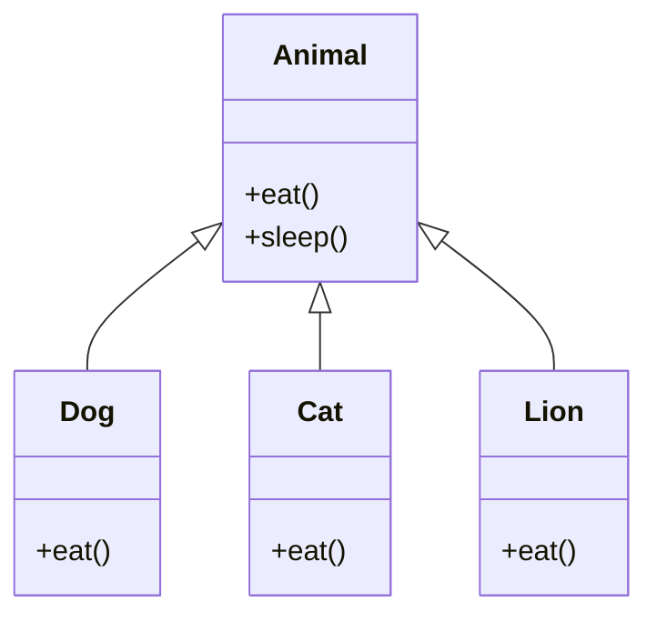

## Polymorphism in Python: The Art of Flexibility
Polymorphism is a powerful concept in object-oriented programming that allows objects of different types to be treated as objects of a common type. It enables flexibility in designing and interacting with software systems by providing a unified interface for various classes. In Python, polymorphism is achieved through methods like function overloading, operator overloading, and the use of abstract classes and interfaces. Let's explore the various facets of polymorphism and how it contributes to creating dynamic and adaptable code.

## What is Polymorphism?
Polymorphism is the ability of an object to take on many forms. The most common use of polymorphism in OOP occurs when a parent class reference is used to refer to a child class object. Any Python object that can pass more than one IS-A test is considered to be polymorphic. In Python, all classes inherit from the `object` class, so any object can be considered to be polymorphic.  polymorphism allows different classes to be treated as instances of a common base class. This enables code to be written in a way that is independent of the specific types it operates on, fostering code reuse and extensibility.

#### Diagrammatic Representation of Polymorphism

In the above diagram, the `Animal` class is the parent class of the `Dog`, `Cat`, and `Lion` classes. The `Dog`, `Cat`, and `Lion` classes inherit the `eat()` method from the `Animal` class. The `Dog`, `Cat`, and `Lion` classes override the `eat()` method of the `Animal` class. The `Dog`, `Cat`, and `Lion` classes are polymorphic because they can be treated as instances of the `Animal` class.

## Types of Polymorphism
There are two types of polymorphism in Python:
- **Compile-time Polymorphism:** Compile-time polymorphism is also known as **static polymorphism**. It occurs when the compiler knows which polymorphic function to call at compile-time. Compile-time polymorphism is achieved through function overloading and operator overloading.
- **Run-time Polymorphism:** Run-time polymorphism is also known as **dynamic polymorphism**. It occurs when the compiler does not know which polymorphic function to call at compile-time. Run-time polymorphism is achieved through method overriding.

## The Advantages of Polymorphism:

1. **Code Reusability:**
   - Polymorphism encourages the reuse of code by allowing different classes to share a common interface.

2. **Flexibility:**
   - The ability to treat different types of objects uniformly enhances the flexibility of the code.

3. **Extensibility:**
   - New classes can be added without modifying existing code, promoting extensibility.

4. **Readability:**
   - Polymorphic code tends to be more readable and understandable, as it operates on a higher level of abstraction.

## Considerations and Best Practices:

1. **Consistent Interfaces:**
   - For effective polymorphism, ensure that classes sharing a common interface adhere to a consistent set of methods.

2. **Use Cases for Operator Overloading:**
   - Choose operator overloading judiciously, focusing on cases where it enhances the clarity and expressiveness of the code.

3. **Careful Use of Compile-Time Polymorphism:**
   - While method overloading can be useful, excessive use may lead to confusion. Use it when it improves code readability.

4. **Understand the Context:**
   - Consider the specific use case when implementing polymorphism. It should make sense in the context of the problem being solved.

## Conclusion:

Polymorphism is a cornerstone of object-oriented programming in Python, providing a mechanism for creating flexible and adaptable code. Whether achieved through compile-time or runtime mechanisms, polymorphism simplifies the design and maintenance of software systems. By embracing polymorphism, developers can create code that is not only more reusable and extensible but also more elegant and expressive. For more information on polymorphism in Python, refer to the [official documentation](https://docs.python.org/3/library/functions.html#isinstance). For more tutorials on Python, check out Python Central Hub.