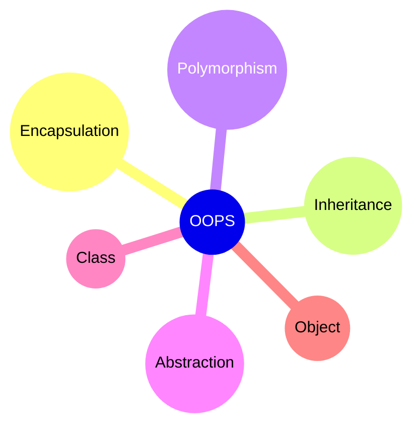
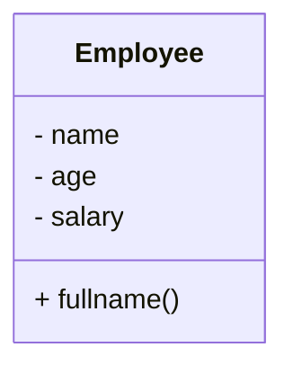

## Object-Oriented Programming (OOP) in Python: An In-Depth Guide
Object-Oriented Programming (OOP) is a programming paradigm that revolves around the concept of objects, which encapsulate data and behavior. Python is an object-oriented programming language, and it provides robust support for OOP principles. In this in-depth guide, we will explore the key concepts of OOP in Python, including classes, objects, inheritance, encapsulation, and polymorphism.

## Programming Paradigms
A programming paradigm is a way of thinking about and approaching problems. It is a way of structuring and organizing code. There are several programming paradigms, including procedural programming, functional programming, and object-oriented programming. A programming paradigm is a way of thinking about and approaching problems. It is a way of structuring and organizing code. There are several programming paradigms, including procedural programming, functional programming, and object-oriented programming.

**The following are the most common programming paradigms:**
- **Procedural Programming**
- **Functional Programming**
- **Object-Oriented Programming**


## Procedural Programming
Procedural programming is a programming paradigm that revolves around the concept of procedures, which are also known as routines, subroutines, or functions. A procedure is a set of instructions that perform a specific task. Procedural programming is a programming paradigm that revolves around the concept of procedures, which are also known as routines, subroutines, or functions. A procedure is a set of instructions that perform a specific task. Procedural programming is a programming paradigm that revolves around the concept of procedures, which are also known as routines, subroutines, or functions. A procedure is a set of instructions that perform a specific task.

### Properties of Procedural Programming
- **Imperative**: Procedural programming is imperative, meaning it specifies explicit steps for the computer to perform.
- **Top-Down Design**: Programs are typically designed using a top-down approach, breaking down tasks into subtasks and sub-subtasks.
- **Global Data**: Data is often global and shared among procedures, which can lead to unintended side effects.
- **Structured Programming**: Procedural programming often follows structured programming principles, emphasizing the use of control structures like loops and conditionals.
- **Readability**: Programs tend to be more readable and understandable for beginners and those familiar with step-by-step procedural logic.

### Advantages of Procedural Programming
- **Simplicity**: Procedural programs are often straightforward and easy to understand.
- **Reusability**: Functions or procedures can be reused across different parts of the program.
- **Efficiency**: Procedural code can be more efficient in terms of memory usage and execution speed for certain tasks.
- **Easier Maintenance**: Code maintenance is often simpler as procedures are typically independent of each other.
- **Predictability**: The flow of the program is predictable and follows a clear sequence of steps.

### Disadvantages of Procedural Programming
- **Global State**: Shared global data can lead to unintended side effects and make it harder to reason about the program.
- **Limited Abstraction**: It may be challenging to represent complex relationships and abstractions in a procedural paradigm.
- **Code Duplication**: Without proper organization, code duplication may occur, leading to maintenance challenges.
- **Less Reusable**: Code can be less reusable when compared to more modular paradigms.
- **Scalability Issues**: Large programs may become harder to manage and scale as they grow in size.

## Functional Programming
Functional programming is a programming paradigm that revolves around the concept of functions. A function is a block of code that performs a specific task. Functional programming is a programming paradigm that revolves around the concept of functions. A function is a block of code that performs a specific task. Functional programming is a programming paradigm that revolves around the concept of functions. A function is a block of code that performs a specific task.

### Properties of Functional Programming
- **Declarative Style**: Functional programming emphasizes a declarative style where the focus is on expressing what the program should accomplish rather than how it should achieve it.
- **Immutability**: Data is treated as immutable, meaning once it is created, it cannot be changed. Functions do not have side effects.
- **First-Class Functions**: Functions are first-class citizens, allowing them to be passed as arguments, returned from other functions, and assigned to variables.
- **Higher-Order Functions**: Functions can take other functions as parameters or return functions as results.
- **Recursion**: Recursion is often used instead of traditional loops for repetitive tasks.

### Advantages of Functional Programming
- **Modularity**: Functional programs are often modular, promoting code reuse and maintainability.
- **Parallelization**: Immutability allows for easier parallelization of code, taking advantage of multicore processors.
- **Predictability**: Functions in functional programming tend to be deterministic, making it easier to reason about program behavior.
- **No Side Effects**: The avoidance of side effects makes programs less error-prone and easier to debug.
- **Expressiveness**: Functional programs can be highly expressive, allowing concise representation of complex operations.

### Disadvantages of Functional Programming
- **Learning Curve**: Functional programming concepts can be challenging for those accustomed to imperative paradigms.
- **Performance Overhead**: Functional programming may introduce a performance overhead due to the creation of new data structures rather than modifying existing ones.
- **Limited Mutability**: The restriction on mutability might be seen as a limitation in scenarios where mutable state is essential.
- **Compatibility**: Some existing libraries and frameworks may not be designed with functional programming in mind.
- **Not Always Intuitive**: Some problems may not be naturally expressed using a functional paradigm, leading to less intuitive solutions.


## What is Object-Oriented Programming (OOP)?
Object-Oriented Programming (OOP) is a programming paradigm that revolves around the concept of objects, which encapsulate data and behavior. An object is an instance of a class. A class is a blueprint for an object. In other words, a class is a template for creating objects. A class defines the properties and behavior of an object. An object is an instance of a class. An object is an entity that has state and behavior. For example, a car is an object. It has a state (color, model, etc.) and behavior (braking, accelerating, etc.). A class is a blueprint for creating objects.

### Properties

1. **Encapsulation:**
   - **Description:** Encapsulation is the bundling of data (attributes) and methods that operate on that data into a single unit (a class).
   - **Advantage:** It hides the internal details of how an object operates, promoting information hiding and reducing complexity.
   - **Disadvantage:** Overuse of encapsulation can make code less transparent and harder to understand.

2. **Inheritance:**
   - **Description:** Inheritance allows a class (subclass/child) to inherit attributes and methods from another class (superclass/parent).
   - **Advantage:** Promotes code reuse, facilitates the creation of a hierarchy of classes, and supports the extension of existing classes.
   - **Disadvantage:** Can lead to a complex class hierarchy if not managed properly, making the code harder to maintain.

3. **Polymorphism:**
   - **Description:** Polymorphism allows objects of different classes to be treated as objects of a common base class.
   - **Advantage:** Enhances flexibility and code readability, supporting dynamic method invocation.
   - **Disadvantage:** Requires a clear understanding of class relationships, and misuse can lead to unexpected behavior.

4. **Abstraction:**
   - **Description:** Abstraction involves simplifying complex systems by modeling classes based on essential properties and behaviors.
   - **Advantage:** Enables modeling of real-world entities, reducing system complexity and promoting a focus on essential features.
   - **Disadvantage:** Abstract classes may introduce an additional layer of complexity if not used judiciously.

5. **Modularity:**
   - **Description:** OOP promotes modularity by breaking down a system into smaller, manageable components (classes).
   - **Advantage:** Enhances code organization, reusability, and maintainability.
   - **Disadvantage:** Poorly designed class interfaces can lead to tight coupling, reducing modularity.

6. **Message Passing:**
   - **Description:** Objects communicate by sending messages to each other, invoking methods and exchanging information.
   - **Advantage:** Facilitates interactions between objects, promoting flexibility in the design.
   - **Disadvantage:** Complex communication patterns can lead to challenges in understanding program flow.

7. **Constructor and Destructor:**
   - **Description:** Constructors initialize objects when they are created, and destructors perform cleanup when an object is destroyed.
   - **Advantage:** Ensures proper initialization and cleanup of objects.
   - **Disadvantage:** Improper use or lack of destructors can lead to memory leaks or resource issues.

8. **Dynamic Binding:**
   - **Description:** Dynamic binding allows the selection of a method to be executed during runtime rather than compile time.
   - **Advantage:** Supports polymorphism, making it possible to decide the appropriate method implementation dynamically.
   - **Disadvantage:** May introduce a slight runtime overhead due to dynamic method resolution.

9. **Association:**
   - **Description:** Association represents a relationship between two or more classes, indicating how they are connected.
   - **Advantage:** Models complex relationships between classes, promoting a clearer representation of system interactions.
   - **Disadvantage:** Overuse of association can lead to overly interconnected classes, complicating the system.

10. **Reusability:**
   - **Description:** OOP promotes the reuse of existing classes and components in the development of new software.
   - **Advantage:** Saves development time, encourages the creation of robust and tested components.
   - **Disadvantage:** Reusable components may not always fit perfectly into new scenarios, requiring adaptations.


#### Diagram


    
## Class
In object-oriented programming (OOP), a class is a blueprint or template for creating objects. It defines a set of attributes (data members) and methods (functions) that characterize any object instantiated from that class. A class encapsulates the common properties and behaviors that its objects share. It serves as a blueprint for creating instances or objects, providing a way to model and organize code in a modular and reusable fashion.

**Syntax:**

```python title="class_syntex.py" showLineNumbers{1} {1,3}
class ClassName:
    pass
```

## Object:
An object is an instance of a class in object-oriented programming. It is a tangible entity created from a class, embodying the characteristics and behaviors defined by the class. Objects have attributes (data members) that represent their state and methods (functions) that define their behavior. When a class is instantiated, it creates an object, and multiple objects can be created from the same class. Each object has its own unique state, but they all share the structure and behavior defined by the class.

**Syntax:**

```python title="object_syntex.py" showLineNumbers{1} {1,3}
object_name = ClassName()
```

### Example:
We are creating a class named `Employee` and creating an object of that class named `emp1`. We are also creating another object named `emp2`. and we also create a class method named `fullname` and we are passing `self` as a parameter in that method. `self` is a reference to the current instance of the class, and is used to access variables that belongs to the class. It does not have to be named self , you can call it whatever you like, but it has to be the first parameter of any function in the class.

**Syntax:**



```python title="class_object.py" showLineNumbers{1} {1-10}
class Employee:
    def __init__(self):
        self.name = "John"
        self.age = 23
        self.salary = 25000
    def fullname(self):
        print("This is a class method")

emp1 = Employee()
emp2 = Employee()
emp1.fullname()
emp2.fullname()
```

Output:
```cmd title="command" showLineNumbers{1} {2-3}
C:\Users\username>python class_object.py
This is a class method
This is a class method
```

### Conclusion

Object-Oriented Programming provides a powerful paradigm for designing and organizing code, promoting principles that enhance code readability, reusability, and maintainability. While its advantages are substantial, effective application requires a solid understanding of OOP principles and careful consideration of design choices. Overuse or misuse of certain features can lead to code that is hard to understand and maintain. For more information on OOP in Python, check out the official documentation. For more tutorials on Python, check out Python Central Hub.