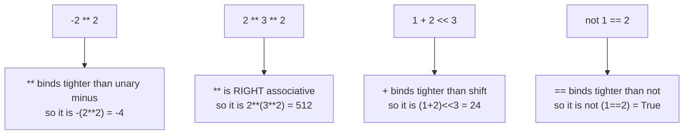

## Unleashing the Power of Operators in Python
Operators in Python play a pivotal role in performing various operations on variables and values. They are the building blocks of expressions, allowing you to manipulate data, make comparisons, and control the flow of your programs. In this comprehensive guide, we'll delve into the diverse world of operators in Python and explore their applications in different contexts.

For example:

```python title="operators.py" showLineNumbers{1} {1} 
x = 10 + 5
print(x)
```

Output:

```cmd title="command" showLineNumbers{1}
C:\Users\Your Name> python operators.py
15
```

Here, `+` is the operator that performs addition. `10` and `5` are the operands and `15` is the output of the operation.

In python, we have the following types of operators:

1. **Arithmetic Operators**
2. **Comparison (Relational) Operators**
3. **Assignment Operators**
4. **Logical Operators**
5. **Bitwise Operators**
6. **Membership Operators**
7. **Identity Operators**
8. **Operator Precedence**
9. **Ternary Operator**
10. **Operator Overloading**
11. **Operator Functions**

Let's take a closer look at each of these operators.

## 1. Arithmetic Operators
Arithmetic operators are used to perform mathematical operations like addition, subtraction, multiplication, etc. They operate on numeric values and return a numeric value as the output. 

The following table lists the arithmetic operators in Python:

| Operator | Description | Example |
| :--- | :--- | :--- |
| `+` | Adds two operands or unary plus | `x + y` |
| `-` | Subtracts right operand from the left or unary minus | `x - y` |
| `*` | Multiplies two operands | `x * y` |
| `/` | Divides left operand by right operand | `x / y` |
| `%` | Modulus operator | `x % y` |
| `**` | Exponentiation operator | `x ** y` |
| `//` | Floor division operator | `x // y` |


## 2. Comparison Operators
Comparison operators are used to compare two values. They either return `True` or `False` according to the condition. The following table lists the comparison operators in Python:

| Operator | Description | Example |
| :--- | :--- | :--- |
| `==` | If the values of two operands are equal, then the condition becomes true | `x == y` |
| `!=` | If values of two operands are not equal, then the condition becomes true | `x != y` |
| `>` | If the value of the left operand is greater than the value of the right operand, then the condition becomes true | `x > y` |
| `<` | If the value of the left operand is less than the value of the right operand, then the condition becomes true | `x < y` |
| `>=` | If the value of the left operand is greater than or equal to the value of the right operand, then the condition becomes true | `x >= y` |
| `<=` | If the value of the left operand is less than or equal to the value of the right operand, then the condition becomes true | `x <= y` |


## 3. Logical Operators
Logical operators are used to combine conditional statements. They either return `True` or `False` according to the condition. The following table lists the logical operators in Python:

| Operator | Description | Example |
| :--- | :--- | :--- |
| `and` | Returns `True` if both statements are true | `x < 5 and  x < 10` |
| `or` | Returns `True` if one of the statements is true | `x < 5 or x < 4` |
| `not` | Reverse the result, returns `False` if the result is true | `not(x < 5 and x < 10)` |


## 4. Bitwise Operators
Bitwise operators are used to perform bitwise calculations on integers. The following table lists the bitwise operators in Python:

| Operator | Description | Example |
| :--- | :--- | :--- |
| `&` | Performs bitwise AND on operands | `x & y` |
| `\|` | Performs bitwise OR on operands | `x \| y` |
| `^` | Performs bitwise XOR on operands | `x ^ y` |
| `~` | Performs bitwise NOT on operands | `~x` |
| `<<` | Performs bitwise left shift on operands | `x << y` |
| `>>` | Performs bitwise right shift on operands | `x >> y` |


## 5. Assignment Operators
Assignment operators are used to assign values to variables. The following table lists the assignment operators in Python:

| Operator | Description | Example |
| :--- | :--- | :--- |
| `=` | Assigns values from the right side operands to the left side operand | `x = y + z` |
| `+=` | It adds the right operand to the left operand and assigns the result to the left operand | `x += y` is equivalent to `x = x + y` |
| `-=` | It subtracts the right operand from the left operand and assigns the result to the left operand | `x -= y` is equivalent to `x = x - y` |
| `*=` | It multiplies the right operand with the left operand and assigns the result to the left operand | `x *= y` is equivalent to `x = x * y` |
| `/=` | It divides the left operand with the right operand and assigns the result to the left operand | `x /= y` is equivalent to `x = x / y` |
| `%=` | It takes modulus using two operands and assigns the result to the left operand | `x %= y` is equivalent to `x = x % y` |
| `**=` | Performs exponential (power) calculation on operators and assigns the result to the left operand | `x **= y` is equivalent to `x = x ** y` |
| `//=` | It performs floor division on operators and assigns the result to the left operand | `x //= y` is equivalent to `x = x // y` |
| `&=` | Performs bitwise AND on operators and assigns the result to the left operand | `x &= y` is equivalent to `x = x & y` |
| `\|=` | Performs bitwise OR on operators and assigns the result to the left operand | `x \|= y` is equivalent to `x = x \| y` |
| `^=` | Performs bitwise XOR on operators and assigns the result to the left operand | `x ^= y` is equivalent to `x = x ^ y` |
| `>>=` | Performs bitwise right shift on operators and assigns the result to the left operand | `x >>= y` is equivalent to `x = x >> y` |
| `<<=` | Performs bitwise left shift on operators and assigns the result to the left operand | `x <<= y` is equivalent to `x = x << y` |


## 6. Membership Operators
Membership operators are used to test if a sequence is presented in an object. The following table lists the membership operators in Python:

| Operator | Description | Example |
| :--- | :--- | :--- |
| `in` | Returns `True` if a sequence with the specified value is present in the object | `x in y` |
| `not in` | Returns `True` if a sequence with the specified value is not present in the object | `x not in y` |

## 7. Identity Operators
Identity operators are used to compare the objects, not if they are equal, but if they are actually the same object, with the same memory location. The following table lists the identity operators in Python:

| Operator | Description | Example |
| :--- | :--- | :--- |
| `is` | Returns `True` if both variables are the same object | `x is y` |
| `is not` | Returns `True` if both variables are not the same object | `x is not y` |

## 8. Operator Precedence
Operator precedence is a set of rules that defines the order in which the operators are evaluated in an expression. The following table lists the operator precedence in Python:

| Operator | Description |
| :--- | :--- |
| `()` | Parentheses |
| `**` | Exponentiation |
| `~` | Bitwise not |
| `*`, `/`, `%`, `//` | Multiplication, Division, Modulus, Floor division |
| `+`, `-` | Addition, Subtraction |
| `<<`, `>>` | Bitwise shift operators |
| `&` | Bitwise AND |
| `^` | Bitwise XOR |
| `\|` | Bitwise OR |
| `==`, `!=`, `>`, `>=`, `<`, `<=`, `is`, `is not`, `in`, `not in` | Comparisons, Identity, Membership operators |
| `not` | Logical NOT |
| `and` | Logical AND |
| `or` | Logical OR |


## 9. Ternary Operator
Ternary operator is also known as conditional operator. It is used to evaluate an expression based on some condition. The following is the syntax of ternary operator in Python:

```python title="ternary_operator.py" showLineNumbers{1}
[on_true] if [expression] else [on_false]
```

Here, `expression` is evaluated and if it is `True`, then `on_true` is returned otherwise `on_false` is returned.

For example:

```python title="ternary_operator.py" showLineNumbers{1} {3}
x = 10
y = 20
big = x if x > y else y
print(big)
```

Output:

```cmd title="command" showLineNumbers{1}
C:\Users\Your Name> python ternary_operator.py
20
```


## 10. Operator Overloading
Operator overloading is a feature in Python that allows the same operator to have different meanings according to the context. For example, the `+` operator will, perform arithmetic addition on two numbers, merge two lists, or concatenate two strings.

In Python, we can redefine or overload most of the built-in operators available in Python. Thus, we can use operators with user-defined types as well.

For example, suppose we have created a class named `Vector` to represent two-dimensional vectors. Let's overload the `+` operator to perform vector addition.

```python title="operator_overloading.py" showLineNumbers{1} {6-7}
class Vector:
    def __init__(self, x, y):
        self.x = x
        self.y = y

    def __add__(self, other):
        return Vector(self.x + other.x, self.y + other.y)

first = Vector(2, 3)
second = Vector(4, 5)
result = first + second
print(result.x)
print(result.y)
```

Output:

```cmd title="command" showLineNumbers{1}
C:\Users\Your Name> python operator_overloading.py
6
8
```

Here, we have overloaded the `+` operator to add two `Vector` objects. The `__add__()` method is called when `+` operator is used on `Vector` objects.

Similarly, we can overload other operators as well. The following table lists the operators that can be overloaded in Python:

| Operator | Method | Description |
| :--- | :--- | :--- |
| `+` | `__add__(self, other)` | Addition |
| `-` | `__sub__(self, other)` | Subtraction |
| `*` | `__mul__(self, other)` | Multiplication |
| `/` | `__truediv__(self, other)` | Division |
| `%` | `__mod__(self, other)` | Modulus |
| `//` | `__floordiv__(self, other)` | Floor Division |
| `**` | `__pow__(self, other)` | Exponentiation |
| `&` | `__and__(self, other)` | Bitwise AND |
| `\|` | `__or__(self, other)` | Bitwise OR |
| `^` | `__xor__(self, other)` | Bitwise XOR |
| `~` | `__invert__(self)` | Bitwise NOT |
| `<<` | `__lshift__(self, other)` | Bitwise left shift |
| `>>` | `__rshift__(self, other)` | Bitwise right shift |
| `==` | `__eq__(self, other)` | Equal to |
| `!=` | `__ne__(self, other)` | Not equal to |
| `<` | `__lt__(self, other)` | Less than |
| `>` | `__gt__(self, other)` | Greater than |
| `<=` | `__le__(self, other)` | Less than or equal to |
| `>=` | `__ge__(self, other)` | Greater than or equal to |
| `+=` | `__iadd__(self, other)` | Addition | 
| `-=` | `__isub__(self, other)` | Subtraction |
| `*=` | `__imul__(self, other)` | Multiplication |
| `/=` | `__idiv__(self, other)` | Division |
| `%=` | `__imod__(self, other)` | Modulus |
| `//=` | `__ifloordiv__(self, other)` | Floor Division |
| `**=` | `__ipow__(self, other)` | Exponentiation |
| `&=` | `__iand__(self, other)` | Bitwise AND |
| `\|=` | `__ior__(self, other)` | Bitwise OR |
| `^=` | `__ixor__(self, other)` | Bitwise XOR |
| `<<=` | `__ilshift__(self, other)` | Bitwise left shift |
| `>>=` | `__irshift__(self, other)` | Bitwise right shift |
| `()` | `__call__(self, other)` | Call operator |
| `[]` | `__getitem__(self, other)` | Index operator |
| `()` | `__setitem__(self, other)` | Index assignment operator |
| `del` | `__delitem__(self, other)` | Index deletion operator |
| `len()` | `__len__(self, other)` | Length operator |
| `str()` | `__str__(self, other)` | String conversion operator |
| `repr()` | `__repr__(self, other)` | Object representation operator |
| `iter()` | `__iter__(self, other)` | Iteration operator |
| `next()` | `__next__(self, other)` | Next iteration operator |
| `reversed()` | `__reversed__(self, other)` | Reverse iteration operator |
| `cmp()` | `__cmp__(self, other)` | Comparison operator |
| `pos()` | `__pos__(self, other)` | Unary plus |
| `neg()` | `__neg__(self, other)` | Unary minus |
| `abs()` | `__abs__(self, other)` | Absolute value |
| `invert()` | `__invert__(self, other)` | Bitwise NOT |
| `complex()` | `__complex__(self, other)` | Complex number conversion |
| `int()` | `__int__(self, other)` | Integer conversion |
| `long()` | `__long__(self, other)` | Long integer conversion |
| `float()` | `__float__(self, other)` | Float conversion |
| `oct()` | `__oct__(self, other)` | Octal conversion |
| `hex()` | `__hex__(self, other)` | Hexadecimal conversion |
| `index()` | `__index__(self, other)` | Conversion to an integer |
| `trunc()` | `__trunc__(self, other)` | Truncation operator |
| `coerce()` | `__coerce__(self, other)` | Coercion |
| `enter()` | `__enter__(self, other)` | Context management protocol |
| `exit()` | `__exit__(self, other)` | Context management protocol |
| `hash()` | `__hash__(self, other)` | Hashing operator |
| `getattr()` | `__getattr__(self, other)` | Attribute access |
| `setattr()` | `__setattr__(self, other)` | Attribute assignment |
| `delattr()` | `__delattr__(self, other)` | Attribute deletion |
| `dir()` | `__dir__(self, other)` | Attribute query |
| `getattribute()` | `__getattribute__(self, other)` | Attribute access |
| `set()` | `__set__(self, other)` | Descriptor access |
| `delete()` | `__delete__(self, other)` | Descriptor deletion |
| `get()` | `__get__(self, other)` | Descriptor access |

## 11. Operator Functions
Python provides built-in functions for performing various operations. These functions are called operator functions. 
For example, `operator.add(x, y)` is equivalent to `x + y`.
```python title="operator_functions.py" showLineNumbers{1} {1-2}
import operator
print(operator.add(10, 20))
```

Output:

```cmd title="command" showLineNumbers{1}
C:\Users\Your Name> python operator_functions.py
30
```

The following table lists the operator functions in Python:

| Operator | Function | Description |
| :--- | :--- | :--- |
| `+` | `operator.add(a, b)` | Addition |
| `-` | `operator.sub(a, b)` | Subtraction |
| `*` | `operator.mul(a, b)` | Multiplication |
| `/` | `operator.truediv(a, b)` | Division |
| `%` | `operator.mod(a, b)` | Modulus |
| `//` | `operator.floordiv(a, b)` | Floor Division |
| `**` | `operator.pow(a, b)` | Exponentiation |
| `&` | `operator.and_(a, b)` | Bitwise AND |
| `\|` | `operator.or_(a, b)` | Bitwise OR |
| `^` | `operator.xor(a, b)` | Bitwise XOR |
| `~` | `operator.invert(a)` | Bitwise NOT |
| `<<` | `operator.lshift(a, b)` | Bitwise left shift |
| `>>` | `operator.rshift(a, b)` | Bitwise right shift |
| `==` | `operator.eq(a, b)` | Equal to |
| `!=` | `operator.ne(a, b)` | Not equal to |
| `<` | `operator.lt(a, b)` | Less than |
| `>` | `operator.gt(a, b)` | Greater than |
| `<=` | `operator.le(a, b)` | Less than or equal to |
| `>=` | `operator.ge(a, b)` | Greater than or equal to |
| `+=` | `operator.iadd(a, b)` | Addition |
| `-=` | `operator.isub(a, b)` | Subtraction |
| `*=` | `operator.imul(a, b)` | Multiplication |
| `/=` | `operator.itruediv(a, b)` | Division |
| `%=` | `operator.imod(a, b)` | Modulus |
| `//=` | `operator.ifloordiv(a, b)` | Floor Division |
| `**=` | `operator.ipow(a, b)` | Exponentiation |
| `&=` | `operator.iand(a, b)` | Bitwise AND |
| `\|=` | `operator.ior(a, b)` | Bitwise OR |
| `^=` | `operator.ixor(a, b)` | Bitwise XOR |
| `<<=` | `operator.ilshift(a, b)` | Bitwise left shift |
| `>>=` | `operator.irshift(a, b)` | Bitwise right shift |
| `()` | `operator()` | Call operator |
| `[]` | `operator[]` | Index operator |
| `()` | `operator[]` | Index assignment operator |
| `del` | `operator[]` | Index deletion operator |
| `len()` | `operator.len()` | Length operator |
| `str()` | `operator.str()` | String conversion operator |
| `repr()` | `operator.repr()` | Object representation operator |
| `iter()` | `operator.iter()` | Iteration operator |
| `next()` | `operator.next()` | Next iteration operator |
| `reversed()` | `operator.reversed()` | Reverse iteration operator |
| `cmp()` | `operator.cmp()` | Comparison operator |
| `pos()` | `operator.pos()` | Unary plus |
| `neg()` | `operator.neg()` | Unary minus |
| `abs()` | `operator.abs()` | Absolute value |
| `invert()` | `operator.invert()` | Bitwise NOT |
| `complex()` | `operator.complex()` | Complex number conversion |
| `int()` | `operator.int()` | Integer conversion |
| `long()` | `operator.long()` | Long integer conversion |
| `float()` | `operator.float()` | Float conversion |
| `oct()` | `operator.oct()` | Octal conversion |
| `hex()` | `operator.hex()` | Hexadecimal conversion |
| `index()` | `operator.index()` | Conversion to an integer |
| `trunc()` | `operator.trunc()` | Truncation operator |
| `coerce()` | `operator.coerce()` | Coercion |
| `enter()` | `operator.enter()` | Context management protocol |
| `exit()` | `operator.exit()` | Context management protocol |
| `hash()` | `operator.hash()` | Hashing operator |
| `getattr()` | `operator.getattr()` | Attribute access |
| `setattr()` | `operator.setattr()` | Attribute assignment |
| `delattr()` | `operator.delattr()` | Attribute deletion |
| `dir()` | `operator.dir()` | Attribute query |
| `getattribute()` | `operator.getattribute()` | Attribute access |
| `set()` | `operator.set()` | Descriptor access |
| `delete()` | `operator.delete()` | Descriptor deletion |
| `get()` | `operator.get()` | Descriptor access |


## Precedence decides what your expression means

Every operator has a binding strength, and the parser applies it before you get a say.
These four are the ones that actually catch people:



```python title="precedence.py" showLineNumbers{1}
print(-2 ** 2)        # -4     not 4
print(2 ** 3 ** 2)    # 512    not 64
print(1 + 2 << 3)     # 24     not 17
print(not 1 == 2)     # True
```

None of these are edge cases invented for a quiz — `-x ** 2` in a formula and
`a + b << c` in bit-packing code both appear in real programs. When in doubt, add the
parentheses; they cost nothing and they encode your intent.

## `and` and `or` do not return booleans

They return **one of the operands**, which is why the "default value" idiom works at all:

```python title="operands.py" showLineNumbers{1}
0 or "fallback"     # 'fallback'   (str)
"" or []            # []           (list)
3 and 7             # 7            (int)
0 and 7             # 0            (int)
```

| expression | result | type |
|:--|:--|:--|
| `0 or 'fallback'` | `'fallback'` | `str` |
| `'' or []` | `[]` | `list` |
| `3 and 7` | `7` | `int` |
| `0 and 7` | `0` | `int` |

:::caution[Why `x = value or default` is a bug for numbers]
`or` falls back on anything **falsy**, not just `None`. If `value` is `0`, `""`, `[]`
or `False` — all legitimate values — you silently get the default instead. When you
mean "only if it was not provided", write `if value is None:`.
:::

They also **short-circuit**: the right-hand side may never be evaluated at all.

```python title="short_circuit.py" showLineNumbers{1}
calls = []
def f(): calls.append("f"); return True

True or f()      # True,  calls == []   <- f never ran
False and f()    # False, calls == []
```

That is what makes `if user is not None and user.is_active:` safe — the attribute access
is never reached when the first test fails.

## Chained comparison evaluates the middle once

```python title="chained.py" showLineNumbers{1}
1 < 2 < 3        # True   -> means (1 < 2) and (2 < 3)
(1 < 2) < 3      # True   -> but for a different reason: True == 1, and 1 < 3

def g(): calls.append("g"); return 2
1 < g() < 3      # g is evaluated exactly ONCE
```

`a < b < c` is not `(a < b) < c`. It expands to `a < b and b < c` with `b` evaluated a
single time — which matters when `b` is a function call or has side effects.

## See it move

Signs are where `//` and `%` stop being obvious. Drag the two operands and watch both
results — and the invariant that ties them together.

```p5 title="Floor division and modulo with negative numbers" desc="Python floors toward negative infinity and the sign of % follows the divisor, unlike C. The identity (p//q)*q + p%q == p holds in every quadrant." height="330"
let p = 7;
let q = 2;
let drag = -1;

function setup() {
  createCanvas(600, 330);
  textFont("monospace");
}

function pyFloorDiv(a, b) { return Math.floor(a / b); }
function pyMod(a, b) { return a - pyFloorDiv(a, b) * b; }

function draw() {
  background(13, 17, 23);
  if (q === 0) q = 1;
  const fd = pyFloorDiv(p, q);
  const md = pyMod(p, q);
  const cTrunc = (p / q) < 0 ? Math.ceil(p / q) : Math.floor(p / q);
  const cMod = p - cTrunc * q;

  noStroke();
  fill(230);
  textSize(14);
  textAlign(LEFT, TOP);
  text("p = " + p + "     q = " + q, 24, 18);

  slider("p", 24, 60, p, -12, 12, 0);
  slider("q", 24, 110, q, -6, 6, 1);

  // results
  stroke(48, 56, 68);
  strokeWeight(1);
  fill(20, 26, 34);
  rect(24, 156, 262, 96, 5);
  rect(300, 156, 262, 96, 5);

  noStroke();
  fill(120);
  textSize(10);
  textAlign(LEFT, TOP);
  text("PYTHON  (floor)", 38, 166);
  text("C / JAVA  (truncate)", 314, 166);

  fill(255, 211, 67);
  textSize(15);
  text(p + " // " + q + "  =  " + fd, 38, 190);
  fill(75, 139, 190);
  text(p + " %  " + q + "  =  " + md, 38, 218);

  fill(150);
  textSize(15);
  text("int div  =  " + cTrunc, 314, 190);
  text("remainder =  " + cMod, 314, 218);

  // invariant
  noStroke();
  fill(120, 190, 130);
  textSize(12);
  textAlign(LEFT, TOP);
  text("(" + fd + ") * " + q + " + (" + md + ")  =  " + (fd * q + md) + "   = p", 24, 264);

  fill(md === 0 ? 120 : (Math.sign(md) === Math.sign(q) || md === 0 ? color(120, 190, 130) : color(232, 110, 110)));
  textSize(11);
  text("sign of %  follows the DIVISOR q", 24, 288);
  fill(90);
  text("drag either slider", 24, 306);
}

function slider(label, x, y, val, lo, hi, id) {
  noStroke();
  fill(150);
  textSize(11);
  textAlign(LEFT, CENTER);
  text(label, x, y + 8);
  const sx = x + 26, sw = 300;
  stroke(60, 70, 84);
  strokeWeight(2);
  line(sx, y + 8, sx + sw, y + 8);
  const f = (val - lo) / (hi - lo);
  noStroke();
  fill(255, 211, 67);
  circle(sx + f * sw, y + 8, 13);
  fill(200);
  textAlign(LEFT, CENTER);
  textSize(12);
  text(val, sx + sw + 16, y + 8);
}

function mousePressed() {
  if (mouseY > 52 && mouseY < 84) drag = 0;
  else if (mouseY > 102 && mouseY < 134) drag = 1;
  mouseDragged();
}

function mouseDragged() {
  if (drag < 0) return;
  const sx = 50, sw = 300;
  const f = constrain((mouseX - sx) / sw, 0, 1);
  if (drag === 0) p = round(-12 + f * 24);
  else {
    let v = round(-6 + f * 12);
    if (v === 0) v = 1;
    q = v;
  }
}

function mouseReleased() { drag = -1; }
```

Measured across all four sign combinations:

| `p, q` | `p // q` | `p % q` |
|:--|--:|--:|
| `7, 2` | 3 | 1 |
| `-7, 2` | **-4** | **1** |
| `7, -2` | **-4** | **-1** |
| `-7, -2` | 3 | -1 |

`-7 // 2` is `-4`, not `-3`: Python floors toward negative infinity rather than
truncating toward zero. The sign of `%` follows the **divisor**, so `-7 % 2` is `1` — a
positive result, unlike C where it would be `-1`. The identity
`(p // q) * q + p % q == p` holds in every case.

That positive-modulo behaviour is a feature: `i % len(xs)` is always a valid index even
when `i` is negative.

## `is` compares identity, `==` compares value

```python title="identity.py" showLineNumbers{1}
int("256") is int("256")   # True    <- inside CPython's small-int cache (-5..256)
int("257") is int("257")   # False   <- outside it

257 is 257                 # True, but ONLY because the compiler folds both
                           # literals into one constant. Python warns:
                           # SyntaxWarning: "is" with 'int' literal
```

The `int("...")` form is the honest test, because it defeats constant folding. The
lesson is not the boundary at 256 — that is an implementation detail that may change —
but that **`is` on numbers or strings gives answers that depend on how your code was
compiled**. Use `is` only for `None`, `True`, `False`, and genuine identity checks.

## `+=` mutates a list and rebinds a tuple

```python title="augmented.py" showLineNumbers{1}
l = [1, 2]; before = id(l)
l += [3]
id(l) == before      # True    <- same list, extended in place

t = (1, 2); before = id(t)
t += (3,)
id(t) == before      # False   <- a brand new tuple
```

Which sets up the strangest error in Python:

```python title="the_weird_one.py" showLineNumbers{1}
tup = ([1],)
tup[0] += [2]
# TypeError: 'tuple' object does not support item assignment
print(tup)           # ([1, 2],)   <- it changed anyway
```

`x[0] += y` is "extend, then store back". The extend succeeded because the inner list is
mutable; the store failed because the tuple is not. You get an exception **and** the
mutation.

## Check yourself

<Quiz
  questions={[
    {
      q: "What does -2 ** 2 evaluate to?",
      options: [
        "4",
        "-4",
        "a SyntaxError",
        "0",
      ],
      answer: 1,
      explain:
        "** binds more tightly than unary minus, so it parses as -(2 ** 2) = -4. Write (-2) ** 2 if you want 4.",
    },
    {
      q: "What is the value and type of 0 or 'fallback'?",
      options: [
        "True, a bool",
        "'fallback', a str, because or returns an operand rather than a boolean",
        "0, an int, because the first operand wins",
        "a TypeError, since the operands differ in type",
      ],
      answer: 1,
      explain:
        "and/or return one of their operands. This is why x = value or default works, and why it is a bug when 0 or '' are valid values — both are falsy.",
    },
    {
      q: "In Python, what are -7 // 2 and -7 % 2?",
      options: [
        "-3 and -1, truncating toward zero as in C",
        "-4 and 1, because Python floors and the sign of % follows the divisor",
        "-4 and -1",
        "-3 and 1",
      ],
      answer: 1,
      explain:
        "Python floors toward negative infinity, so -7 // 2 is -4, and -7 % 2 is 1. The identity (p//q)*q + p%q == p still holds: -4*2 + 1 = -7.",
    },
    {
      q: "tup = ([1],) and you run tup[0] += [2]. What happens?",
      options: [
        "it succeeds, and tup becomes ([1, 2],)",
        "TypeError is raised and tup is unchanged",
        "TypeError is raised, but tup has still become ([1, 2],)",
        "the inner list is replaced with a new one",
      ],
      answer: 2,
      explain:
        "+= on a list extends it in place, which works. The result is then stored back into tup[0], which fails. You get both the exception and the mutation.",
    },
  ]}
/>

## Conclusion
Operators in Python provide a powerful and flexible means of manipulating data, making decisions, and controlling the flow of your programs. Understanding how to use and combine different operators is essential for writing expressive, efficient, and functional code.

As you explore Python programming, experiment with various operators, understand their behaviors, and leverage their capabilities in your projects. Whether you're performing arithmetic calculations, making logical decisions, or managing data, operators are your allies in creating robust and dynamic Python code.

For more in-depth tutorials and practical examples, check out our resources on Python Central Hub!

---


## Try it: Python Operators Exercises

### Exercise 1 – Arithmetic Operators

<DataCampExercise
  lang="python"
  hint={`Use +, -, *, /, //, %, ** for arithmetic operations.`}
  code={`# Task: Exercise 1 – Arithmetic Operators
# Follow the steps below and fill in the blanks.
# Use the 'Show Solution' button only after you have tried!

# Hint: print(value) displays output; print(a, b) prints multiple values.
# Step: Assign the correct value (a number) to 'a'.
a = ___  # replace ___ with the correct value
# Hint: Use +, -, *, /, //, %, ** for arithmetic operations.
# Step: Assign the correct value (a number) to 'b'.
b = ___  # replace ___ with the correct value
# Hint: Run after every change -- small steps are easier to debug!
# Step: Call print() with the right argument(s).
# Example structure: print(a + b, a - b, a * b)
print(___)  # replace ___ with the correct expression
# Hint: Read error messages carefully -- they point to the exact line.
# Step: Call print() with the right argument(s).
# Example structure: print(a // b, a % b, a ** 2)
print(___)  # replace ___ with the correct expression

# ── Expected Output ──────────────────────────────────────────
# (Run your completed code to check the output)
# ──────────────────────────────────────────────────────────────`}
  solution={`a = 17
b = 5
print(a + b, a - b, a * b)
print(a // b, a % b, a ** 2)`}
  sct={`test_output_contains("22")
success_msg("Arithmetic operators work!")`}
  height={150}
/>

### Exercise 2 – Comparison Operators

<DataCampExercise
  lang="python"
  hint={`Comparison operators return True or False.`}
  code={`# Task: Exercise 2 – Comparison Operators
# Follow the steps below and fill in the blanks.
# Use the 'Show Solution' button only after you have tried!

# Hint: print(value) displays output; print(a, b) prints multiple values.
# Step: Assign the correct value (a number) to 'x'.
x = ___  # replace ___ with the correct value
# Hint: Comparison operators return True or False.
# Step: Call print() with the right argument(s).
# Example structure: print(x > 5)
print(___)  # replace ___ with the correct expression
# Hint: Run after every change -- small steps are easier to debug!
# Step: Call print() with the right argument(s).
# Example structure: print(x == 10)
print(___)  # replace ___ with the correct expression
# Hint: Read error messages carefully -- they point to the exact line.
# Step: Call print() with the right argument(s).
# Example structure: print(x != 20)
print(___)  # replace ___ with the correct expression

# ── Expected Output ──────────────────────────────────────────
# (Run your completed code to check the output)
# ──────────────────────────────────────────────────────────────`}
  solution={`x = 10
print(x > 5)
print(x == 10)
print(x != 20)`}
  sct={`test_output_contains("True")
success_msg("Comparison operators work!")`}
  height={140}
/>

### Exercise 3 – Logical Operators

<DataCampExercise
  lang="python"
  hint={`Use and, or, not with boolean expressions.`}
  code={`# Task: Exercise 3 – Logical Operators
# Follow the steps below and fill in the blanks.
# Use the 'Show Solution' button only after you have tried!

# Hint: print(value) displays output; print(a, b) prints multiple values.
# Step: Assign the correct value (True or False) to 'a'.
a = ___  # replace ___ with the correct value
# Hint: Use and, or, not with boolean expressions.
# Step: Assign the correct value (True or False) to 'b'.
b = ___  # replace ___ with the correct value
# Hint: Run after every change -- small steps are easier to debug!
# Step: Call print() with the right argument(s).
# Example structure: print(a and b)
print(___)  # replace ___ with the correct expression
# Hint: Read error messages carefully -- they point to the exact line.
# Step: Call print() with the right argument(s).
# Example structure: print(a or b)
print(___)  # replace ___ with the correct expression
# Step: Call print() with the right argument(s).
# Example structure: print(not a)
print(___)  # replace ___ with the correct expression

# ── Expected Output ──────────────────────────────────────────
# (Run your completed code to check the output)
# ──────────────────────────────────────────────────────────────`}
  solution={`a = True
b = False
print(a and b)
print(a or b)
print(not a)`}
  sct={`test_output_contains("False")
test_output_contains("True")
success_msg("Logical operators work!")`}
  height={150}
/>

