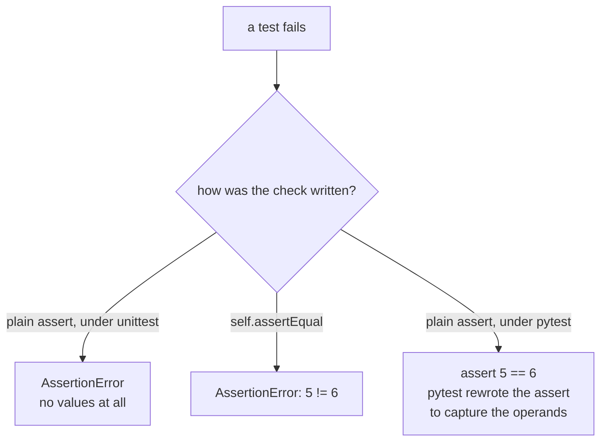

import DataCampExercise from "../../../../components/DataCampExercise.astro";
import Quiz from "../../../../components/Quiz.astro";

Automated tests check that your code does what you expect — and keep doing it as the code changes. Python ships **`unittest`** in the standard library, and the third-party **`pytest`** is the most popular framework in the ecosystem.

```python title="why_test.py"
def add(a, b):
    return a + b

# A test is just code that checks an assumption:
assert add(2, 3) == 5
assert add(-1, 1) == 0
print("all good")
```

## The idea: Arrange, Act, Assert

Most tests follow three steps:

1. **Arrange** — set up inputs and state.
2. **Act** — call the thing under test.
3. **Assert** — check the result matches what you expect.

## unittest (standard library)

`unittest` groups tests into classes that subclass `TestCase`. Each method named `test_*` is a test, and you check results with `assert*` methods.

```python title="unittest_basic.py"
import unittest

def add(a, b):
    return a + b

class TestAdd(unittest.TestCase):
    def test_positive(self):
        self.assertEqual(add(2, 3), 5)

    def test_negative(self):
        self.assertEqual(add(-1, -1), -2)

    def test_type(self):
        self.assertIsInstance(add(1, 2), int)

if __name__ == "__main__":
    unittest.main()
```

Run it from the terminal:

```bash title="terminal"
$ python -m unittest test_math.py
...
Ran 3 tests in 0.001s
OK
```

### Common assert methods

| Method | Passes when |
|:---|:---|
| `assertEqual(a, b)` | `a == b` |
| `assertNotEqual(a, b)` | `a != b` |
| `assertTrue(x)` / `assertFalse(x)` | `x` is truthy / falsy |
| `assertIsNone(x)` | `x is None` |
| `assertIn(a, b)` | `a in b` |
| `assertIsInstance(a, cls)` | `a` is an instance of `cls` |
| `assertRaises(Err)` | The block raises `Err` |

### setUp and tearDown

`setUp` runs before **each** test, `tearDown` after — great for shared fixtures.

```python title="setup_teardown.py"
import unittest

class TestList(unittest.TestCase):
    def setUp(self):
        self.data = [1, 2, 3]      # fresh for every test

    def test_append(self):
        self.data.append(4)
        self.assertEqual(self.data, [1, 2, 3, 4])

    def test_length(self):
        self.assertEqual(len(self.data), 3)
```

### Testing exceptions

```python title="unittest_raises.py"
import unittest

def divide(a, b):
    return a / b

class TestDivide(unittest.TestCase):
    def test_zero(self):
        with self.assertRaises(ZeroDivisionError):
            divide(1, 0)
```

## pytest (third-party)

`pytest` lets you write tests as **plain functions** using ordinary `assert`. Install it first:

```bash title="terminal"
$ pip install pytest
```

```python title="test_pytest.py"
# Functions named test_* are collected automatically.
def add(a, b):
    return a + b

def test_positive():
    assert add(2, 3) == 5

def test_negative():
    assert add(-1, 1) == 0
```

```bash title="terminal"
$ pytest
==== 2 passed in 0.01s ====
```

### Parametrize — one test, many cases

```python title="parametrize.py"
import pytest

def square(n):
    return n * n

@pytest.mark.parametrize("value,expected", [
    (2, 4),
    (3, 9),
    (-4, 16),
])
def test_square(value, expected):
    assert square(value) == expected
```

### Fixtures — reusable setup

```python title="fixtures.py"
import pytest

@pytest.fixture
def sample_data():
    return [1, 2, 3]

def test_sum(sample_data):       # the fixture is injected by name
    assert sum(sample_data) == 6
```

### Testing exceptions in pytest

```python title="pytest_raises.py"
import pytest

def divide(a, b):
    return a / b

def test_zero():
    with pytest.raises(ZeroDivisionError):
        divide(1, 0)
```

## unittest vs pytest

| | unittest | pytest |
|:---|:---|:---|
| Ships with Python | Yes | No (`pip install pytest`) |
| Test style | `TestCase` classes | Plain functions |
| Assertions | `self.assertEqual(...)` | plain `assert` |
| Fixtures | `setUp`/`tearDown` | `@pytest.fixture` |
| Parametrize | manual / subTest | `@pytest.mark.parametrize` |

> Both are excellent. `unittest` is always available; `pytest` is more concise and has a rich plugin ecosystem. Many projects write plain `assert` tests and run them with `pytest`.

## Common pitfalls

- **Test functions/methods must start with `test`** or the runner skips them.
- **Test one thing per test** — small, focused tests pinpoint failures.
- **Don't depend on test order** — each test should stand alone.
- **`assertEqual(a, b)` argument order** — convention is `(actual, expected)`.

## Practice Exercises

### Exercise 1 – Assert a function's result

<DataCampExercise
  lang="python"
  hint={`Compare add(2, 2) to 4 with ==.`}
  code={`# Task: Complete the assertion so it passes, then print "passed".
def add(a, b):
    return a + b

assert add(2, 2) == ___
print("passed")

# Expected Output:
# passed`}
  solution={`def add(a, b):
    return a + b

assert add(2, 2) == 4
print("passed")`}
  sct={`test_output_contains("passed")
success_msg("A passing assert lets execution continue to the print.")`}
  height={170}
/>

### Exercise 2 – assertEqual in a TestCase

<DataCampExercise
  lang="python"
  hint={`Use self.assertEqual(double(3), 6).`}
  code={`# Task: Fill in the expected value so the test passes.
import unittest

def double(n):
    return n * 2

class TestDouble(unittest.TestCase):
    def test_it(self):
        self.assertEqual(double(3), ___)

unittest.main(argv=["x"], exit=False)
print("done")

# Expected Output (ends with):
# done`}
  solution={`import unittest

def double(n):
    return n * 2

class TestDouble(unittest.TestCase):
    def test_it(self):
        self.assertEqual(double(3), 6)

unittest.main(argv=["x"], exit=False)
print("done")`}
  sct={`test_output_contains("done")
success_msg("assertEqual checks double(3) equals 6.")`}
  height={220}
/>

### Exercise 3 – Expect an exception

<DataCampExercise
  lang="python"
  hint={`Use a with self.assertRaises(ValueError) block around int("nope").`}
  code={`# Task: Assert that int("nope") raises a ValueError.
import unittest

class TestParse(unittest.TestCase):
    def test_bad(self):
        with self.___(ValueError):
            int("nope")

unittest.main(argv=["x"], exit=False)
print("done")

# Expected Output (ends with):
# done`}
  solution={`import unittest

class TestParse(unittest.TestCase):
    def test_bad(self):
        with self.assertRaises(ValueError):
            int("nope")

unittest.main(argv=["x"], exit=False)
print("done")`}
  sct={`test_output_contains("done")
success_msg("assertRaises confirms the code raises the expected error.")`}
  height={210}
/>

## The one difference you feel every day

Both frameworks find your tests and report failures. What differs is **how much the
failure tells you** before you have to go and look:



The same wrong function, three ways of checking it. Measured output:

```text title="unittest: plain assert"
FAIL: test_plain_assert_says_nothing
    assert add(2, 3) == 6
           ^^^^^^^^^^^^^^
AssertionError
```

```text title="unittest: assertEqual"
FAIL: test_assertEqual_says_what
    self.assertEqual(add(2, 3), 6)
AssertionError: 5 != 6
```

```text title="pytest: plain assert"
>       assert got == 6
        ^^^^^^^^^^^^^^^
E       assert 5 == 6
```

Under `unittest` a bare `assert` tells you only that something was false — which is why
it has forty-odd `assertXxx` methods. `pytest` rewrites the assertion at import time so
a plain `assert` reports the operands, and the `assertXxx` vocabulary becomes
unnecessary.

## Running the same check over many inputs

```python title="parametrize.py" showLineNumbers{1}
import pytest

@pytest.mark.parametrize("a,b,want", [(1, 1, 2), (2, 3, 5), (0, 0, 0), (-1, 1, 0)])
def test_add(a, b, want):
    assert add(a, b) == want
```

Four cases become **four separate tests**: the run reported `1 failed, 5 passed` from
three test functions, because `parametrize` expanded one of them into four. Each case
fails, reports, and is named independently.

The `unittest` equivalent is `subTest`, which keeps them inside one test but still
reports each case:

```python title="subtest.py" showLineNumbers{1}
def test_subtest(self):
    for a, b, want in [(1, 1, 2), (2, 3, 6), (0, 0, 0)]:
        with self.subTest(a=a, b=b):
            self.assertEqual(add(a, b), want)
```

```text title="the failure names the case"
FAIL: test_subtest (__main__.TestAdd.test_subtest) (a=2, b=3)
AssertionError: 5 != 6
```

:::caution[A plain loop hides everything after the first failure]
Without `subTest` or `parametrize`, the first failing case raises and the rest never
run. You fix it, re-run, and discover the next one — one round trip per bug.
:::

## See it move

Arrange, Act, Assert is not ceremony — it is what makes a failure readable. Step a test
through its phases and see what each framework prints when the assertion goes wrong.

```p5 title="Arrange, Act, Assert - and what the failure says" desc="Both frameworks run the same three phases. They differ in how much the failed assertion reports without extra work from you." height="340"
let framework = 0;   // 0 = pytest, 1 = unittest plain assert, 2 = unittest assertEqual
let phase = 0;
let t = 0;
let playing = true;

const PHASES = [
  { n: "Arrange", d: "build the inputs", c: [75, 139, 190] },
  { n: "Act", d: "call the thing under test", c: [255, 211, 67] },
  { n: "Assert", d: "compare against what you expect", c: [232, 110, 110] },
];
const OUT = [
  { label: "pytest, plain assert", msg: "assert 5 == 6", good: true },
  { label: "unittest, plain assert", msg: "AssertionError", good: false },
  { label: "unittest, assertEqual", msg: "AssertionError: 5 != 6", good: true },
];

function setup() {
  createCanvas(600, 340);
  textFont("monospace");
}

function draw() {
  background(13, 17, 23);
  if (playing) {
    t++;
    if (t % 45 === 0) phase = (phase + 1) % 3;
  }

  noStroke();
  fill(230);
  textSize(13);
  textAlign(LEFT, TOP);
  text("def test_add():", 24, 16);

  const lines = [
    "    a, b = 2, 3",
    "    got = add(a, b)",
    "    assert got == 6",
  ];
  for (let i = 0; i < 3; i++) {
    const y = 44 + i * 46;
    const on = i === phase;
    const c = PHASES[i].c;
    stroke(on ? color(c[0], c[1], c[2]) : color(40, 48, 58));
    strokeWeight(on ? 2 : 1);
    fill(on ? color(c[0] * 0.2, c[1] * 0.2, c[2] * 0.2) : color(17, 22, 29));
    rect(24, y, 400, 38, 4);
    noStroke();
    fill(on ? color(c[0], c[1], c[2]) : 110);
    textSize(12);
    textAlign(LEFT, CENTER);
    text(lines[i], 36, y + 19);
    fill(on ? 150 : 70);
    textSize(9);
    textAlign(RIGHT, CENTER);
    text(PHASES[i].n, 414, y + 19);
  }

  noStroke();
  fill(120);
  textSize(10);
  textAlign(LEFT, TOP);
  text(PHASES[phase].d, 24, 188);

  const o = OUT[framework];
  stroke(o.good ? color(120, 190, 130) : color(232, 110, 110));
  strokeWeight(1);
  fill(18, 23, 30);
  rect(24, 212, 460, 62, 5);
  noStroke();
  fill(110);
  textSize(10);
  textAlign(LEFT, TOP);
  text("what the failure prints - " + o.label, 38, 222);
  fill(o.good ? color(120, 190, 130) : color(232, 110, 110));
  textSize(15);
  textAlign(LEFT, CENTER);
  text(o.msg, 38, 254);

  if (!o.good) {
    fill(232, 110, 110);
    textSize(10);
    textAlign(RIGHT, CENTER);
    text("no values - go and debug", 470, 254);
  }

  drawBtn(24, 292, 250, "output: " + o.label);
  drawBtn(286, 292, 90, playing ? "pause" : "play");
}

function drawBtn(x, y, w, label) {
  const hot = mouseX > x && mouseX < x + w && mouseY > y && mouseY < y + 24;
  stroke(hot ? color(255, 211, 67) : color(60, 70, 84));
  strokeWeight(1);
  fill(hot ? color(34, 40, 50) : color(22, 28, 36));
  rect(x, y, w, 24, 4);
  noStroke();
  fill(hot ? color(255, 211, 67) : 200);
  textSize(11);
  textAlign(CENTER, CENTER);
  text(label, x + w / 2, y + 12);
}

function mousePressed() {
  if (mouseY < 292 || mouseY > 316) return;
  if (mouseX > 24 && mouseX < 274) framework = (framework + 1) % 3;
  if (mouseX > 286 && mouseX < 376) playing = !playing;
}
```

## Fixtures and setUp do the same job

```python title="fixture.py" showLineNumbers{1}
# pytest — a fixture is requested by naming it as a parameter
@pytest.fixture
def sample():
    return {"n": 3}

def test_fixture(sample):
    assert sample["n"] == 3
```

```python title="setup.py" showLineNumbers{1}
# unittest — setUp runs before every test method in the class
class TestAdd(unittest.TestCase):
    def setUp(self):
        self.sample = {"n": 3}
```

`setUp` runs before **every** method in the class whether that method needs it or not.
A pytest fixture runs only for tests that ask for it by name, and can be scoped to a
module or session so expensive setup happens once.

## Which to choose

| | `unittest` | `pytest` |
|:--|:--|:--|
| ships with Python | yes | no, `pip install pytest` |
| plain `assert` reports values | no | **yes** |
| many inputs | `subTest` | `@parametrize` |
| shared setup | `setUp` per class | fixtures, scoped |
| runs `unittest` tests | — | **yes, it runs both** |

`pytest` discovers and runs `unittest.TestCase` classes unchanged, so adopting it does
not mean rewriting anything. Use `unittest` when a third-party dependency is
unacceptable; otherwise `pytest` costs one install and gives better failure output from
the first run.

## Check yourself

<Quiz
  questions={[
    {
      q: "Under pytest, a plain `assert got == 6` fails and prints `assert 5 == 6`. How does pytest know the value of got?",
      options: [
        "it inspects local variables after the exception",
        "it rewrites assert statements at import time to capture the operands",
        "plain assert always reports operands in Python",
        "it re-runs the test with tracing enabled",
      ],
      answer: 1,
      explain:
        "pytest rewrites the bytecode of assert statements when it imports your test module. The same assert under unittest prints a bare AssertionError, which is why unittest needs assertEqual and friends.",
    },
    {
      q: "A test module has three test functions, one of which is parametrized with four cases. How many tests run?",
      options: [
        "3",
        "4",
        "6",
        "12",
      ],
      answer: 2,
      explain:
        "parametrize expands one function into four independent tests, so 2 + 4 = 6. The measured run reported '1 failed, 5 passed'. Each case is named and reported separately.",
    },
    {
      q: "Why loop over cases with self.subTest(...) rather than a plain for loop inside a unittest method?",
      options: [
        "a plain loop runs the cases in a random order",
        "subTest is faster",
        "without it the first failing case raises and the remaining cases never run",
        "a plain loop cannot use assertEqual",
      ],
      answer: 2,
      explain:
        "subTest reports each case independently and keeps going, naming the failure like '(a=2, b=3)'. A plain loop stops at the first failure, so you find bugs one re-run at a time.",
    },
    {
      q: "How does unittest's setUp differ from a pytest fixture?",
      options: [
        "setUp runs before every test method in the class; a fixture runs only for tests that request it and can be scoped",
        "setUp runs once per class, a fixture runs once per test",
        "they are identical in behaviour",
        "fixtures cannot return values",
      ],
      answer: 0,
      explain:
        "setUp is unconditional for the whole class. Fixtures are requested by name and support module or session scope, so expensive setup can be done once rather than per test.",
    },
  ]}
/>

## Summary

- Tests **arrange, act, assert** to lock in expected behaviour.
- **`unittest`** (built in) uses `TestCase` classes, `assert*` methods, and `setUp`/`tearDown`.
- **`pytest`** (install with pip) uses plain functions, bare `assert`, fixtures, and `@parametrize`.
- Test exceptions with `assertRaises` / `pytest.raises`.
- Keep tests small, independent, and named `test_*`.
