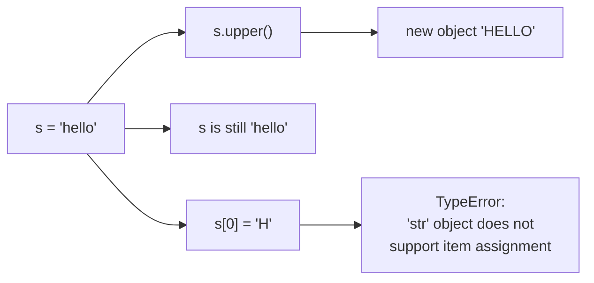

## Mastering Python Strings

A string is a sequence of characters enclosed in quotation marks. In Python, strings are ordered sequences of character data, and thus can be indexed in this way. You can access individual characters of a string using indexing and a range of characters using slicing. Strings are immutable data types, which means that once a string is created, you can't modify it.

In this tutorial, we'll learn everything about Python strings, from how to create and format strings to the different methods you can use to manipulate and work with string data.

## Creating Strings

In Python, you can create strings by enclosing a sequence of characters within a pair of single or double quotes. For example:

```python title="strings.py" showLineNumbers{1}
# Single word
print('hello')

# Entire phrase
print('This is also a string')

# We can also use double quote
print("String built with double quotes")
```

Output:

```cmd title="command" showLineNumbers{1} {2-4}
C:\Users\Your Name> python strings.py
hello
This is also a string
String built with double quotes
```

## String Type

In Python, string is an object of type `str` class. You can verify this with the `type()` function:

```python title="strings.py" showLineNumbers{1}
a = "Hello"
print(type(a))
```

Output:

```cmd title="command" showLineNumbers{1} {2}
C:\Users\Your Name> python strings.py
<class 'str'>
```

## Assign String to a Variable

Assigning a string to a variable is as simple as assigning a value to a variable. For example:

```python title="strings.py" showLineNumbers{1}
# You can use single or double quotes
a = "Hello" 
b = 'Hello'
print(a)
print(b)
```

Output:

```cmd title="command" showLineNumbers{1} {2-3}
C:\Users\Your Name> python strings.py
Hello
Hello
```

## Multiline Strings

In Python, you can assign a multiline string to a variable by using three quotes:

```python title="strings.py" showLineNumbers{1}
a = """Lorem ipsum dolor sit amet,
consectetur adipiscing elit,
sed do eiusmod tempor incididunt
ut labore et dolore magna aliqua."""

# You can also use three single quotes:
b = '''Lorem ipsum dolor sit amet,
consectetur adipiscing elit,
sed do eiusmod tempor incididunt
ut labore et dolore magna aliqua.'''

print(a)
print("------")
print(b)
```

Output:

```cmd title="command" showLineNumbers{1} {2-9}
C:\Users\Your Name> python strings.py
Lorem ipsum dolor sit amet,
consectetur adipiscing elit,
sed do eiusmod tempor incididunt
ut labore et dolore magna aliqua.
------
Lorem ipsum dolor sit amet,
consectetur adipiscing elit,
sed do eiusmod tempor incididunt
ut labore et dolore magna aliqua.
```

## Strings Arrays

In Python, strings are arrays of bytes representing Unicode characters. A string can be thought of as an array of characters. Like other programming languages, Python strings are indexed starting from 0. For example:

```python title="strings.py" showLineNumbers{1}
a = "Hello, World!"
print(a[1])
```

Output:

```cmd title="command" showLineNumbers{1} {2}
C:\Users\Your Name> python strings.py
e
```

## Length of a String

To get the length of a string, use the `len()` function:

```python title="strings.py" showLineNumbers{1}
a = "Hello, World!"
print(len(a))
```

Output:

```cmd title="command" showLineNumbers{1} {2}
C:\Users\Your Name> python strings.py
13
```

## Going through a String with a Loop

Strings are iterable objects, which means you can iterate through each character of the string using a `for` loop. For example:

```python title="strings.py" showLineNumbers{1}
for x in "cricket":
  print(x)
```

Output:

```cmd title="command" showLineNumbers{1} {2-8}
C:\Users\Your Name> python strings.py
c
r
i
c
k
e
t
```
:::note 
You can also use a `while` loop to iterate through a string.
```python title="strings.py" showLineNumbers{1}
i = 0
while i < len(a):
  print(a[i])
  i = i + 1
```
:::
:::tip
We are going to learn more about loops in the next tutorial. [Click here](/tutorials/python-control-statement/for-loop/) to learn more about loops.
:::

## Finding a String in a String

To check if a certain phrase or character is present in a string, we can use the keyword `in`.

```python title="strings.py" showLineNumbers{1}
txt = "Nothing is impossible, you need to believe"
print("impossible" in txt)
```

Output:

```cmd title="command" showLineNumbers{1} {2}
C:\Users\Your Name> python strings.py
True
```

## Not Finding a String in a String

To check if a certain phrase or character is not present in a string, we can use the keyword `not in`.

```python title="strings.py" showLineNumbers{1}
txt = "Nothing is impossible, you need to believe"
print("possible" not in txt)
```

Output:

```cmd title="command" showLineNumbers{1} {2}
C:\Users\Your Name> python strings.py
True
```

## Immutable means every method returns a new string

Nothing you call on a string changes it. The original is still there, untouched:



```python title="immutable.py" showLineNumbers{1}
s = "hello"
s.upper()        # 'HELLO'
print(s)         # 'hello'   <- unchanged; the result was discarded
s = s.upper()    # you must reassign

s[0] = "H"       # TypeError: 'str' object does not support item assignment
```

Forgetting to reassign is the single most common string bug — `s.strip()` on its own
line does nothing at all.

## Which is why `+=` in a loop is the wrong tool

Each `+=` builds a whole new string and copies everything so far. Measured, 20,000
characters:

| approach | time | vs `+=` |
|:--|--:|--:|
| `s += "x"` in a loop | 13.73 ms | 1.0× |
| `"".join(generator)` | 5.91 ms | **2.3× faster** |
| `"".join(list)` | 1.44 ms | **9.6× faster** |

```python title="building.py" showLineNumbers{1}
s = ""
for i in range(n):
    s += "x"                  # 13.73 ms — quadratic in disguise

s = "".join("x" for i in range(n))   #  5.91 ms
s = "".join(["x"] * n)               #  1.44 ms
```

`join` walks the pieces once to total their length, allocates the result a single time,
then copies each piece into place. The list form beats the generator form because
`join` can measure a list up front but must materialise a generator first.

:::note[Interning is not something to rely on]
`"hello" is "hello"` is `True` because the compiler folds identical literals into one
constant. The same string built at runtime is a different object:
`"hello world!" is "".join(["hello", " ", "world", "!"])` is **`False`**, though `==`
is `True`. Always compare strings with `==`.
:::

## See it move

`len` counts **code points**, not bytes and not what you would call characters. Click
through the samples and watch the three numbers come apart.

```p5 title="Length, bytes, and what the eye sees" desc="len counts code points. An emoji is one code point but four UTF-8 bytes, and an accented letter may be one code point or two depending on normal form." height="330"
let idx = 0;
const SAMPLES = [
  { t: "cafe",  show: "cafe",  len: 4, utf8: 4, note: "plain ascii: 1 char = 1 byte" },
  { t: "cafeA", show: "cafe\u00e9", len: 4, utf8: 5, note: "e-acute as ONE code point (NFC)" },
  { t: "cafeB", show: "cafe + combining", len: 5, utf8: 6, note: "e then a combining accent (NFD) - looks identical, len differs" },
  { t: "emoji", show: "one emoji", len: 1, utf8: 4, note: "1 code point, 4 UTF-8 bytes" },
];

function setup() {
  createCanvas(600, 330);
  textFont("monospace");
}

function draw() {
  background(13, 17, 23);
  const s = SAMPLES[idx];

  noStroke();
  fill(230);
  textSize(13);
  textAlign(LEFT, TOP);
  text("len(s)  vs  len(s.encode())", 24, 18);

  for (let i = 0; i < SAMPLES.length; i++) {
    const x = 24 + i * 140;
    const on = i === idx;
    stroke(on ? color(255, 211, 67) : color(48, 56, 68));
    strokeWeight(1);
    fill(on ? color(34, 40, 50) : color(20, 26, 34));
    rect(x, 46, 130, 30, 4);
    noStroke();
    fill(on ? color(255, 211, 67) : 140);
    textSize(11);
    textAlign(CENTER, CENTER);
    text(SAMPLES[i].show.length > 14 ? SAMPLES[i].show.slice(0, 13) + "." : SAMPLES[i].show, x + 65, 61);
  }

  // bars
  const rows = [
    { label: "len(s)  code points", v: s.len, c: [255, 211, 67] },
    { label: "len(s.encode())  utf-8 bytes", v: s.utf8, c: [75, 139, 190] },
  ];
  for (let i = 0; i < rows.length; i++) {
    const y = 110 + i * 62;
    noStroke();
    fill(150);
    textSize(11);
    textAlign(LEFT, TOP);
    text(rows[i].label, 24, y);
    const unit = 46;
    for (let k = 0; k < rows[i].v; k++) {
      stroke(rows[i].c[0], rows[i].c[1], rows[i].c[2]);
      strokeWeight(1);
      fill(rows[i].c[0] * 0.25, rows[i].c[1] * 0.25, rows[i].c[2] * 0.25);
      rect(24 + k * (unit + 6), y + 20, unit, 26, 3);
    }
    noStroke();
    fill(rows[i].c[0], rows[i].c[1], rows[i].c[2]);
    textSize(14);
    textAlign(LEFT, CENTER);
    text(rows[i].v, 24 + rows[i].v * (unit + 6) + 10, y + 33);
  }

  noStroke();
  fill(120, 190, 130);
  textSize(12);
  textAlign(LEFT, TOP);
  text(s.note, 24, 246);

  fill(120);
  textSize(11);
  text("two strings that LOOK the same can differ in length -", 24, 274);
  text("normalise with unicodedata.normalize('NFC', s) before comparing", 24, 292);
}

function mousePressed() {
  for (let i = 0; i < SAMPLES.length; i++) {
    const x = 24 + i * 140;
    if (mouseX > x && mouseX < x + 130 && mouseY > 46 && mouseY < 76) idx = i;
  }
}
```

Measured:

| string | `len` | UTF-8 bytes |
|:--|--:|--:|
| `"cafe"` | 4 | 4 |
| `"café"` written with U+00E9 | 4 | 5 |
| `"café"` written as `e` + combining accent | **5** | 6 |
| one emoji | 1 | 4 |

The two spellings of *café* print identically and compare **unequal**, because one is
five code points and the other four. Normalise before comparing text that came from
outside your program:

```python title="normalize.py" showLineNumbers{1}
import unicodedata
a = "caf\u00e9"        # NFC: e-acute as one code point
b = "cafe\u0301"       # NFD: e + combining acute
a == b                                          # False
unicodedata.normalize("NFC", b) == a            # True
```

## `strip` takes a set of characters, not a suffix

This is the string bug most likely to reach production, because the obvious test case
passes:

```python title="strip_trap.py" showLineNumbers{1}
"banana.txt".strip(".txt")      # 'banana'   <- looks right!
"text.txt".strip(".txt")        # 'e'        <- everything in ".txt" stripped from BOTH ends
"xxt.txt".strip(".txt")         # ''         <- the whole string is gone

"text.txt".removesuffix(".txt")  # 'text'    <- what you actually meant
```

`strip(".txt")` removes any of the characters `.`, `t`, `x` repeatedly from both ends.
`"banana.txt"` survives only because `b` is not in that set. Use `removesuffix` (3.9+)
or slice by length.

## Indexing raises, slicing does not

```python title="slicing.py" showLineNumbers{1}
s = "python"
s[2:4]     # 'th'
s[::-1]    # 'nohtyp'
s[99:]     # ''      <- no error
s[99]      # IndexError: string index out of range
```

And `in` tests for a **substring**, not a word: `"cat" in "concatenate"` is `True`. Use
`.find()` when you want a position and can tolerate absence — it returns `-1` rather
than raising, unlike `.index()`.

## Check yourself

<Quiz
  questions={[
    {
      q: "What does 'text.txt'.strip('.txt') return?",
      options: [
        "'text'",
        "'text.txt'",
        "'e'",
        "''",
      ],
      answer: 2,
      explain:
        "strip takes a SET of characters and removes any of '.', 't', 'x' from both ends repeatedly, leaving 'e'. Use removesuffix('.txt') to strip a suffix. 'banana.txt' happens to give the right answer, which is why the bug survives testing.",
    },
    {
      q: "Building a 20,000-character string took 13.73 ms with += in a loop and 1.44 ms with ''.join(list). Why is join faster?",
      options: [
        "join is written in C and += is not",
        "strings are immutable, so each += allocates a new string and copies everything so far",
        "join skips the loop entirely",
        "+= converts the string to a list internally",
      ],
      answer: 1,
      explain:
        "Each += builds a whole new string. join totals the lengths once, allocates the result a single time, and copies each piece in.",
    },
    {
      q: "Two strings both display as 'café' but compare unequal. What is the most likely reason?",
      options: [
        "one has trailing whitespace",
        "one uses a single code point for the accented e, the other uses e plus a combining accent",
        "one is bytes and the other is str",
        "string comparison is unreliable for non-ascii text",
      ],
      answer: 1,
      explain:
        "NFC spells it as 4 code points and NFD as 5. They render identically and are different strings. Normalise with unicodedata.normalize('NFC', s) before comparing.",
    },
    {
      q: "What is the result of s.upper() on its own line, where s = 'hello'?",
      options: [
        "s becomes 'HELLO'",
        "nothing observable: a new string is created and discarded, s is still 'hello'",
        "a TypeError, since strings are immutable",
        "s becomes 'HELLO' only if s is a local variable",
      ],
      answer: 1,
      explain:
        "Every string method returns a new string and leaves the original alone. You must write s = s.upper(). The same trap applies to strip, replace and lower.",
    },
  ]}
/>

## Conclusion
In this tutorial, we learned how to create strings, assign strings to variables, and access string characters using indexing and slicing. We also learned how to get the length of a string, iterate through a string using a loop, and check if a string contains a certain phrase or character. For more information on strings, check out the [official Python documentation](https://docs.python.org/3/library/stdtypes.html#text-sequence-type-str). For more tutorials, Visit Python Central Hub.
---

import DataCampExercise from "../../../../components/DataCampExercise.astro";
import Quiz from "../../../../components/Quiz.astro";

## Try it: String Exercises

### Exercise 1 – Create and Print a String

<DataCampExercise
  lang="python"
  hint={`Assign a string to a variable and print it.`}
  code={`# Task: Exercise 1 – Create and Print a String
# Follow the steps below and fill in the blanks.
# Use the 'Show Solution' button only after you have tried!

# Hint: print(value) displays output; print(a, b) prints multiple values.
# Step: Assign the correct value (a string) to 'greeting'.
greeting = ___  # replace ___ with the correct value
# Hint: Assign a string to a variable and print it.
# Step: Call print() with the right argument(s).
# Example structure: print(greeting)
print(___)  # replace ___ with the correct expression

# ── Expected Output ──────────────────────────────────────────
# (Run your completed code to check the output)
# ──────────────────────────────────────────────────────────────`}
  solution={`greeting = "Hello, Python!"
print(greeting)`}
  sct={`test_output_contains("Hello, Python!")
success_msg("String created and printed successfully!")`}
  height={120}
/>

### Exercise 2 – String Length

<DataCampExercise
  lang="python"
  hint={`Use len() to find the length of the string "Python".`}
  code={`# Task: Exercise 2 – String Length
# Follow the steps below and fill in the blanks.
# Use the 'Show Solution' button only after you have tried!

# Hint: print(value) displays output; print(a, b) prints multiple values.
# Step: Assign the correct value (a string) to 'word'.
word = ___  # replace ___ with the correct value
# Hint: Use len() to find the length of the string "Python".
# Step: Call print() with the right argument(s).
# Example structure: print("Length:", len(word))
print(___)  # replace ___ with the correct expression

# ── Expected Output ──────────────────────────────────────────
# (Run your completed code to check the output)
# ──────────────────────────────────────────────────────────────`}
  solution={`word = "Python"
print("Length:", len(word))`}
  sct={`test_output_contains("Length: 6")
success_msg("len() works on strings!")`}
  height={120}
/>

### Exercise 3 – String Indexing

<DataCampExercise
  lang="python"
  hint={`Access the first and last characters of "Python" using index 0 and -1.`}
  code={`# Task: Exercise 3 – String Indexing
# Follow the steps below and fill in the blanks.
# Use the 'Show Solution' button only after you have tried!

# Hint: print(value) displays output; print(a, b) prints multiple values.
# Step: Assign the correct value (a string) to 's'.
s = ___  # replace ___ with the correct value
# Hint: Access the first and last characters of "Python" using index 0 and -1.
# Step: Call print() with the right argument(s).
# Example structure: print("First:", s[0])
print(___)  # replace ___ with the correct expression
# Hint: Run after every change -- small steps are easier to debug!
# Step: Call print() with the right argument(s).
# Example structure: print("Last:", s[-1])
print(___)  # replace ___ with the correct expression

# ── Expected Output ──────────────────────────────────────────
# (Run your completed code to check the output)
# ──────────────────────────────────────────────────────────────`}
  solution={`s = "Python"
print("First:", s[0])
print("Last:", s[-1])`}
  sct={`test_output_contains("First: P")
test_output_contains("Last: n")
success_msg("String indexing works!")`}
  height={150}
/>
