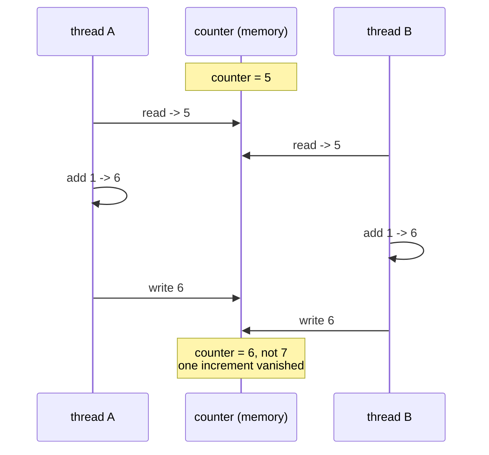

## What is synchronization?

**Synchronization** is how you coordinate multiple threads/processes so they:

- don’t corrupt shared data
- don’t run in the wrong order
- can safely communicate

## Why it matters

Without synchronization you can get:

- race conditions
- deadlocks
- inconsistent reads

## Common synchronization tools

### For threads (`threading`)

- `Lock`, `RLock`
- `Semaphore`, `BoundedSemaphore`
- `Event`
- `Condition`
- `Barrier`

### For processes (`multiprocessing`)

- `multiprocessing.Lock`, `RLock`
- `multiprocessing.Semaphore`
- `multiprocessing.Event`
- `multiprocessing.Condition`

## Design tip

Prefer designs that reduce shared mutable state:

- message passing via `queue.Queue` (threads)
- `multiprocessing.Queue` (processes)

When you must share state, use synchronization.


## Why `counter += 1` is three operations

A single statement compiles to a read, an add, and a write. A thread can be suspended
between any two of them, and when it resumes it writes back a value computed from stale
data:



Both threads did their work. One increment is gone, nothing raised, and the total is
simply wrong.

## The uncomfortable part: you probably cannot reproduce it

Four threads, 200,000 increments each, plain `counter += 1` on CPython 3.14.4:

| run | result | expected | lost |
|:--|--:|--:|--:|
| no lock, plain `+=` | 800,000 | 800,000 | **0** |
| no lock, widened read-modify-write, 1 µs switch interval | 480,000 | 480,000 | **0** |
| no lock, with an explicit yield between read and write | **4,000** | 16,000 | **12,000 (75%)** |
| with `threading.Lock` | 16,000 | 16,000 | 0 |

The first two rows are the important ones. The race is genuinely present in that code —
nothing about it is thread-safe — and it still lost **nothing** across 800,000
opportunities, because the gap between the read and the write is only a few bytecodes
wide and the interpreter rarely switches inside it.

Forcing a yield into that gap loses 75% immediately, and gives the same figure on
CPython 3.11.9, so this is not a quirk of one version.

:::danger[A test that passes proves nothing here]
This is why concurrency bugs reach production. They do not fail on your laptop, in CI,
or during review; they fail under load, on different hardware, at 3 a.m. Reason about
whether shared state is protected — do not conclude it is safe because a test passed.
:::

```python title="the_fix.py" showLineNumbers{1}
import threading

counter = 0
lock = threading.Lock()

def worker(n):
    global counter
    for _ in range(n):
        with lock:            # the whole read-modify-write is now indivisible
            counter += 1
```

## See it move

Step the two threads by hand and try to lose an increment. With the lock on, the second
thread cannot enter until the first has written back.

```p5 title="Losing an increment, one step at a time" desc="Each thread reads, adds, then writes. Without a lock the interleaving lets one thread overwrite the other's result. With a lock the sequence cannot be split." height="340"
let locked = false;
let shared = 5;
let performed = 0;
let owner = -1;
let A = { step: 0, reg: null };
let B = { step: 0, reg: null };

function setup() {
  createCanvas(600, 340);
  textFont("monospace");
}

function reset() {
  shared = 5; performed = 0; owner = -1;
  A = { step: 0, reg: null };
  B = { step: 0, reg: null };
}

function canStep(p, id) {
  if (!locked) return true;
  if (owner === -1) return true;
  return owner === id;
}

function step(p, id) {
  if (!canStep(p, id)) return;
  if (locked && owner === -1) owner = id;
  if (p.step === 0) { p.reg = shared; p.step = 1; }
  else if (p.step === 1) { p.reg = p.reg + 1; p.step = 2; }
  else {
    shared = p.reg;
    p.step = 0; p.reg = null;
    performed++;
    if (locked) owner = -1;
  }
}

function draw() {
  background(13, 17, 23);
  noStroke();
  fill(230);
  textSize(13);
  textAlign(LEFT, TOP);
  text("counter += 1   is   read / add / write", 24, 16);
  fill(locked ? color(120, 190, 130) : color(232, 110, 110));
  textSize(11);
  text(locked ? "Lock ON: a thread holds the lock for all three steps"
              : "Lock OFF: either thread may step at any time", 24, 36);

  drawThread("thread A", A, 0, 66);
  drawThread("thread B", B, 1, 150);

  stroke(48, 56, 68);
  strokeWeight(1);
  fill(20, 26, 34);
  rect(24, 232, 240, 44, 5);
  noStroke();
  fill(255, 211, 67);
  textSize(17);
  textAlign(LEFT, CENTER);
  text("counter = " + shared, 38, 254);

  const expected = 5 + performed;
  textSize(11);
  fill(150);
  textAlign(LEFT, TOP);
  text("writes completed: " + performed, 284, 238);
  if (shared === expected) {
    fill(120, 190, 130);
    text("expected " + expected + "  -  correct", 284, 258);
  } else {
    fill(232, 110, 110);
    text("expected " + expected + "  -  LOST " + (expected - shared), 284, 258);
  }

  drawBtn(24, 288, 110, "step A");
  drawBtn(144, 288, 110, "step B");
  drawBtn(264, 288, 130, locked ? "Lock: ON" : "Lock: OFF");
  drawBtn(404, 288, 90, "reset");
}

function drawThread(name, p, id, y) {
  const steps = ["read counter", "add 1", "write back"];
  const blocked = locked && owner !== -1 && owner !== id;
  noStroke();
  fill(150);
  textSize(11);
  textAlign(LEFT, TOP);
  text(name + "     register = " + (p.reg === null ? "-" : p.reg), 24, y);
  for (let i = 0; i < 3; i++) {
    const x = 24 + i * 132;
    const next = p.step === i;
    stroke(next && !blocked ? color(255, 211, 67) : color(48, 56, 68));
    strokeWeight(next && !blocked ? 2 : 1);
    fill(next && !blocked ? color(38, 34, 18) : color(18, 23, 30));
    rect(x, y + 20, 120, 32, 4);
    noStroke();
    fill(next && !blocked ? color(255, 211, 67) : 110);
    textSize(11);
    textAlign(CENTER, CENTER);
    text(steps[i], x + 60, y + 36);
  }
  if (blocked) {
    noStroke();
    fill(232, 110, 110);
    textSize(11);
    textAlign(LEFT, CENTER);
    text("blocked", 428, y + 36);
  }
}

function drawBtn(x, y, w, label) {
  const hot = mouseX > x && mouseX < x + w && mouseY > y && mouseY < y + 24;
  stroke(hot ? color(255, 211, 67) : color(60, 70, 84));
  strokeWeight(1);
  fill(hot ? color(34, 40, 50) : color(22, 28, 36));
  rect(x, y, w, 24, 4);
  noStroke();
  fill(hot ? color(255, 211, 67) : 200);
  textSize(11);
  textAlign(CENTER, CENTER);
  text(label, x + w / 2, y + 12);
}

function mousePressed() {
  if (mouseY < 288 || mouseY > 312) return;
  if (mouseX > 24 && mouseX < 134) step(A, 0);
  else if (mouseX > 144 && mouseX < 254) step(B, 1);
  else if (mouseX > 264 && mouseX < 394) { locked = !locked; reset(); }
  else if (mouseX > 404 && mouseX < 494) reset();
}
```

## The other primitives, measured

**`Lock` is not reentrant. `RLock` is.**

```python title="reentrant.py" showLineNumbers{1}
lk = threading.Lock()
lk.acquire()
lk.acquire(timeout=0.3)      # False — the SAME thread cannot acquire it twice
                             # without a timeout this deadlocks against itself

rl = threading.RLock()
rl.acquire()
rl.acquire(timeout=0.3)      # True — counts recursion, needs matching releases
```

A method that takes a lock and calls another method that takes the same lock will hang
on a plain `Lock`. That is the case `RLock` exists for.

**`Semaphore(n)` caps how many run at once.** 12 jobs of 0.20 s through
`Semaphore(3)`: measured **peak concurrency exactly 3**.

**`Event` releases every waiter at once**, not one:

```python title="event.py" showLineNumbers{1}
ev = threading.Event()
# four threads call ev.wait()
# before ev.set(): 0 released
ev.set()
# after  ev.set(): 4 released   <- all of them
```

Use an `Event` for "the configuration is loaded, everyone may proceed". Use a
`Semaphore` when you want to admit a fixed number at a time.

## Deadlock needs only two locks and two orders

```python title="deadlock.py" showLineNumbers{1}
def ab():
    with A:
        with B:  ...          # A then B

def ba():
    with B:
        with A:  ...          # B then A   <- opposite order
```

Measured with each thread guaranteed to be holding its first lock: the second acquire
**timed out**, which is what a deadlock looks like when you give it a deadline. Without
`timeout=`, both threads wait forever, consuming no CPU — a process that is perfectly
healthy by every metric and doing nothing at all.

:::note[The rule that prevents it]
Establish one global order for acquiring locks and follow it everywhere. If every thread
takes A before B, the cycle cannot form. Where that is impractical, use `timeout=` and
treat failure as a real error rather than retrying immediately.
:::

## Check yourself

<Quiz
  questions={[
    {
      q: "Four threads each ran counter += 1 200,000 times with no lock, and the total was exactly 800,000 with nothing lost. What should you conclude?",
      options: [
        "the code is thread-safe, since the result was correct",
        "the GIL makes += atomic, so no lock is needed",
        "the race exists but the window is too narrow to hit reliably; a passing run proves nothing",
        "the threads ran one after another rather than concurrently",
      ],
      answer: 2,
      explain:
        "Forcing a yield between the read and the write lost 75% immediately, on both 3.14 and 3.11. The unprotected version is unsafe whether or not a given run exposes it — which is why these bugs survive testing.",
    },
    {
      q: "A method holding a threading.Lock calls another method that acquires the same Lock. What happens?",
      options: [
        "it succeeds, since the same thread already owns it",
        "it blocks forever: a plain Lock is not reentrant",
        "it raises RuntimeError immediately",
        "the second acquire is ignored",
      ],
      answer: 1,
      explain:
        "Lock.acquire from the owning thread returns False with a timeout and blocks without one — the thread deadlocks against itself. RLock counts recursion and is the right tool here.",
    },
    {
      q: "Four threads are waiting on a threading.Event. What happens when one thread calls ev.set()?",
      options: [
        "one waiter is released, like a queue",
        "all four waiters are released",
        "the waiters are released one per subsequent set() call",
        "nothing until clear() is called",
      ],
      answer: 1,
      explain:
        "An Event is a broadcast flag: set() releases every waiter. Measured 0 released before set and 4 after. Use a Semaphore when you want to admit a fixed number.",
    },
    {
      q: "Thread 1 takes lock A then B; thread 2 takes B then A. What is the standard fix?",
      options: [
        "give both threads a shorter timeout",
        "replace both locks with RLock",
        "acquire the locks in the same global order everywhere",
        "run the threads at different priorities",
      ],
      answer: 2,
      explain:
        "A cycle in the wait graph is what causes the deadlock. One consistent ordering makes the cycle impossible. Timeouts detect the problem rather than preventing it.",
    },
  ]}
/>

## 🧪 Try It Yourself

### Exercise 1 – Basic Lock Usage

<DataCampExercise
  lang="python"
  hint={`Use \`lock.acquire()\` before and \`lock.release()\` after the critical section.`}
  code={`# Task: Exercise 1 – Basic Lock Usage
import threading

lock = threading.Lock()
counter = 0

def increment():
    global counter
    lock.___()          # replace ___ with acquire
    counter += 1
    lock.___()          # replace ___ with release

threads = [threading.Thread(target=increment) for _ in range(5)]
for t in threads: t.start()
for t in threads: t.join()
print("Counter:", counter)

# ── Expected Output ───────────────────────────────────────────
# Counter: 5
# ──────────────────────────────────────────────────────────────`}
  solution={`import threading

lock = threading.Lock()
counter = 0

def increment():
    global counter
    lock.acquire()
    counter += 1
    lock.release()

threads = [threading.Thread(target=increment) for _ in range(5)]
for t in threads: t.start()
for t in threads: t.join()
print("Counter:", counter)`}
  sct={`test_output_contains("Counter: 5")
success_msg("Lock prevents race conditions!")`}
  height={160}
/>

### Exercise 2 – Lock as Context Manager

<DataCampExercise
  lang="python"
  hint={`Use \`with lock:\` to automatically acquire and release.`}
  code={`# Task: Exercise 2 – Lock as Context Manager
import threading

lock = threading.Lock()
total = 0

def add(n):
    global total
    # Hint: use \`with lock:\` instead of acquire/release
    ___ lock:           # replace ___ with with
        total += n

threads = [threading.Thread(target=add, args=(i,)) for i in range(5)]
for t in threads: t.start()
for t in threads: t.join()
print("Total:", total)

# ── Expected Output ───────────────────────────────────────────
# Total: 10
# ──────────────────────────────────────────────────────────────`}
  solution={`import threading

lock = threading.Lock()
total = 0

def add(n):
    global total
    with lock:
        total += n

threads = [threading.Thread(target=add, args=(i,)) for i in range(5)]
for t in threads: t.start()
for t in threads: t.join()
print("Total:", total)`}
  sct={`test_output_contains("Total: 10")
success_msg("with lock: is cleaner and safer!")`}
  height={150}
/>

### Exercise 3 – Detect Locked State

<DataCampExercise
  lang="python"
  hint={`Use \`lock.locked()\` to check whether a lock is held.`}
  code={`# Task: Exercise 3 – Detect Locked State
import threading

lock = threading.Lock()

# Before acquiring
print("Locked before acquire:", lock.___())   # replace ___ with locked

with lock:
    print("Locked inside with:", lock.___())  # replace ___ with locked

print("Locked after release:", lock.___())    # replace ___ with locked

# ── Expected Output ───────────────────────────────────────────
# Locked before acquire: False
# Locked inside with: True
# Locked after release: False
# ──────────────────────────────────────────────────────────────`}
  solution={`import threading

lock = threading.Lock()
print("Locked before acquire:", lock.locked())
with lock:
    print("Locked inside with:", lock.locked())
print("Locked after release:", lock.locked())`}
  sct={`test_output_contains("False")
test_output_contains("True")
success_msg("locked() tells you the state!")`}
  height={150}
/>

