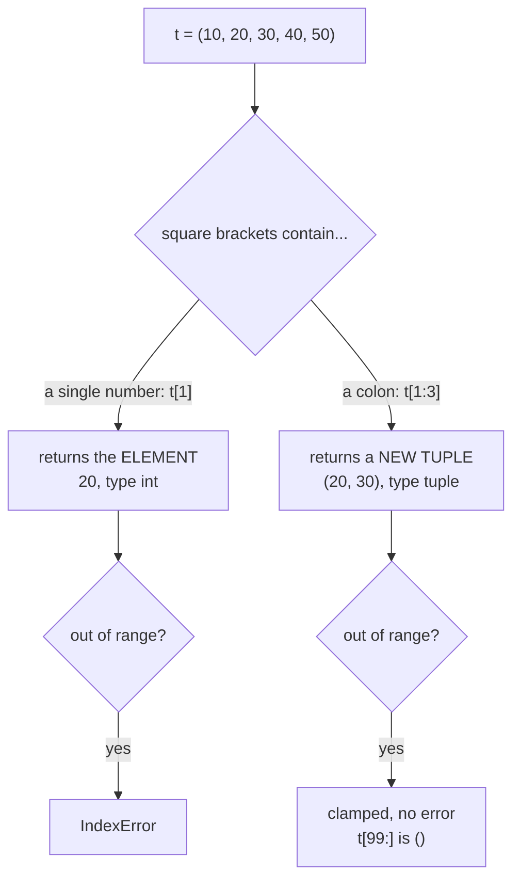

## Navigate Tuple Items: A Guide to Access the Tuple List
In Python, Tuple is an immutable sequence of elements. It means that once a tuple is created, we cannot change its values. We can access the tuple elements using the index number. We can also access the tuple elements using the negative index number. We can also access the tuple elements using the range of index numbers. We can also access the tuple elements using the range of negative index numbers.

## Basic of Tuple Indexing
In Python, we can access the tuple elements using the index number. The index number starts from 0. We can also access the tuple elements using the negative index number. The negative index number starts from -1. We can also access the tuple elements using the range of index numbers. We can also access the tuple elements using the range of negative index numbers.

## Access the Tuple Elements Using the Index Number
In Python, we can access the tuple elements using the index number. The index number starts from 0. We can access the tuple elements using the index number by using the following syntax.

```python title="tuple_index.py" showLineNumbers{1} {1-5}
data = ('a', 'b', 'c', 'd', 'e', 'f', 'g', 'h', 'i', 'j')
print(data[0])
print(data[1])
print(data[2])
print(data[3])
```

Output:

```cmd title="command" showLineNumbers{1} {2-5}
C:\Users\username>python tuple_index.py
a
b
c
d
```

In this example, we declare a tuple and assign it to the variable `data`. We then print the tuple elements using the index number. The output shows that the tuple elements are accessed using the index number.

## Access the Tuple Elements Using the Negative Index Number
In Python, we can access the tuple elements using the negative index number. The negative index number starts from -1. We can access the tuple elements using the negative index number by using the following syntax.

```python title="tuple_index.py" showLineNumbers{1} {1-5}
data = ('a', 'b', 'c', 'd', 'e', 'f', 'g', 'h', 'i', 'j')
print(data[-1])
print(data[-2])
print(data[-3])
print(data[-4])
```

Output:

```cmd title="command" showLineNumbers{1} {2-5}
C:\Users\username>python tuple_index.py
j
i
h
g
```

In this example, we declare a tuple and assign it to the variable `data`. We then print the tuple elements using the negative index number. The output shows that the tuple elements are accessed using the negative index number.

## Diagram of Tuple Indexing
The following diagram illustrates the indexing of a tuple with five elements:

```python title="tuple_indexing.py" showLineNumbers{1} {1,3-7}
my_list = ('a', 'b', 'c', 'd', 'e')
```

| Element | 'a' | 'b' | 'c' | 'd' | 'e' |
| --- | --- | --- | --- | --- | --- |
| Index | 0 | 1 | 2 | 3 | 4 |
| Index (Negative) | -5 | -4 | -3 | -2 | -1 |

## Accessing Multidimensional Tuples
In Python, Multidimensional Tuples are tuples that contain other tuples. We can access the tuple elements using the index number. We can also access the tuple elements using the negative index number. We can also access the tuple elements using the range of index numbers. We can also access the tuple elements using the range of negative index numbers.

Example:
```python title="multidimensional_tuple.py" showLineNumbers{1} {1-5}
data = (('a', 'b', 'c'), ('d', 'e', 'f'), ('g', 'h', 'i'))
print(data[0])
print(data[1])
print(data[2])
```

Output:

```cmd title="command" showLineNumbers{1} {2-4}
C:\Users\username>python multidimensional_tuple.py
('a', 'b', 'c')
('d', 'e', 'f')
('g', 'h', 'i')
```

In this example, we declare a multidimensional tuple and assign it to the variable `data`. We then print the tuple elements using the index number. The output shows that the tuple elements are accessed using the index number.

### Accessing Elements of Multidimensional Tuples
You can access the elements of a multidimensional tuple by using the index number. The index number starts from 0. We can also access the tuple elements using the negative index number. The negative index number starts from -1. We can also access the tuple elements using the range of index numbers. We can also access the tuple elements using the range of negative index numbers.

Example:
```python title="multidimensional_tuple.py" showLineNumbers{1} {1-5}
data = (('a', 'b', 'c'), ('d', 'e', 'f'), ('g', 'h', 'i'))
print(data[0][0])
print(data[1][1])
print(data[2][2])
```

Output:

```cmd title="command" showLineNumbers{1} {2-4}
C:\Users\username>python multidimensional_tuple.py
a
e
i
```

In this example, we declare a multidimensional tuple and assign it to the variable `data`. We then print the tuple elements using the index number. The output shows that the tuple elements are accessed using the index number.

### Diagram of Multidimensional List Indexing

|Index|0|1|2|
|---|---|---|---|
|0|'a'|'b'|'c'|
|1|'d'|'e'|'f'|
|2|'g'|'h'|'i'|

You can also use negative indices to access multidimensional lists. For example, the last element of the last list can be accessed using an index of -1 for the first dimension and an index of -1 for the second dimension.

|Index|-3|-2|-1|
|---|---|---|---|
|-3|'a'|'b'|'c'|
|-2|'d'|'e'|'f'|
|-1|'g'|'h'|'i'|

## Access the Tuple Elements Using the Range of Index Numbers
In Python, we can access the tuple elements using the range of index numbers. We can access the tuple elements using the range of index numbers by using the following syntax.

```python title="tuple_index.py" showLineNumbers{1} {1-5}
data = ('a', 'b', 'c', 'd', 'e', 'f', 'g', 'h', 'i', 'j')
print(data[0:4])
print(data[1:5])
print(data[2:6])
print(data[3:7])
```

Output:

```cmd title="command" showLineNumbers{1} {2-5}
C:\Users\username>python tuple_index.py
('a', 'b', 'c', 'd')
('b', 'c', 'd', 'e')
('c', 'd', 'e', 'f')
('d', 'e', 'f', 'g')
```

In this example, we declare a tuple and assign it to the variable `data`. We then print the tuple elements using the range of index numbers. The output shows that the tuple elements are accessed using the range of index numbers.

## Accessing tuple Slices
tuple slices are a way of accessing a subset of a tuple. In Python, tuple slices are created using the syntax `tuple[start:stop]`, where `start` is the index of the first element to include in the slice and `stop` is the index of the first element to exclude from the slice. If `start` is omitted, it defaults to 0, and if `stop` is omitted, it defaults to the length of the tuple.

**Syntax**:
```python title="syntax.py" showLineNumbers{1} {1,3-4}
tuple[start:stop]
```

### Access the Tuple Elements Using the Range of Negative Index Numbers
In Python, we can access the tuple elements using the range of negative index numbers. We can access the tuple elements using the range of negative index numbers by using the following syntax.

```python title="tuple_index.py" showLineNumbers{1} {1-5}
data = ('a', 'b', 'c', 'd', 'e', 'f', 'g', 'h', 'i', 'j')
print(data[-4:-1])
print(data[-5:-2])
print(data[-6:-3])
print(data[-7:-4])
```

Output:

```cmd title="command" showLineNumbers{1} {2-5}
C:\Users\username>python tuple_index.py
('g', 'h', 'i')
('f', 'g', 'h')
('e', 'f', 'g')
('d', 'e', 'f')
```

In this example, we declare a tuple and assign it to the variable `data`. We then print the tuple elements using the range of negative index numbers. The output shows that the tuple elements are accessed using the range of negative index numbers.

### Access the Tuple Elements Using the Range of Index Numbers and Negative Index Numbers
In Python, we can access the tuple elements using the range of index numbers and negative index numbers. We can access the tuple elements using the range of index numbers and negative index numbers by using the following syntax.

```python title="tuple_index.py" showLineNumbers{1} {1-5}
data = ('a', 'b', 'c', 'd', 'e', 'f', 'g', 'h', 'i', 'j')
print(data[0:-1])
print(data[1:-2])
print(data[2:-3])
print(data[3:-4])
```

Output:

```cmd title="command" showLineNumbers{1} {2-5}
C:\Users\username>python tuple_index.py
('a', 'b', 'c', 'd', 'e', 'f', 'g', 'h', 'i')
('b', 'c', 'd', 'e', 'f', 'g', 'h')
('c', 'd', 'e', 'f', 'g')
('d', 'e', 'f')
```

In this example, we declare a tuple and assign it to the variable `data`. We then print the tuple elements using the range of index numbers and negative index numbers. The output shows that the tuple elements are accessed using the range of index numbers and negative index numbers.

### Access the Tuple Elements Using Step
In Python, we can access the tuple elements using the range of negative index numbers and index numbers and step. We can access the tuple elements using the range of negative index numbers and index numbers and step by using the following syntax.

```python title="syntax.py" showLineNumbers{1} {1,3-4}
tuple[start:stop:step]
```

Example:
```python title="tuple_index.py" showLineNumbers{1} {1-5}
data = ('a', 'b', 'c', 'd', 'e', 'f', 'g', 'h', 'i', 'j')
print(data[0:-1:2])
print(data[1:-2:2])
print(data[2:-3:2])
print(data[3:-4:2])
```

Output:

```cmd title="command" showLineNumbers{1} {2-5}
C:\Users\username>python tuple_index.py
('a', 'c', 'e', 'g', 'i')
('b', 'd', 'f', 'h')
('c', 'e', 'g')
('d', 'f')
```

In this example, we declare a tuple and assign it to the variable `data`. We then print the tuple elements using the range of negative index numbers and index numbers and step. The output shows that the tuple elements are accessed using the range of negative index numbers and index numbers and step.

### Omitting the Start and Stop Indices
In Python, we can omit the start and stop indices. We can omit the start and stop indices by using the following syntax.

```python title="syntax.py" showLineNumbers{1} {1-2}
tuple[start:]
tuple[:stop]
```

Example:
```python title="tuple_index.py" showLineNumbers{1} {1-5}
data = ('a', 'b', 'c', 'd', 'e', 'f', 'g', 'h', 'i', 'j')
print(data[0:])
print(data[:5])
print(data[2:])
print(data[:7])
```

Output:

```cmd title="command" showLineNumbers{1} {2-5}
C:\Users\username>python tuple_index.py
('a', 'b', 'c', 'd', 'e', 'f', 'g', 'h', 'i', 'j')
('a', 'b', 'c', 'd', 'e')
('c', 'd', 'e', 'f', 'g', 'h', 'i', 'j')
('a', 'b', 'c', 'd', 'e', 'f', 'g')
```

In this example, we declare a tuple and assign it to the variable `data`. We then print the tuple elements using the range of negative index numbers and index numbers and step. The output shows that the tuple elements are accessed using the range of negative index numbers and index numbers and step.

In Slicing, when you omit the start index, it defaults to 0. When you omit the stop index, it defaults to the length of the tuple. 

`data[0:]` -> `data[0:len(data)]`
`data[:5]` -> `data[0:5]`
`data[2:]` -> `data[2:len(data)]`
`data[:7]` -> `data[0:7]`

### Omitting the Start and Stop Indices with Step
In Python, we can omit the start and stop indices with step. We can omit the start and stop indices with step by using the following syntax.

```python title="syntax.py" showLineNumbers{1} {1-2}
tuple[start::step]
tuple[:stop:step]
```

Example:
```python title="tuple_index.py" showLineNumbers{1} {1-5}
data = ('a', 'b', 'c', 'd', 'e', 'f', 'g', 'h', 'i', 'j')
print(data[0::2])
print(data[:5:2])
print(data[2::2])
print(data[:7:2])
```

Output:

```cmd title="command" showLineNumbers{1} {2-5}
C:\Users\username>python tuple_index.py
('a', 'c', 'e', 'g', 'i')
('a', 'c', 'e')
('c', 'e', 'g', 'i')
('a', 'c', 'e', 'g')
```

In this example, we declare a tuple and assign it to the variable `data`. We then print the tuple elements using the range of negative index numbers and index numbers and step. The output shows that the tuple elements are accessed using the range of negative index numbers and index numbers and step.

In Slicing, when you omit the start index, it defaults to 0. When you omit the stop index, it defaults to the length of the tuple.

`data[0::2]` -> `data[0:len(data):2]`
`data[:5:2]` -> `data[0:5:2]`
`data[2::2]` -> `data[2:len(data):2]`
`data[:7:2]` -> `data[0:7:2]`

### Omitting the Start and Stop Indices with Negative Step
In Python, we can omit the start and stop indices with negative step. We can omit the start and stop indices with negative step by using the following syntax.

```python title="syntax.py" showLineNumbers{1} {1-2}
tuple[start::-step]
tuple[:stop:-step]
```

Example:
```python title="tuple_index.py" showLineNumbers{1} {1-5}
data = ('a', 'b', 'c', 'd', 'e', 'f', 'g', 'h', 'i', 'j')
print(data[0::-2])
print(data[:5:-2])
print(data[2::-2])
print(data[:7:-2])
```

Output:

```cmd title="command" showLineNumbers{1} {2-5}
C:\Users\username>python tuple_index.py
('a',)
('j', 'h', 'f')
('c', 'a')
('j', 'h', 'f', 'd')
```

In this example, we declare a tuple and assign it to the variable `data`. We then print the tuple elements using the range of negative index numbers and index numbers and step. The output shows that the tuple elements are accessed using the range of negative index numbers and index numbers and step.

`data[0::-2]` -> `data[0: len(data): -2]`
`data[:5:-2]` -> `data[0:5: -2]`
`data[2::-2]` -> `data[2: len(data): -2]`
`data[:7:-2]` -> `data[0:7: -2]`

### Omitting the Both Indices
In Python, we can omit the both indices. We can omit the both indices by using the following syntax.

```python title="syntax.py" showLineNumbers{1} {1}
tuple[::step]
```

Example:
```python title="tuple_index.py" showLineNumbers{1} {1-5}
data = ('a', 'b', 'c', 'd', 'e', 'f', 'g', 'h', 'i', 'j')
print(data[::2])
print(data[::3])
print(data[::4])
print(data[::5])
```

Output:

```cmd title="command" showLineNumbers{1} {2-5}
C:\Users\username>python tuple_index.py
('a', 'c', 'e', 'g', 'i')
('a', 'd', 'g', 'j')
('a', 'e', 'i')
('a', 'f')
```

In this example, we declare a tuple and assign it to the variable `data`. We then print the tuple elements using the range of negative index numbers and index numbers and step. The output shows that the tuple elements are accessed using the range of negative index numbers and index numbers and step.

`data[::2]` -> `data[0: len(data): 2]`
`data[::3]` -> `data[0: len(data): 3]`
`data[::4]` -> `data[0: len(data): 4]`
`data[::5]` -> `data[0: len(data): 5]`

### Slicing with Negative Indices
In Python, we can slice with negative indices. We can slice with negative indices by using the following syntax.

```python title="syntax.py" showLineNumbers{1} {1}
tuple[start:stop:step]
```

Example:
```python title="tuple_index.py" showLineNumbers{1} {1-5}
data = ('a', 'b', 'c', 'd', 'e', 'f', 'g', 'h', 'i', 'j')
print(data[-1::-2])
print(data[-2::-2])
print(data[:-3:-2])
print(data[-4::-2])
```

Output:

```cmd title="command" showLineNumbers{1} {2-5}
C:\Users\username>python tuple_index.py
('j', 'h', 'f', 'd', 'b')
('i', 'g', 'e', 'c', 'a')
('j',)
('g', 'e', 'c', 'a')
```

In this example, we declare a tuple and assign it to the variable `data`. We then print the tuple elements using the range of negative index numbers and index numbers and step. The output shows that the tuple elements are accessed using the range of negative index numbers and index numbers and step.

`data[-1::-2]` -> `data[-1: len(data): -2]`
`data[-2::-2]` -> `data[-2: len(data): -2]`
`data[:-3:-2]` -> `data[0: -3: -2]`
`data[-4::-2]` -> `data[-4: len(data): -2]`

## Index or slice: two different operations

`t[1]` and `t[1:2]` look alike and behave nothing alike. One reaches **inside** the
tuple and hands you an element; the other builds a **new tuple**. Their failure modes
differ too — one raises, the other quietly returns empty.



```python title="index_vs_slice.py" showLineNumbers{1}
t = (10, 20, 30, 40, 50)

print(t[0], type(t[0]).__name__)       # 10 int
print(t[1:3], type(t[1:3]).__name__)   # (20, 30) tuple

print(t[99:])                          # ()  <- silent
t[99]                                  # IndexError: tuple index out of range
```

:::caution[A silent empty slice hides bugs]
An off-by-one in an index stops your program at the line that caused it. An
off-by-one in a slice hands you `()` and the failure appears somewhere else entirely.
If a slice must be non-empty, check its length.
:::

### Slicing a tuple does not copy it

```python title="no_copy.py" showLineNumbers{1}
t = (10, 20, 30)
print(t[:] is t)          # True   <- the very same object

nums = [10, 20, 30]
print(nums[:] is nums)    # False  <- a real copy
```

A tuple cannot change, so handing back the original is indistinguishable from handing
back a copy — and cheaper. A list *can* change, so `[:]` must build a new one. This is
why `t[:]` is not a way to "defensively copy" a tuple: there is nothing to defend
against, and you did not get a new object.

## See it move

Drag the `start` and `stop` handles. Watch which cells the slice selects, what happens
when a bound runs past the end, and how negative numbers count from the right.

```p5 title="Slicing a tuple" desc="Slice bounds are clamped to the tuple, never raise, and always return a tuple. Negative bounds count from the right end." height="300"
let vals = [10, 20, 30, 40, 50];
let startV = 1;
let stopV = 3;
let dragging = -1;

function setup() {
  createCanvas(600, 300);
  textFont("monospace");
}

function cellX(i) { return 70 + i * 82; }

function resolve(v) {
  let r = v < 0 ? vals.length + v : v;
  return max(0, min(vals.length, r));
}

function draw() {
  background(13, 17, 23);
  const lo = resolve(startV);
  const hi = resolve(stopV);

  noStroke();
  fill(230);
  textSize(14);
  textAlign(LEFT, TOP);
  text("t[" + startV + ":" + stopV + "]", 24, 20);

  for (let i = 0; i < vals.length; i++) {
    const x = cellX(i);
    const inSlice = i >= lo && i < hi;
    stroke(inSlice ? color(255, 211, 67) : color(48, 56, 68));
    strokeWeight(inSlice ? 2 : 1);
    fill(inSlice ? color(38, 34, 18) : color(20, 26, 34));
    rect(x, 110, 62, 52, 5);
    noStroke();
    fill(inSlice ? color(255, 211, 67) : 170);
    textSize(15);
    textAlign(CENTER, CENTER);
    text(vals[i], x + 31, 136);
    fill(100);
    textSize(10);
    textAlign(CENTER, TOP);
    text(i, x + 31, 168);
    fill(70);
    text(i - vals.length, x + 31, 182);
  }

  fill(120);
  textSize(10);
  textAlign(RIGHT, TOP);
  text("index", 62, 168);
  text("negative", 62, 182);

  drawHandle(lo, "start", 0);
  drawHandle(hi, "stop", 1);

  const picked = vals.slice(lo, hi);
  noStroke();
  textAlign(LEFT, CENTER);
  textSize(13);
  fill(120, 190, 130);
  const shown = picked.length === 1 ? "(" + picked[0] + ",)" : "(" + picked.join(", ") + ")";
  text("result  " + shown, 24, 232);
  fill(120);
  textSize(11);
  text("resolved to t[" + lo + ":" + hi + "]  ->  " + picked.length + " item(s), always a tuple", 24, 258);
  if (startV > vals.length || stopV > vals.length) {
    fill(232, 110, 110);
    text("a bound past the end is clamped, not an error", 24, 278);
  }
}

function drawHandle(pos, label, slot) {
  const x = 70 + pos * 82;
  stroke(75, 139, 190);
  strokeWeight(2);
  line(x, 96, x, 176);
  noStroke();
  fill(75, 139, 190);
  triangle(x - 6, 88, x + 6, 88, x, 96);
  textAlign(CENTER, BOTTOM);
  textSize(10);
  text(label, x, 86 - slot * 12);
}

function mousePressed() {
  if (mouseY < 88 || mouseY > 176) return;
  const ds = abs(mouseX - (70 + resolve(startV) * 82));
  const de = abs(mouseX - (70 + resolve(stopV) * 82));
  dragging = ds < de ? 0 : 1;
  mouseDragged();
}

function mouseDragged() {
  if (dragging < 0) return;
  const p = round((mouseX - 70) / 82);
  const c = max(0, min(vals.length, p));
  if (dragging === 0) startV = c; else stopV = c;
}

function mouseReleased() { dragging = -1; }
```

### Unpacking, and the one type surprise

```python title="unpacking.py" showLineNumbers{1}
t = (10, 20, 30, 40, 50)

a, b, c, d, e = t              # exact count required
first, *mid, last = t
print(first, mid, last)        # 10 [20, 30, 40] 50
print(type(mid).__name__)      # list   <- NOT a tuple

x, y = t                       # ValueError: too many values to unpack (expected 2, got 5)
```

The starred target always collects into a **list**, even when the source is a tuple.
If you need a tuple back, wrap it: `tuple(mid)`.

### Immutable container, mutable contents

```python title="nested.py" showLineNumbers{1}
nest = (1, [2, 3], 4)
nest[1].append(99)
print(nest)              # (1, [2, 3, 99], 4)   <- allowed

nest[0] = 5              # TypeError: 'tuple' object does not support item assignment
hash((1, [2], 3))        # TypeError: unhashable type: 'list'
```

The tuple stores *references*. It refuses to swap one for another, but it has no say
over what those objects do internally. That is also why the tuple stops being hashable
the moment it contains a list — so it cannot be a dict key.

A tuple has exactly two methods, `count` and `index`. Everything else on a list is a
mutator, and a tuple has nothing to mutate.

## Check yourself

<Quiz
  questions={[
    {
      q: "For a tuple t, what is t[:] is t?",
      options: [
        "False, because slicing always builds a new object",
        "True, because a tuple cannot change so returning the original is safe",
        "True only when the tuple is empty",
        "it raises, because a bare colon is not a valid slice",
      ],
      answer: 1,
      explain:
        "Slicing a whole tuple returns the same object. For a list, nums[:] is nums is False, because a list can be mutated and so a real copy is required.",
    },
    {
      q: "t = (10, 20, 30). What do t[99] and t[99:] do?",
      options: [
        "both raise IndexError",
        "both return an empty tuple",
        "t[99] raises IndexError, t[99:] returns () with no error",
        "t[99] returns None, t[99:] raises IndexError",
      ],
      answer: 2,
      explain:
        "Indexing must produce an element, so an out-of-range index raises. Slicing clamps its bounds to the sequence and quietly yields an empty tuple.",
    },
    {
      q: "After first, *mid, last = (10, 20, 30, 40, 50), what is type(mid)?",
      options: [
        "tuple",
        "list",
        "slice",
        "generator",
      ],
      answer: 1,
      explain:
        "A starred assignment target always collects into a list, whatever the source type. mid is [20, 30, 40]. Use tuple(mid) if you need a tuple.",
    },
    {
      q: "nest = (1, [2, 3], 4). Which statement succeeds?",
      options: [
        "nest[0] = 5",
        "nest[1].append(99)",
        "hash(nest)",
        "none of them, since a tuple is immutable",
      ],
      answer: 1,
      explain:
        "The tuple holds a reference to the list and cannot stop the list from changing itself, so append works. Rebinding nest[0] raises TypeError, and hash(nest) raises because the list inside is unhashable.",
    },
  ]}
/>

## Conclusion
In this tutorial, we learned how to access the tuple in Python. We learned how to access the tuple elements using the index number. We learned how to access the tuple elements using the negative index number. We learned how to access the tuple elements using the range of index numbers. We learned how to access the tuple elements using the range of negative index numbers. For more information on tuples, visit the [Python Tuple](https://docs.python.org/3/tutorial/datastructures.html#tuples-and-sequences) documentation page.

---

## Try it: Access Tuple Exercises

### Exercise 1 – Index Access

<DataCampExercise
  lang="python"
  hint={`Use index to access the first and last items.`}
  code={`# Task: Exercise 1 – Index Access
# Follow the steps below and fill in the blanks.
# Use the 'Show Solution' button only after you have tried!

# Hint: print(value) displays output; print(a, b) prints multiple values.
# Step: Assign the correct value (a tuple or function call) to 'nums'.
nums = ___  # replace ___ with the correct value
# Hint: Use index to access the first and last items.
# Step: Call print() with the right argument(s).
# Example structure: print(nums[0])
print(___)  # replace ___ with the correct expression
# Hint: Run after every change -- small steps are easier to debug!
# Step: Call print() with the right argument(s).
# Example structure: print(nums[-1])
print(___)  # replace ___ with the correct expression

# ── Expected Output ──────────────────────────────────────────
# (Run your completed code to check the output)
# ──────────────────────────────────────────────────────────────`}
  solution={`nums = (10, 20, 30, 40, 50)
print(nums[0])
print(nums[-1])`}
  sct={`test_output_contains("10")
test_output_contains("50")
success_msg("Tuple index access works!")`}
  height={140}
/>

### Exercise 2 – Tuple Slicing

<DataCampExercise
  lang="python"
  hint={`Use [1:4] to get elements from index 1 to 3.`}
  code={`# Task: Exercise 2 – Tuple Slicing
# Follow the steps below and fill in the blanks.
# Use the 'Show Solution' button only after you have tried!

# Hint: print(value) displays output; print(a, b) prints multiple values.
# Step: Assign the correct value (a tuple or function call) to 't'.
t = ___  # replace ___ with the correct value
# Hint: Use [1:4] to get elements from index 1 to 3.
# Step: Call print() with the right argument(s).
# Example structure: print(t[1:4])
print(___)  # replace ___ with the correct expression

# ── Expected Output ──────────────────────────────────────────
# (Run your completed code to check the output)
# ──────────────────────────────────────────────────────────────`}
  solution={`t = (0, 10, 20, 30, 40, 50)
print(t[1:4])`}
  sct={`test_output_contains("10, 20, 30")
success_msg("Tuple slicing works!")`}
  height={120}
/>

### Exercise 3 – Nested Tuple Access

<DataCampExercise
  lang="python"
  hint={`Access nested tuple item using double indexing t[1][0].`}
  code={`# Task: Exercise 3 – Nested Tuple Access
# Follow the steps below and fill in the blanks.
# Use the 'Show Solution' button only after you have tried!

# Hint: print(value) displays output; print(a, b) prints multiple values.
# Step: Assign the correct value (a tuple or function call) to 'nested'.
nested = ___  # replace ___ with the correct value
# Hint: Access nested tuple item using double indexing t[1][0].
# Step: Call print() with the right argument(s).
# Example structure: print(nested[1][0])
print(___)  # replace ___ with the correct expression

# ── Expected Output ──────────────────────────────────────────
# (Run your completed code to check the output)
# ──────────────────────────────────────────────────────────────`}
  solution={`nested = ((1, 2), (3, 4), (5, 6))
print(nested[1][0])`}
  sct={`test_output_contains("3")
success_msg("Nested tuple access works!")`}
  height={120}
/>

