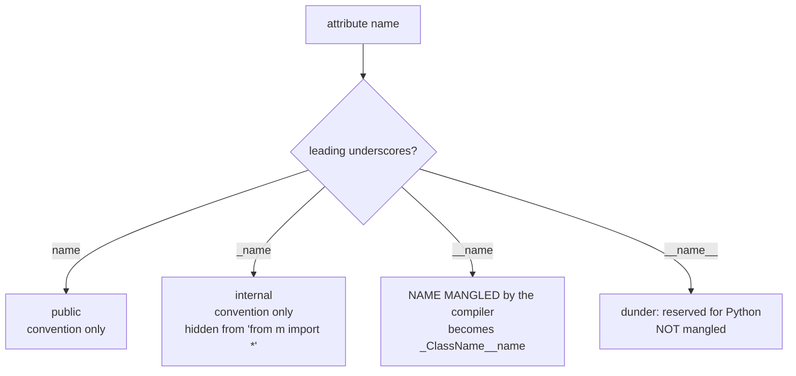

## Variable Naming Conventions
A variable can have a short name (like `x` and `y`) or a more descriptive name (like `age`, `carname`, `total_volume`). Rules for Python variables:
- A variable name must start with a letter or the underscore character
- A variable name cannot start with a number
- A variable name can only contain alpha-numeric characters and underscores (A-z, 0-9, and _ )
- Variable names are case-sensitive (age, Age and AGE are three different variables)
- The reserved words (keywords) cannot be used naming the variable
- Variable names should be short but descriptive
- Use of underscores (`_`) is recommended to improve readability
- Avoid using special characters like `!`, `@`, `#`, `$`, `%`, etc. in variable names
- Avoid using built-in function names as variable names
- Avoid using single characters like `l`, `O`, `I`, etc. as variable names
- Avoid using words with double meaning like `list`, `str`, `dict`, etc. as variable names
- Avoid using words with different spellings like `colour` and `color`, `centre` and `center` , etc. as variable names

#### Example:
```python title="variable.py" showLineNumbers{1} {2,3,4,5,6,7,8,9}
# Valid variable names
name = "John"
my_name = "John"
_my_name = "John"
myName = "John"
MYNAME = "John"
myname = "John"
myName2 = "John"
my2name = "John"
```

:::caution
Python is a case-sensitive language. This means that `my_name` and `myName` are two different variables.
:::

:::caution
Don't use long variable names. Use short names instead. This improves readability and reduces the amount of typing.
```python title="variable.py" showLineNumbers{1} {2,3,4,5,6,7,8,9}
# Don't recommend
my_name_is_john_and_i_am_20_years_old = "John"
```
:::

:::danger
You cannot use Python keywords as variable names. Keywords are the reserved words in Python. They are used to define the syntax and structure of the Python language. You can't use them as variable names.
```python title="variable.py" showLineNumbers{1} {2,3,5,6,7,8}
# Invalid variable names
class = "John"
for = "John"
# Some other Invalid variable names
2myname = "John"
my-name = "John"
my name = "John"
```
:::

## Constant Naming Conventions
Constants are usually declared and assigned in a module. Python does not have built-in constant types, but Python programmers use all capital letters to indicate a variable should be treated as a constant and never be changed after it is initialized.

#### Example:
```python title="constant.py" showLineNumbers{1} {2,3,4}
# Valid constant names
PI = 3.14
GRAVITY = 9.8
PLANET = "Earth"
```

## Function Naming Conventions
Function names should be lowercase, with words separated by underscores as necessary to improve readability. Mixed case is allowed only in contexts where that's already the prevailing style (e.g. `threading.py`), to retain backwards compatibility.

#### Example:
```python title="function.py" showLineNumbers{1} {2,3,5,6}
# Valid function names
def my_function():
    pass

def myFunction():
    pass
```

## Class Naming Conventions
Class names should normally use the CapWords convention.

#### Example:
```python title="class.py" showLineNumbers{1} {2,3,4}
# Valid class names
class MyClass:
    pass
```

## Naming Convention Standards
Python has a set of naming conventions for different types of identifiers. These conventions are defined in PEP 8 -- Style Guide for Python Code, which is the style guide that most Python projects follow.

There are different naming styles for different types of identifiers. The following table summarizes the naming conventions for different types of identifiers:
### Camel Case
Starts each word with a capital letter except the first word. For example: `firstName`, `lastName`, `getFirstName()`, `setFirstName()`, etc.
```python title="variable.py" showLineNumbers{1} {2,3,4,5,6,7} 
# Camel Case
firstName = "John"
lastName = "Doe"
def getFirstName():
    pass
def setFirstName():
    pass
```
### Pascal Case
Starts each word with a capital letter. For example: `FirstName`, `LastName`, `GetFirstName()`, `SetFirstName()`, etc.
```python title="variable.py" showLineNumbers{1} {2,3,4,5,6,7} 
# Pascal Case
FirstName = "John"
LastName = "Doe"
def GetFirstName():
    pass
def SetFirstName():
    pass
```

### Snake Case
Uses underscores (`_`) between words. For example: `first_name`, `last_name`, `get_first_name()`, `set_first_name()`, etc.
```python title="variable.py" showLineNumbers{1} {2,3,4,5,6,7} 
# Snake Case
first_name = "John"
last_name = "Doe"
def get_first_name():
    pass
def set_first_name():
    pass
```

## Which Style Does Python Use?

The three styles above all *run*, but Python's official style guide (**PEP 8**) assigns a specific style to each kind of identifier. Following it makes your code look like everyone else's Python.

| Identifier | Convention | Example |
| :--- | :--- | :--- |
| Variable | `snake_case` | `user_age`, `total_price` |
| Function | `snake_case` | `get_user()`, `calc_total()` |
| Constant | `UPPER_SNAKE_CASE` | `MAX_SIZE`, `PI` |
| Class | `PascalCase` (CapWords) | `BankAccount`, `UserProfile` |
| Module / file | short `lowercase` | `utils.py`, `data_loader.py` |

:::tip
**`camelCase` is *not* idiomatic Python** even though it works. Use `snake_case` for variables and functions — reserve `PascalCase` for classes.
:::

## Underscore Conventions

The underscore carries special meaning in several naming patterns:

| Pattern | Meaning |
| :--- | :--- |
| `_name` | "Internal use" hint — a weak private signal to other developers. |
| `name_` | Trailing underscore to avoid clashing with a keyword, e.g. `class_`, `type_`. |
| `__name` | Name mangling inside a class — Python rewrites it to avoid subclass clashes. |
| `__name__` | "Dunder" (double underscore) — reserved for Python, e.g. `__init__`, `__name__`. |
| `_` | A throwaway variable for values you intend to ignore: `for _ in range(3):`. |

```python title="underscores.py" showLineNumbers{1} {1-3}
_internal = "use within this module"
class_ = "Biology 101"     # avoids the 'class' keyword
for _ in range(3):         # loop counter is unused
    print("hi")
```

:::note
For the full rules, see [PEP 8 — Style Guide for Python Code](https://peps.python.org/pep-0008/).
:::

---

import DataCampExercise from "../../../../components/DataCampExercise.astro";
import Quiz from "../../../../components/Quiz.astro";

## Underscores are a language feature, not only a style

Three of the four underscore conventions are pure convention. One of them changes what
the compiler does:



```python title="mangling.py" showLineNumbers{1}
class C:
    def __init__(self):
        self.public = 1
        self._internal = 2
        self.__private = 3

c = C()
print(list(vars(c)))     # ['public', '_internal', '_C__private']
c.__private              # AttributeError
c._C__private            # 3
```

The attribute was **renamed at compile time** to `_C__private`. This is not access
control — the value is trivially reachable — it is collision avoidance, so a subclass
defining its own `__private` cannot clobber the parent's.

:::caution[Two underscores is rarely what you want]
Use a single `_name` to mean "internal, do not rely on this". Reserve `__name` for the
specific case where a subclass might reasonably choose the same attribute name and you
need both to survive. Mangling also makes debugging and testing harder.
:::

## Reserved, soft-reserved, and merely conventional

```python title="keywords.py" showLineNumbers{1}
import keyword

len(keyword.kwlist)              # 35 hard keywords: def, class, if, ...
keyword.softkwlist               # ['_', 'case', 'match', 'type']
keyword.iskeyword("match")       # False  <- a SOFT keyword; usable as a name
keyword.iskeyword("def")         # True   <- `def = 1` is a SyntaxError
```

There are **35** hard keywords you cannot use as names, and four **soft** keywords that
are only special in context — `match` and `case` are ordinary identifiers everywhere
else, which is how `match` could be added without breaking existing code.

## See it move

Type-check a name against the rules Python actually enforces, and the ones PEP 8 merely
recommends. Click a name to see which of each it satisfies.

```p5 title="What Python enforces, and what PEP 8 suggests" desc="Only two rules are enforced by the language: the character set and the keyword list. Everything about casing is convention that tools check, not the interpreter." height="340"
let idx = 0;
const NAMES = [
  { n: "user_count",  legal: true,  style: true,  why: "snake_case: the PEP 8 style for variables and functions" },
  { n: "userCount",   legal: true,  style: false, why: "legal, but camelCase is not the Python convention" },
  { n: "MAX_SIZE",    legal: true,  style: true,  why: "ALL_CAPS: the convention for constants" },
  { n: "_internal",   legal: true,  style: true,  why: "single underscore: internal, hidden from import *" },
  { n: "__private",   legal: true,  style: true,  why: "inside a class this is MANGLED to _Class__private" },
  { n: "2nd_place",   legal: false, style: false, why: "SyntaxError: a name cannot start with a digit" },
  { n: "class",       legal: false, style: false, why: "SyntaxError: one of the 35 reserved keywords" },
  { n: "match",       legal: true,  style: true,  why: "a SOFT keyword: special only in a match statement" },
  { n: "list",        legal: true,  style: false, why: "legal, but shadows a builtin - a silent trap" },
];

function setup() {
  createCanvas(600, 340);
  textFont("monospace");
}

function draw() {
  background(13, 17, 23);
  const it = NAMES[idx];

  noStroke();
  fill(230);
  textSize(13);
  textAlign(LEFT, TOP);
  text("is this a valid Python name?", 24, 16);
  fill(120);
  textSize(11);
  text("click a name", 24, 36);

  for (let i = 0; i < NAMES.length; i++) {
    const y = 62 + i * 25;
    const on = i === idx;
    stroke(on ? color(255, 211, 67) : color(40, 48, 58));
    strokeWeight(1);
    fill(on ? color(28, 34, 44) : color(17, 22, 29));
    rect(24, y, 170, 22, 3);
    noStroke();
    fill(on ? color(255, 211, 67) : 140);
    textSize(12);
    textAlign(LEFT, CENTER);
    text(NAMES[i].n, 34, y + 11);
  }

  const bx = 224;
  card(bx, 66, "the interpreter accepts it", it.legal,
       it.legal ? "runs" : "SyntaxError");
  card(bx, 152, "PEP 8 is happy with it", it.style,
       it.style ? "idiomatic" : "legal but discouraged");

  noStroke();
  fill(180);
  textSize(11);
  textAlign(LEFT, TOP);
  const words = it.why.split(" ");
  let line = "", ly = 244;
  for (const w of words) {
    if ((line + w).length > 44) { text(line, bx, ly); ly += 16; line = ""; }
    line += w + " ";
  }
  text(line, bx, ly);

  fill(90);
  textSize(10);
  text("only two rules are enforced: the character set,", 24, 276);
  text("and the 35 reserved keywords. casing is convention.", 24, 292);
}

function card(x, y, label, good, verdict) {
  const c = good ? color(120, 190, 130) : color(232, 110, 110);
  stroke(c);
  strokeWeight(1);
  fill(20, 26, 34);
  rect(x, y, 340, 66, 5);
  noStroke();
  fill(110);
  textSize(10);
  textAlign(LEFT, TOP);
  text(label, x + 14, y + 10);
  fill(c);
  textSize(16);
  textAlign(LEFT, CENTER);
  text((good ? "yes" : "no") + "   " + verdict, x + 14, y + 42);
}

function mousePressed() {
  for (let i = 0; i < NAMES.length; i++) {
    const y = 62 + i * 25;
    if (mouseX > 24 && mouseX < 194 && mouseY > y && mouseY < y + 22) idx = i;
  }
}
```

## Identifiers are normalised before they are compared

This one surprises almost everyone. Python applies **NFKC normalisation** to
identifiers, so two different sequences of characters can be the *same name*:

```python title="nfkc.py" showLineNumbers{1}
import unicodedata
unicodedata.normalize("NFKC", "\ufb01")     # 'fi'  — the ligature becomes two letters

# a name written with U+FB01 (the 'fi' ligature) is reachable as plain ascii 'fi'
```

A variable written with the typographic ligature `fi` and one written `fi` are the same
variable. Not every lookalike normalises, though — the dotless `ı` (U+0131) stays
distinct from `i`.

:::caution[Why this matters for code review]
Two identifiers can render identically in your editor and be different names, or render
differently and be the same name. Any project accepting outside contributions should
restrict identifiers to ASCII — most linters have a rule for it.
:::

## The conventions worth following

| kind | convention | example |
|:--|:--|:--|
| variable, function | `lower_snake_case` | `user_count`, `parse_row` |
| constant | `UPPER_SNAKE_CASE` | `MAX_RETRIES` |
| class | `CapWords` | `HttpClient` |
| internal | `_leading_underscore` | `_cache` |
| avoid a keyword clash | `trailing_underscore_` | `class_`, `id_` |
| module | short `lowercase` | `utils`, `http` |

Note the last row of the previous section: shadowing a builtin such as `list`, `id`,
`type` or `sum` is perfectly legal and never warns. `class_` with a trailing underscore
is the documented way to name something that would otherwise collide.

## Check yourself

<Quiz
  questions={[
    {
      q: "Inside class C, you assign self.__private = 3. What key appears in vars(instance)?",
      options: [
        "__private",
        "_private",
        "_C__private",
        "private",
      ],
      answer: 2,
      explain:
        "The compiler mangles a double-underscore name to _ClassName__name. It exists to stop a subclass accidentally reusing the same attribute name, not to enforce privacy — _C__private is readable by anyone.",
    },
    {
      q: "Which of these is a SOFT keyword, meaning it is reserved only in certain positions?",
      options: [
        "class",
        "match",
        "return",
        "lambda",
      ],
      answer: 1,
      explain:
        "match, case, type and _ are soft keywords: special inside a match statement and ordinary identifiers elsewhere. That is how match could be added without breaking code that used it as a variable.",
    },
    {
      q: "A contributor submits code where a name is written with the typographic ligature for 'fi'. What does Python do?",
      options: [
        "rejects it with a SyntaxError",
        "treats it as a distinct identifier from the ascii spelling",
        "normalises identifiers with NFKC, so it is the SAME name as the ascii spelling",
        "accepts it only inside string literals",
      ],
      answer: 2,
      explain:
        "Identifiers are NFKC-normalised, so the ligature becomes 'fi'. Two names can look different and be identical — a reason to restrict identifiers to ASCII in projects taking outside contributions.",
    },
    {
      q: "Which naming rule does the interpreter actually enforce?",
      options: [
        "constants must be written in ALL_CAPS",
        "classes must use CapWords",
        "a name may not start with a digit and may not be one of the 35 reserved keywords",
        "functions must use snake_case",
      ],
      answer: 2,
      explain:
        "Only the character set and the keyword list are enforced. Every casing rule is PEP 8 convention, checked by linters rather than by the interpreter.",
    },
  ]}
/>

## Try it: Naming Convention Exercises

### Exercise 1 – Valid Variable Names

<DataCampExercise
  lang="python"
  hint={`Use snake_case for variable names. Underscores and letters are valid starters.`}
  code={`# Task: Exercise 1 – Valid Variable Names
# Follow the steps below and fill in the blanks.
# Use the 'Show Solution' button only after you have tried!

# Hint: print(value) displays output; print(a, b) prints multiple values.
# Step: Assign the correct value (a string) to 'my_name'.
my_name = ___  # replace ___ with the correct value
# Hint: Use snake_case for variable names. Underscores and letters are valid starters.
# Step: Assign the correct value (a number) to 'user_age'.
user_age = ___  # replace ___ with the correct value
# Hint: Run after every change -- small steps are easier to debug!
# Step: Assign the correct value (a number) to 'total_price'.
total_price = ___  # replace ___ with the correct value
# Hint: Read error messages carefully -- they point to the exact line.
# Step: Call print() with the right argument(s).
# Example structure: print(my_name, user_age, total_price)
print(___)  # replace ___ with the correct expression

# ── Expected Output ──────────────────────────────────────────
# (Run your completed code to check the output)
# ──────────────────────────────────────────────────────────────`}
  solution={`my_name = "Bob"
user_age = 25
total_price = 99.99
print(my_name, user_age, total_price)`}
  sct={`test_output_contains("Bob")
success_msg("Naming convention applied correctly!")`}
  height={150}
/>

### Exercise 2 – Constants in UPPER_CASE

<DataCampExercise
  lang="python"
  hint={`By convention, constants are written in ALL_CAPS with underscores.`}
  code={`# Task: Exercise 2 – Constants in UPPER_CASE
# Follow the steps below and fill in the blanks.
# Use the 'Show Solution' button only after you have tried!

# Hint: print(value) displays output; print(a, b) prints multiple values.
# Step: Assign the correct value (a number) to 'MAX_SPEED'.
MAX_SPEED = ___  # replace ___ with the correct value
# Hint: By convention, constants are written in ALL_CAPS with underscores.
# Step: Assign the correct value (a number) to 'PI'.
PI = ___  # replace ___ with the correct value
# Hint: Run after every change -- small steps are easier to debug!
# Step: Call print() with the right argument(s).
# Example structure: print("Max speed:", MAX_SPEED)
print(___)  # replace ___ with the correct expression
# Hint: Read error messages carefully -- they point to the exact line.
# Step: Call print() with the right argument(s).
# Example structure: print("Pi:", PI)
print(___)  # replace ___ with the correct expression

# ── Expected Output ──────────────────────────────────────────
# (Run your completed code to check the output)
# ──────────────────────────────────────────────────────────────`}
  solution={`MAX_SPEED = 120
PI = 3.14159
print("Max speed:", MAX_SPEED)
print("Pi:", PI)`}
  sct={`test_output_contains("Max speed: 120")
success_msg("Constants naming convention works!")`}
  height={150}
/>

### Exercise 3 – CamelCase for Classes

<DataCampExercise
  lang="python"
  hint={`Use CamelCase (PascalCase) for class names.`}
  code={`# Task: Exercise 3 – CamelCase for Classes
# Follow the steps below and fill in the blanks.
# Use the 'Show Solution' button only after you have tried!

# Hint: Define the class using 'class ClassName:' -- remember the colon!
class PersonInfo:
    # Step: Define the class body (attributes, __init__, methods).
    # Hint: Use 'def function_name(param1, param2):' to define a function.
    def __init__(self, name):
        # Step: Write the function body here.
        pass  # remove 'pass' and add your code
        # Hint: print(value) displays output; print(a, b) prints multiple values.
        # Step: Assign the correct value to 'self.name'.
        self.name = ___  # replace ___ with the correct value

# Hint: Use CamelCase (PascalCase) for class names.
# Step: Assign the correct value to 'p'.
p = ___  # replace ___ with the correct value
# Hint: Run after every change -- small steps are easier to debug!
# Step: Call print() with the right argument(s).
# Example structure: print(p.name)
print(___)  # replace ___ with the correct expression

# ── Expected Output ──────────────────────────────────────────
# (Run your completed code to check the output)
# ──────────────────────────────────────────────────────────────`}
  solution={`class PersonInfo:
    def __init__(self, name):
        self.name = name
p = PersonInfo("Alice")
print(p.name)`}
  sct={`test_output_contains("Alice")
success_msg("CamelCase class naming works!")`}
  height={170}
/>

